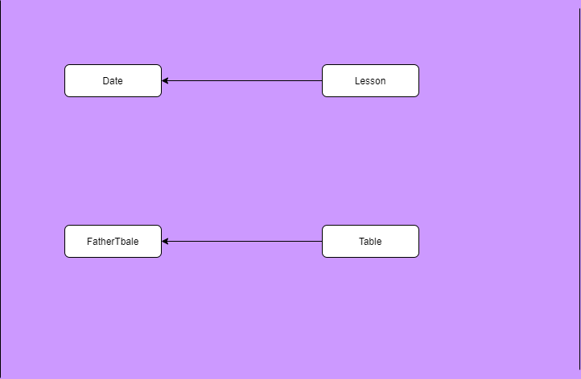
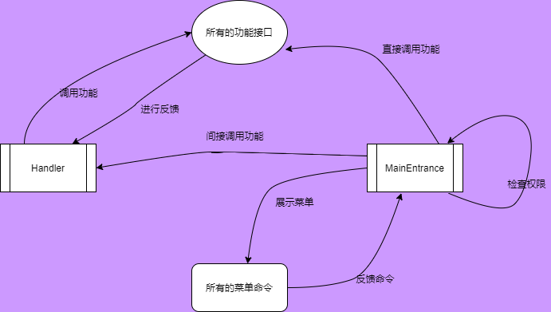

<br>
<br>

<center>

<font size=8> 

南京航空航天大学

<br>

《程序设计课程设计》报告 
  
  </font>


<font  size=7>  状元阁管理系统 </font>


<br>
<br>
<br>
<br>
<font face="黑体" size=6>

<br>
<br>
<br>
<br>

班级 1619103

学号 161910322

姓名 潘佳辉           

 指导教师 郑洪源

 完成日期  2020年5月20日

</font>

<br>
</br>

<div STYLE="page-break-after: always;"></div>

## 目录

</center>

<!-- TOC -->

- [目录](#目录)
- [A 需求分析](#a-需求分析)
    - [背景陈设](#背景陈设)
    - [开发目的：](#开发目的)
    - [开发目标：](#开发目标)
    - [为什么使用C++](#为什么使用c)
- [B 程序主要功能](#b-程序主要功能)
    - [对于教师对象](#对于教师对象)
    - [对于管理人员](#对于管理人员)
- [C 系统总框架图](#c-系统总框架图)
- [D 程序运行平台 Visual Studio 2019](#d-程序运行平台-visual-studio-2019)
- [E 程序类的说明和模块设计分析](#e-程序类的说明和模块设计分析)
    - [类的继承关系视图](#类的继承关系视图)
        - [有关人员的类](#有关人员的类)
        - [文件储存位置的类](#文件储存位置的类)
        - [以Menu为基类的Class的介绍](#以menu为基类的class的介绍)
        - [操作模块类的说明](#操作模块类的说明)
        - [记录模块的介绍](#记录模块的介绍)
        - [表格数据模块和日期模块说明](#表格数据模块和日期模块说明)
        - [一些比较孤单的类的说明](#一些比较孤单的类的说明)
        - [最顶层的操作类的介绍](#最顶层的操作类的介绍)
        - [外部函数的介绍](#外部函数的介绍)
- [F 比较有特色的算法](#f-比较有特色的算法)
    - [1. 使用了STL标准模板库](#1-使用了stl标准模板库)
    - [3. 获取产生记录时间戳并保存，需要时转化为标准时间](#3-获取产生记录时间戳并保存需要时转化为标准时间)
    - [4. 使用了从屏幕获取字符串并不显示处理的函数](#4-使用了从屏幕获取字符串并不显示处理的函数)
    - [5. 修改学生姓名的同时修改学生姓名命名的文件](#5-修改学生姓名的同时修改学生姓名命名的文件)
    - [6. 其他一些小的技巧和操作](#6-其他一些小的技巧和操作)
- [G 存在问题的不足与对策](#g-存在问题的不足与对策)
    - [问题1  : 没有实现图形化界面](#问题1---没有实现图形化界面)
    - [问题2  : 没有实现Excel储存课表](#问题2---没有实现excel储存课表)
    - [问题3 : 没有实现文件的加密和备份](#问题3--没有实现文件的加密和备份)
    - [问题4 : 一些小功能没有实现](#问题4--一些小功能没有实现)
- [H 开发的心得与体会](#h-开发的心得与体会)
    - [第一部分 从遇到的问题中谈谈谈编程的体会](#第一部分-从遇到的问题中谈谈谈编程的体会)
    - [第二部分 用鸡汤文的形式分享一些体会](#第二部分-用鸡汤文的形式分享一些体会)
    - [第三部分 最后的一些总结](#第三部分-最后的一些总结)
- [I 状元阁管理系统使用说明书](#i-状元阁管理系统使用说明书)
    - [第零部分 快速配置使用状元阁管理系统。](#第零部分-快速配置使用状元阁管理系统)
    - [第一部分 设置文档的储存位置](#第一部分-设置文档的储存位置)
    - [第二部分 外部功能的使用说明](#第二部分-外部功能的使用说明)
    - [第三部分 内部功能的使用说明](#第三部分-内部功能的使用说明)
    - [第四部分 管理功能的使用说明](#第四部分-管理功能的使用说明)
- [J 源代码展示](#j-源代码展示)
- [致谢](#致谢)

<!-- /TOC -->


<div STYLE="page-break-after: always;"></div>

## A 需求分析 

  </center>`

### 背景陈设

状元阁坐落于河北省滦州市，创立于2019年夏，是由沈俊东(大连理工大学)、李品桥(清华大学)等河北衡水第一中学优秀毕业生牵头创办的高中生课外辅导机构。自机构成立以来，得到一众高中学生和家长的一致认可，状元阁在当地广受好评。去年暑假，成立之初的状元阁便取得营业额30万元的佳绩。

作为机构任课教师，我有能力和义务用所学的专业知识为状元阁添砖加瓦。

适逢在大一下学期学习了《C++程序设计》这门课程，让酷爱编程学习的我得到一个展示自己的机会，在课程设计布置任务之初，我便决定为状元阁开发一个实用、高效、安全的管理系统，虽然这个设计的出发点远远没有其他同学的宏大雄伟，但是经过一系列的测试，此系统的可靠性和可拓展性是非常不错的。

此外，开发状元阁管理系统的工作量还是比较大的，截止到2020/5/19，有效代码量已经超过了10000行，值得一提的是，在当前的版本中，有些程序的接口虽然没有被用到，但这些接口为以后的版本更新和增减新功能提供了极大的便利，这也体现了此次开发管理系统是从实际出发的特点，所有功能和设计都为满足现有或者未来的的用户需求。

总结一下就是状元阁管理系统是从实际的需求出发，开发出的一款实用性、可拓展性都很强的管理系统。


### 开发目的：

1. 减轻状元阁内部的管理压力
2. 避免人为因素(核对课表和缴费信息错误等)造成的店内不必要的损失
3. 提升数据管理效率和安全性
4. 实现内部数据统一管理和保存
5. 实现可视化数据和内部存储数据的转换
6. 增强机构的整体竞争力
	
### 开发目标：
1. 操作界面图形化界面
2. 操作简便，上手容易
3. 安全性高，可移植性好（稍加修改可为其他机构服务）
4. 文件生成和保存的机制严密
5. 实现数据的备份和隐藏


### 为什么使用C++
+ C++ 是一门伟大的编程语言，同时具有面向对象和面向过程的特性
+ 对开发者友好，减轻了函数和控制的负担
+ 利用面向对象的编程形式方便版本升级
+ 能够连接SQL，在有条件时进行数据库的连接
+ 学生、老师、课表等典型的类能够实现很好地操作
+ 文件保存比较便捷

<div STYLE="page-break-after: always;"></div>

`<center>

## B 程序主要功能
</center>`


<font color=8470FF> 以下灰色部分为尚未实现的功能</font>

  ### 对于学生对象
  
  1. 学员报名并登记信息（姓名 性别 联系电话 补习科目 QQ等）
  2. 修改学生信息（可以实现单项修改）
  3. 学生预约课程（可选择是否缴纳定金）
  4. 学生确定课程（支付学费，与定金核查）
  5. 缴费时提醒应缴金额
  6. 建立学生课表
  7. 提醒上课科目和时间，任课老师
  8. 修改学生课表
  9. 课表自动生成csv文件
  10. 课表内容屏幕显示
  11. 移除学生课表<font color=#D3D3D3>
  12. 学生重名启用第二关键字（性别等）
  13. 学生退课 学生退费（退课后的确认退费）
  14. 学生意见反馈
  15. 学生请求更换老师（记录下）
  16. 成功更换老师（进行课表转移和拼接）</font>


### 对于教师对象
  
  1. 添加教师并记录基本信息（姓名 性别 联系电话 教授科目等 ）
  2. 修改教师个人信息（可单项修改）
  3. 展示自我介绍文件（连接网站）
  4. 添加教师课表
  5. 查询教师课表
  6. 修改教师课表
  7. $\color{#D3D3D3}{ 教师日常反馈记录}$
  8.  $\color{#D3D3D3}{清除教师教学事故记录}$
  9.  教师工资预查询
  10. 工资结算（呈现Excel和屏幕显示）


<div STYLE="page-break-after: always;"></div>


### 对于管理人员

  1. 注册管理员
  2. 管理员登录系统
  3. 一键总账（有密钥，总收款 ）
  4. $\color{#D3D3D3}{一键总账（收款加退款）}$ 
  5. 课表核对（双向入口，核对教师课表和学生课表是否一致）
  6. 添加教师违规记录
  7. 查询单项教学事故
  8. 查询教师违规总表
  9.  添加店内流水账（店内日常开销）
  10. 查询单项流水情况
  11. 查询流水账总表
  12. 收银功能
  13. 记录当次交易信息
  14. 查询单项交易数据
  15. 查询所有交易数据
  16. 初始化课程收费标准
  17. 初始化教师工资标准
  18. 修改课程收费标准
  19. 修改教师工资标准<font color=#D3D3D3>
  20. 备份所有数据
  21. 联系开发人员，进行数据解密（启用解密程序）
  22. 反馈管理系统问题给开发人员</font>

+ **对于经营者**
  1. 管理人员所有权限<font color=#D3D3D3>
  2. 数据加密和备份
  3. 利用二进制的简单加密算法进行加密和备份
  4. 利用程序系统反馈管理系统问题给开发人员 
  5. 删除学生、教师</font>

<center> 


<div STYLE="page-break-after: always;"></div>


## C 系统总框架图

</center>


系统功能大致可分为四个模块，分别是增加模块、查询模块、修改模块、管理模块，操作的对象有学生、教师、课表、记录、课程价位等。

<div STYLE="page-break-after: always;"></div>

<center>

## D 程序运行平台 Visual Studio 2019 


 
</center>

<font color=8470FF size=5>VisualStudio简介</font>


Visual Studio 集成开发环境是一种创新启动板，可用于编辑、调试并生成代码，然后发布应用 。 集成开发环境 (IDE) 是一个功能丰富的程序，可用于软件开发的许多方面。 除了大多数 IDE 提供的标准编辑器和调试器之外，Visual Studio 还包括编译器、代码完成工具、图形设计器和许多其他功能，以简化软件开发过程。


<font color=8470FF size=5>为什么选用VS2019</font>


在设计之初，我原本想用我熟悉的轻量级编辑器 Visual Studio Code 作为开发环境，在写了程勋进行到一定程度的时候，我发现没有IDE的开发是很耗费精力的，没有自动生成的文件夹和筛选器让文件的管理变得异常困难，因此我选用了强大的IDE Visual Studio 2019 社区版，为软件的调试和管理提供了很大的便利。另外，VS支持打开和编辑Qt工程，日后增加图形化界面不必再转为选用其他的IDE

<center>

<div STYLE="page-break-after: always;"></div>

## E 程序类的说明和模块设计分析

</center>

<font color=8470FF size=5> 介绍类前的一些说明</font>

在设计之初，我本想按照往年的课程设计的模板(比如图书馆管理系统)来进行类的设计，用一些名词作为Class，然后其中添加方法，这样一来程序的主体部分还是程序的主函数(或者其他的功能性函数)。**但考虑到此次选题各种的功能需求比较复杂，并且初学编程的我没有把这个系统功能分解为几十上百个函数的能力**，我努力的使用完全面向对象的思想，类似于Java的一切皆是类的思想。
现在返回来看当时类的设计，确实有很多的缺点和不足，甚至曾经出现了头文件循环包含的问题。这里类的说明会有一些比较难理解的地方，我会尽我最大努力把的当初的设计思想展现出来。

<font color=8470FF size=4 >友情提示 此部分容量较大，阅读大约需要十分钟，最顶层的操作封装在最后部分，如有需要请先查看顶层的封装和逻辑</font>

### 类的继承关系视图

#### 有关人员的类


1. 关系介绍
   1. Student，Teacher，Manager均为抽象类People的派生类
   2. Student代表学生，Teacher代表教师，这两个是数据类型的成员，基本没有对应自身行为的方法
   3. Manager为操作者，用Manager的身份信息获得系统的操作权限
   4. Manager具有个人密码，支持登录时设置和自行修改


<div STYLE="page-break-after: always;"></div>


2. 类定义源码
   1. Class People 

```C++

  class People
  {
  private:
      
      static int numID;//静态变量，一个人一个ID

  protected:
      
      char name[30];//姓名
      char gender;//性别
      char phone[20];//电话号码
      int ID;//状元阁唯一识别号,存入文件时候进行更新

  public:
      
      People(char* name, char sex, char* phone);
      People(char*name, char* phone,char sex='F');
      People(char* name);
      People(char* name, char sex);
      People(const People&);
      People();

      virtual ~People(){}
      
      People operator =(const People&);
      
      static int checkNumID();
      
      void setName(char *);
      void setGender(char sex);
      void setPhone(char *);
      void display();
      char* getName();
      char getGender();
      char* getPhone();
      int getID();

      friend class OperateSTD;    //存入文件时会通过友元
      friend class OperateTEA;    //通过友元进行内部访问

  };

```
<div STYLE="page-break-after: always;"></div>

   2. Class Student 
   
```C++
class Student : public People {
	//学生类，是People 的派生类,已经有的的成员有，name,ID,gender,phone ，phone 是家长的手机号
	//还要记录学生的QQ号，科目（内置分数），学生的其他要求，是否缴纳了定金
private:
	char QQ[20];
	int downPayment;//预付订金
	Purpose sub;//科目
	char requirement[100];//学生的要求
public:
	//姓名 性别 电话 QQ 科目 要求 定金
	//姓名 性别 电话 科目 要求 定金
	//姓名 电话 科目 要求 定金
	//姓名 科目 要求 定金
	//姓名 性别 科目 要求 定金
	//最后两项都是缺省构造
	Student(char*, char, char*, char*, Purpose, string requirement = "无", int downpayment = 0);

	Student(char*, char, char*, Purpose, string requirement = "无", int downpayment = 0);

	Student(char*, char*, Purpose, string requirement = "无", int downpayment = 0);

	Student(char*, Purpose, string requirement = "无", int downpayment = 0);

	Student(char*, char, Purpose, string requirement = "无", int downPayment = 0);

	Student();
	Student(const Student& obj);//拷贝构造函数
	Student operator = (const Student obj);
	void display();

	void setQQ(char*);

	void setDownPayment(int);

	void setRequirement(string);
	friend class OperateSTD;
	int getDownPayment();
};

```

<div STYLE="page-break-after: always;"></div>


  3. Class Teacher

``` C++

class Teacher :public People {
	
	//教师类，是People 的派生类,
	//已经有的的成员有，name,ID,gender,phone ，phone 是老师的
	//还要记录老师的QQ号，科目，工资标准

private:
	
	char QQ[20];
	Purpose sub;//科目
	int salary;//工资标准

public:
	
	//构造函数 ， 添加老师只需一个构造函数，薪水为60
	//姓名 性别 phone QQ salary
	
	Teacher(char* name, char sex, char* phone, char* QQ, Purpose subj, int salary=60);
	Teacher(const Teacher& obj);
	Teacher();

	~Teacher();

	void setQQ(char*);
	
	void setSalary(int);
	
	void display();

	Teacher operator=(const Teacher& obj);

	friend class OperateTEA;


};
```

<div STYLE="page-break-after: always;"></div>

  4. Class Manager

```C++
class Manager :public People

{

protected :

	char SSH[30];		//密钥，一些关于账目的管理需要密钥验证身份
					      	//需要使用时转成string进行比较
public :


	Manager(char* name, char sex, char* phone, char*);
	Manager();
	~Manager();
	Manager(const Manager&);
	
    //重载一下赋值号	
	Manager operator =(const Manager& obj);
	
	  //更改个人管理密钥
	void display();

	bool setSSH();

	string getSSH();	//返回密钥,只能通过友元Handler调用

	bool checkSSH(string ssh);

};

```
3. 展示源码后的一些解释
   1. 类声明有OperateMode(操作模块)类的友元类，为的是在进行人员信息保存的时候进行ID的更改。
   2. 需要进行字符串储存的成员，用字符数组储存
   3. 返回字符串或者传入字符串的地方用string和字符数组相结合


<div STYLE="page-break-after: always;"></div>


#### 文件储存位置的类


1. 展示代码前的一些说明
   1. BaseFile记录了文件的储存位置，分为三层进行记录，分别是数据文件夹储存位置，数据文件夹子文件夹的名称，当前问价你的名称
   2. 设计这个类的初衷是在储存文件时直接生成类，防止每次都添加绝对路径的繁琐形式，避免了不必要的错误。更改文件的储存位置时只要从配置文件中读取出储存的字符串即可，避免因为路径完全集成在代码中造成的不便
   3. 每个储存路径Class的命名都是见名知意的形式，对系统的调试提供了方便
   4. STDInfo派生出的几个文件类都是为了让代码更加精简，因为一些要用的方法在STDInfo中已经实现，不必再次从TEAInfo中进行重复的重载或者覆盖
   5. PeoNum和Table是人和课表的唯一识别码，都把当前ID存入文件中，在下一次调用是自动更新一个ID，这样就为查询时提供了很大的便利


<div STYLE="page-break-after: always;"></div>

2. BaseFile为基类的源码展示
   1. Class BaseFile
   
```C++
   
   class BaseFile 

	//创建基础文件类，是所有文件类的基类
	//文件绝对路径= saveAddress+uniqueAddress+fileName
	//功能文件夹，按照文件的种类进行分类

{

private:

	static string REGISTERADDRESS;//储存的绝对路径，只会出现在参数列表里
	static void RESETADDRESS(string);//修改绝对路径

protected :
	
	const string saveAddress;//储存位置,绝对路径，到位置文件夹,一般不进行修改
	string uniqueAddress;//功能文件夹
	string fileName;//文件的名称
	string completeFile;//把前三个整合到一起，这是为了方便调用

public :
	
	BaseFile();
	BaseFile(string UA, string FA);	//第一个参数是功能描述uniqueAddress，第二个参数是文件名称filename
	BaseFile(const BaseFile&);
	BaseFile operator=(const BaseFile&);

	string getCompleteAddress();
	string getSaveAddress();
	string getfileName();
	void setFileName(string FA);//参数是filename
	void changeSaveAddress();//改变储存的位置，需要验证密码
	void display();
	virtual ~BaseFile(){}
};

```

<div STYLE="page-break-after: always;"></div>


 2. Class STDInfo

```C++
class  STDInfo : public BaseFile 

	//这是学生信息文件类
	//有保存位置和数据类型，也是文件类型
{

public:

	STDInfo(string Name);
	
	STDInfo();
	
	STDInfo(const STDInfo&);

	virtual ~STDInfo();


	STDInfo operator = (const STDInfo&);

	void setName(string Name);


};
```


<div STYLE="page-break-after: always;"></div>


  3. Class PeoNum

```C++
class PeoNum :public BaseFile 

{

protected:
	
	int NowNum;//当前数字

	bool setFile(int a=1);//设置此文件
	
	bool getNum();//取出文件内容

	void setNowNum(int);//更新当前的NowNum

	void update(int);//更新了ID数

public:
	
	PeoNum();
	~PeoNum();
	int returnNum();

};
```
3. 展示代码后的一些说明
   1. 记录表格ID的类(TabInfo)与PeoNum大同小异，不在此进行赘述
   2. STDInfo的派生类与其基类的差别是内置的储存位置不同，各项功能基本是继承下来的

<div STYLE="page-break-after: always;"></div>


#### 以Menu为基类的Class的介绍


1. 展示代码前的一些说明
   1. Menu类是一个抽象类，是所有显示菜单的基类
   2. 菜单分为两种，一种是简单的菜单，只有向屏幕输出信息和获取命令的功能，另一种是高度封装的菜单，对外部只提供显示菜单的接口，能够在调用中进行数据的查询，比如便利课表或者查询教师和学生的信息，而且在调用结束前能够对从从屏幕捕获的输入信息生成相应的文件进行储存
   3. 现在请看上图，教师教学事故菜单(ViolationMenu),店内流水菜单(RunningMenu),收银菜单(TollMenu),注册管理员的菜单(RegisterManagerMenu)都属于上述第二种菜单，从屏幕获得信息并进行储存
   4. 增添老师、学生、课表的菜单，分别是AddTEAMenu，AddSTDMenu，和AddTABMenu，都是从屏幕获取到信息，生成相应的对象，并提供接口把此对象返回
   5. 主菜单和内部功能菜单是进行屏幕显示，并获取相应命令的菜单，这里应该还有一个管理员专有功能的菜单，但是体量较小，我把他内置在了最顶层的命令处理部分，这个问题稍后会详细的进行说明
   6. 值得一提的是，登录菜单LoginMenu是我通过充分的考虑，把一些本来在外部的函数封装进来的菜单，登录菜单的功能是对的登录人员进行权限的检测，只有获得店铺经营者授予权限的人才能注册使用这个管理系统
   7. 补充上一点，这里的注册和管理员注册不是一个概念，这里的注册只是能使用其中的一些功能，比如查询自己的课表和修改自己的个人信息等等
   
<div STYLE="page-break-after: always;"></div>

2. 下面进行以Menu为基类的派生类的源代码展示

    1. Class Menu 
```C++
class Menu 

//这是一个菜单的抽象类

{
public:
	
	Menu() {};
	virtual void display()=0;
	virtual ~Menu() {}

};

```

  2. Class AddTABMenu


```C++
class AddTABMenu :public Menu 
{

protected:

	Table table ;
	
	Date getDateFromScreen();
	int display2();
		
	Student checkThisStudent(string name);

public:

	AddTABMenu();
	~AddTABMenu();
	AddTABMenu(const AddTABMenu&);

	void display();

	Table getTable();

};
```
<div STYLE="page-break-after: always;"></div>

   3. Class RegisterManagerMenu
```C++
class RegisterManagerMenu:public Menu 
{
protected:
	
	Manager Man;
	bool checkQuality();
	string getSSHFromScreen();
	bool saveThisMan(string name);

public:
	
	RegisterManagerMenu();
	~RegisterManagerMenu();
	virtual void display();  //填入成员的属性

	Manager getManager();

};

```

<div STYLE="page-break-after: always;"></div>


   4. Class TollMenu
```C++

class TollMenu :public Menu 

{
protected:


	Manager operatorManager;

	bool display2();  //附加项目询问

	bool saveThisTranRecord(TransactionRecord );  
		//保存这个交易记录，只能内部访问
	
	Student checkSTDInfo(string STDname); 
		//通过学生姓名查询学生信息，并生成一个学生对象返回会来 
	int HowMuchToPay(Student &);

	int getClassTypeInPrice(int );

public:

	//生成交易菜单必须传入当前的操作者
	//否则不能生成这个对象

	TollMenu(Manager &);
	TollMenu(const TollMenu&);
	~TollMenu();
	
	void display();
	

};
```
<div STYLE="page-break-after: always;"></div>

  5. Class LoginMenu

```C++
class LoginMenu:public Menu 
{

protected:

	bool checkBigPassword(string s);				//检测经营者邀请码

	bool checkPassword(string input);				//检测个人登录密码
	
	bool saveAccount(string name, string password); //保存当前注册账户

	string login_one();								//接收密钥

	void register_one();							//进行注册的第一部分

	void register_two();							//进行注册的第二部分

public :

	void display();									//外部唯一接口

};
```
3. 展示代码后的一些说
   1. 一些接口的功能已经在注释里说明，其他未经展示部分的类的实现方法与已经展示的类具有相似之处，具体实现请查看源代码

<div STYLE="page-break-after: always;"></div>

#### 操作模块类的说明


1. 展示代码前的一些说明
   1. 操作模块是数据对象和操作者的介质，具有十分重要也十分强大的功能
   2. 所有可以对实际对象进行操作的类都是OperateMode这个基类的子类
   3. 这些操作包括增添，读取，修改并保存等功能
   4. 根据实际需求，其中对课表的增添只有从学生出发，修改只能从教师出发
2. 下面进行OperateMode为基类的代码展示
   1. Class  OperateMode

```C++

class OperateMode 

	//OperateMode ，抽象类
	//刚开始我想把查询模块和增加模块分开的
	// 现在觉得这俩放一起挺好
{

public:
	
	virtual bool readPreFile() = 0;//读取前置文件
	virtual bool saveThisFile() = 0;//保存当前文件
	
	OperateMode(){}
	virtual ~OperateMode(){}
	
};

```

<div STYLE="page-break-after: always;"></div>

   2. Class OperateTable
```C++

class OperateTable : public OperateMode 
{
	//操作学生课表的类
protected :
	Table table;
	TableInfo saveAddress;

	bool checkIsThisTable();
	bool changeThisTable();
	bool addLesson();
	bool deleteLesson();

	int checkHowLongBelonging(Table TEATab);

public:

	OperateTable( Table &tab);
	OperateTable();
	~OperateTable();

	//对父类虚函数进行重写 
	virtual bool saveThisFile();		//保存当前文件，把当前的Table保存文件
	
	bool saveThisFile(int ruler);

	virtual bool readPreFile();			//读取前置文件，把数据读出到当前的Table
	
	bool readPreFile(string name);

	bool readPreFile(string name, int ordinal);//读出这个人的第几个课表
	
	bool updateThisTable();                //更新这个课表

	bool transformSTToCSV();
	bool transformTTToCSV();

	void getTableFromScreen();

	void clearHidenTable();
	
	Table getTable();			//返回这个让table对象

	string getAddress();
};

```
<div STYLE="page-break-after: always;"></div>

3. Class OperateSTD

```C++
class OperateSTD :public OperateMode

	//刚开始我想把查询模块和增加模块分开的
	// 现在觉得这俩放一起挺好的
	//为了避免来回改名字，类名就不变了
{
private:
	//内置函数，声明成Student的友元函数
	//修改自己数据的ID，进行数据保护
	void setStdsID(People&);
protected:

	Student stud;//学生对象
	STDInfo saveAddress;//文件地址对象

	void getChangeInfo();
	bool catchElection();
	bool doChangeInfo(int election);
	Purpose catchPurpose();

public:

	OperateSTD( );
	~OperateSTD( );
	void getInfoFromScreen( );//把保护变量里的STD 填入信息
	bool saveThisFile( );//保存文件
	bool readPreFile( );//无参 从文件中读取文件信息
	bool readPreFile( string );//包含学生姓名参数读取学生信息
	bool readPreFile(int oridinal);//参数是学生的第几个信息
	Student getStudent();
	bool updateStudentInfo(string STDname);
};
```
3. 展示代码后的一些说明
     1. 这个模块中的类进行了较多的重载，以适应多种参数的需求
     2. 这里操作课表的模快有两个函数是把当前的课表对象输出为csv文件，并用当前课表的拥有着进行命名，csv文件可以用Excel打开，这样就可以实现可视化的课表，方便查询和核对。 


<div STYLE="page-break-after: always;"></div>

#### 记录模块的介绍


1. 展示代码前的一些说明
   1.  系统内所有的记录的类都是抽象类类Record的派生类
   2.  基类Record中Unix时间戳(TimeStamp)的记录是这个基类的核心
   3.  Record中记录的时间戳是int类型，在显示时用外部的函数转换成标准时间格式(Standard)
   4. 基类派生出的其他类，会根据自身需求扩展所记录的信息 
   5. Record中有一个Manager成员，是用来记录当前记录的生成者是谁，便于后期的核对
   6. Record模块里所有的类都没有无参构造，因为不能凭空产生一条记录

2. 下面进行代码展示

   1.  Class Record

```C++
class Record
{
protected:
	Manager operatorManager;		//操作者
	int timeStamp;					//系统时间戳，记录操作时的时间
public:
	//只能含参构造，不能缺省，因为操作人员不明确会出问题
	Record(Manager &) ;

	virtual ~Record() ;
	Record(const Record&);

	virtual Record operator =(const Record&);
	virtual int getTimeStamp();
};
```
<div STYLE="page-break-after: always;"></div>

   2. Class TransactionRecord
```C++
class TransactionRecord :public Record

	//交易记录类

{
protected:
	
	Student stud;    //学生对象信息
	float payment;	// 缴纳费用
	char collectWay[20]; // 收款方式
	char remarks[100]; //收款备注

public:
	
	//不能有无参构造函数

	TransactionRecord(Manager&, Student&, float pay=0,string CW="现金收款",string R="无");
	
	virtual ~TransactionRecord();
	
	TransactionRecord(const TransactionRecord&);
	
	virtual TransactionRecord operator =(const TransactionRecord&);

	void display();

	void shortShow();

	float getPayment();
};
```

<div STYLE="page-break-after: always;"></div>


  3. Class ViolationRecord 

```C++

class ViolationRecord :public Record 
{
protected:
	
	Teacher VioTeacher;
	int FirstVioCode;
	int SecondCVioCode;
	Date OccurTime;
	char Remarks[100];//备注或者其他教学事故

public : 
	
	ViolationRecord(Manager&,Teacher &,int first,int second,Date d,string remark );
	~ViolationRecord();
	ViolationRecord(const ViolationRecord&);
	ViolationRecord operator =(const ViolationRecord&);
	void display();
};

```

<div STYLE="page-break-after: always;"></div>


  4. Class RUnningRecord 
```C++
/**************************************************************
	类型说明
	店内流水账类，主要记录店内日常开销，比如购买水性笔，桶装水等
	需要记录信息 操作人员（Manager 或者 Teacher ） 
***************************************************************/

class RunningRecord :public Record 

{
protected:

	float payment;			// 此次费用
	char collectWay[20];	// 支付方式
	char remarks[100];		//用途备注
	char payer[30];			//支付者说明，是否是管理员本人

public:

	RunningRecord(Manager&, float pay, string Remarks
		, string payer = "管理员本人", string collect = "微信支付");

	~RunningRecord();
	

	RunningRecord(const RunningRecord&);

	RunningRecord operator= (const RunningRecord&);
	
	//重载一个赋值号


	void display();
	void shortShow();

};

```
<div STYLE="page-break-after: always;"></div>

#### 表格数据模块和日期模块说明




<font color=8470FF> 这张图十分的简洁， 但设计时却花费了我大量的心血，经过了很多次的修改，才有实现了最后的功能，这里的讲解会从需求分析讲起，说明我一步一步解决问题的过程，如果对开发过程不感兴趣，请直接下拉，查看类的定义即可。
</font>
在设计之初，我想到了很多不易实现并且很重要的需求，在这其中如何记录课表是最令人挠头的部分，虽然现在看起来是顺理成章的，但是从刚开始的过程来看，这个过程并不容易。

+ **从需求层面来看**，状元阁有一对一、一对二、一对三、一对四、小班课等多种课程类型，此外，还要记录课程的上课时间，而且每个课表都是由老师和学生双向维护的，也就是课表内要包含这两个互相对应的关系。另外，展示出的课表是要经过排序的，不能是乱序的。
+ 在一开始，我想到让单节课程作为成员直接储存在课表中，这样就模拟了现实中的课表。而容器又是一个问题，直接开大的课程数组会造成占用很多不必要的空间。但是课程类型如何记录呢？是一对一还是一对多？用字符串记录在其中的话势必会造成记录不统一的情况。
+ 在后来我了解到了**优先队列**，我用优先队列储存课表，就满足了自动排序的功能，在便利和修改时更是很方便

1. 展示源代码前的几点说明
   1. 日期Date类是Lesson的基类，但Date的功能不局限于此，它在Record类中也得到了很多的应用
   2. Date类中进行了大量的运算符重载，这并不是无用的，作为一个基础类型，它必须像基础数据类型一样强大和稳健，支持多种运算。
   3. FatherTable与刚开始的设计出现了一些偏差，只是派生出了课表类
   4. Fathertable 会记录这个表格的拥有者，也会记录表格的名称
   5. 这里值得说明一点的是Table类中有一个theOtherName的成员，这记录了与课表拥有着对应的老师或者学生，发挥着很重要的作用，在下文中还会介绍到。

<div STYLE="page-break-after: always;"></div>

2. 展示上述类的源代码
   1. Class Date
```C++
class Date {
    //日期类，包含月日年,主要功能是记录课在哪天上
protected:

    int year;
    int month;
    int day;

public:

    Date();
    Date(int year, int month, int day);//普普通通的构造函数
    Date(int month, int day);//重载构造函数，缺省年的构造
    Date(const Date& obj);//拷贝构造函数

    void display();//演示一下
    
    int operator - (const Date& obj);//重载+ - = ，日期相减返回整数，日期加整数返回日期

    Date operator + (int x);

    Date operator =(const Date& obj);//赋值号，按位赋值
    bool operator >(const Date& obj)const;//重载大于小于和等于
    bool operator <(const Date& obj)const;
    bool operator ==(const Date& obj)const;
    bool operator <= (const Date& obj)const;
    bool operator >=(const Date& obj)const;

    Date operator ++ (int);//重载后置++
    Date operator ++ ();//重载前置++
    Date operator --(int );//重载后置--
    Date operator --();//重载前置--
    
    int getYear();
    int getMonth();
    int getDay();
    bool Simplify();//进行加法后简化，向月份和年份上加；
};

```

<div STYLE="page-break-after: always;"></div>

  2. Class Lesson
```C++
class Lesson :public Date

	//这是一个课程类，是Date的子类，包含课的日期和第几节的信息

{
private:

	int ordinalNumber;//记录这是第几节课
    

public:

    Lesson();
    
    Lesson(int year, int month, int day,int ordinalNumber);//普普通通的构造函数
    
    Lesson(int month, int day,int ordinalNumber);//重载构造函数，缺省年的构造
    
    Lesson(const Lesson& obj);//拷贝构造函数
    
    Lesson(const Date& obj, int num);//日期和课程节数进行构造

    bool operator <(const Lesson& obj)const;
    
    //这个很重要，为了避免使用比较函数，
    //这里把小于号重载为大于号，再Table中就能实现小根堆

    void display();//演示一下

    int getOriginalNumber();//返回这是第几节课

    bool operator !=(const Lesson&)const;
};

```

<div STYLE="page-break-after: always;"></div>

3. Class FatherTable 

```C++

class FatherTable 

	//这是一个表格类，拥有表头，所有者姓名，所有者ID
	//会派生出老师的课表和学生的课程表Table，老师的工资表 SalaryTable

{
protected :
	
	//char dataHeader[30];

	char ownerName[20];//所有者姓名

	int ownerID;//所有者的状元阁唯一识别号

	string selfName;  //

public :

	FatherTable(People*);

	FatherTable();
	FatherTable(const FatherTable&);
	FatherTable operator=(const FatherTable&);
	void display();//展示一下
	
	virtual string getSelfName();

	string getOwnerName();

	int getOwnerID();
};

```

<div STYLE="page-break-after: always;"></div>

  4. Class Table

```C++
class Table : public FatherTable 

{

protected:

    //这是一个优先队列，存放课程
    priority_queue <Lesson> lessonTimeTable;
    
    Date startDate;

    Date endDate;
    
    int number;//课程节数

    char theOtherName[30];//配对教师姓名

    int classType;//记录课程类型
    
    int tableID;

public:

    
    friend class OperateTable;
    friend class StoreTable;

    //构造函数
    Table();

    Table(People*, Date startDate, Date endDate,int num, char* name,int Type);
    //起止时间，推入队列
    
    Table(People*, char* name, int Type);
    //只传入人，然后进行输入课表，推入队列
    
    Table(People*, Date startDate, int x,int num, char* name,int Type);
    //开始时间，课程节数

    Table(const Table&);

    Table( StoreTable& );
    
    Table operator =(const Table&);
    

    void ReviseTeam();//转换拥有着为老师

    void ReviseTeamToSTD();//转换拥有着为学生

    void translateFromStoreTable(StoreTable&);// 转为储存课表

    void displaySTD();  //展示学生课表

    void displayTEA();  //展示老师课表
    
    void shortShowSTD(); //简短展示学生表头信息
    
    void shortShowTEA(); //简短展示老师表头信息

    void shortShortShowTEA(); //精简的展示信息

    void clearThisTable(); //清空当前课表内的内容

    int getNum();// 获得课程节数
    
    string getSelfName();//获得表格名称

    int getClassType();//获得类型代号

    string getTheOtherName();//获得对应成员的姓名

    int getTableID();//获得课表的编号
};

```

<div STYLE="page-break-after: always;"></div>


#### 一些比较孤单的类的说明

<font color=8470FF> 这里对一些与其他类没有继承只有组合关系的类进行说明，别看没有亲人，他们的功能同样十分重要，没有这些，这个系统是有缺陷的，甚至是瘫痪的。</font>

<font color = 8470FF>下面对这些类进行一一说明</font>

1. 展示源码前的说明
   1. Storetable是Table储存在文件中是要转换为的类型，因为Table中含有优先队列，方便操作，但是不方便储存，转换成StoreTable进行储存就能解决这个问题
   2. Purpose类是科目类型，之所以没有用Subject这个单词是因为用Subject作为类型名会被编译器识别为别的符号，因此有Purpose这个名称进行替代
   3. ClassPrice是课程单价的类型，记录一种课程学生的收费标准和老师的工资标准
   4. ConClassPrice是对课程单价进行初始化的类，能够对配置文件进行初始化和修改，也能读出一个 map<int,ClassPrice>,其中的含义是课程类型代码对应课程和的收费和支出标准。
   5. SalaryTable，这个不同于以上的类，是一个集成的类，能够通过传入一个教师对象的引用，查询教师所有的课表，并且通过查询相应的课程单价，计算应该支付的工资。
   6. QueryRecord 这是查询三种主要记录的类，通过传入记录的条数能够返回相应的记录对象
   7. FeasibleCmd 这是简单的适应窗口类，能够调整dos窗口为比较好看的模式

<div STYLE="page-break-after: always;"></div>

2. 所有这些类的源代码展示
   1. Class StoreTable
```C++
class StoreTable 

	//因为Table使用优先队列实现的，不能存入文件
	//这个类型的对象用于储存在文件中 
	//这两个类互为友元类，方便互相初始化

{
protected:

	char ownerName[20];			//所有者姓名
	int ownerID;				//所有者ID

	char selfName[50];
	char theOtherName[30];
	
	Lesson lessonTable[100];			//课表数组
	int num;							//课程数
	int classType;
	int tableID;						//课表编号
	
public:

	friend class Table;
	
	~StoreTable();
	StoreTable();
	StoreTable(const StoreTable& );
	StoreTable( Table  );

	void buildStoreTable( Table );
	void setOtherName(string name);

	int getNum();
	int getClassType();

	Lesson* getLessonTable();

	string GetTheOtherName();

	void setTableID();				//更改课表的编号，在存入文件的时候更改
	void setTableID( const  StoreTable &);
};
```

<div STYLE="page-break-after: always;"></div>

  2. Class Purpose
```C++
class Purpose
{
private:

	char subject[7][10];
	int sum;

	//把vector存车的方式改成了string数组和记录数量的变量
public:
	
	Purpose( vector <string>  );//含参数构造
	Purpose();//无参数构造
	Purpose(const Purpose& obj);//拷贝构造
	~Purpose();//析构
	void display();
	Purpose operator=(const Purpose&);

};
```


3. Class ClassPrice

```C++
/***************************************************************************
			这是一个简单的数据类
		负责记录课程类型的收入单价和发放单价
		注意也要对应课程的类型
****************************************************************************/
class ClassPrice 
{
private:
	int classTypeCode;				//课程类型的代码
	int inPrice;					//从学生处收取
	int outPrice;					//发放给教师
	char Remarks[20];

public:
	ClassPrice(int classTC,int IP,int OP,string remark);
	~ClassPrice();

	void updateCP(int IP, int OP, string remark);				//读取出来后进行修改
	void setClassPrice(int classTC, int IP, int OP, string remark);
	
	int getType();
	int getInPrice();
	int getOutPrice();
};
```
<div STYLE="page-break-after: always;"></div>

4. Class ConClassPrice

```C++
/****************************************************************
			对课程单价进行增添和修改的类
		增加是初始化的时候进行调用，修改是读取并进行修改
		用一个读取函数进行检验
*****************************************************************/


class ConClassPrice 
{
protected:

	ClassPrice classPrice;
	void getInfo(int type);

public:

	ConClassPrice();
	~ConClassPrice();
	ConClassPrice(const ConClassPrice&);
	bool initClassPrice();
	bool setClassPrice();
	map<int ,ClassPrice> getMapFromCon();//返回一个课程类型到单价的map

};
```
<div STYLE="page-break-after: always;"></div>

5. Class SalaryTable

```C++

class SalaryTable 

{
protected:
	
	int totalSalary;		//总薪水

	Teacher teacher;		//老师的数据

	void caculateSalary();  //计算总薪水
	
	
	int HowMuchInShort();

	int getClassTypeOutPrice(int key);

	int HowMuchInDisplay();

public:
	
	SalaryTable(Teacher &);
	
	SalaryTable(const SalaryTable&);
	
	~SalaryTable();
	
	SalaryTable operator =(const SalaryTable&);

	void showAllTable();	//展示这位老师的所有课表
	void briefShow();		//进行简短的展示

};

```

<div STYLE="page-break-after: always;"></div>

6. Class QueryRecord

```C++
/*****************************************************
	这是查询课表的操纵台，只能被handler所调用

	能够查询收银记录，店内流水账，教师违规记录
	需要传入的参数是第几条记录
	返回这个类型的record
	注意收银记录有两条查询路线，第二条隐藏

	因为交易记录类型的类没有默认构造函数，所以需要创建一个临时的对象
	进行有参构造，当然这个记录是无意义的
	
	为了函数的简洁性，打开文件失败会抛出异常,要记得处理
******************************************************/
class QueryRecord 

{
protected:

	friend class Handler;			//只能通过友元类调用方法

	RunningRecord getRunningRecord(int ruler=1);
	ViolationRecord getViolationRecord(int ruler=1);
	TransactionRecord getTransactionRecord(int ruler=1);
	TransactionRecord getHidenTransactionRecord(int ruler = 1);

public :	
	QueryRecord();
	~QueryRecord();
};
```

7. Class FeasibleCmd

```C++
class FeasibleCmd 

	//这是窗口类，能够调整窗口大小和颜色
{

public:
	
	FeasibleCmd( );
	FeasibleCmd(FeasibleCmd& obj){}
	~FeasibleCmd(){}

};
```

<div STYLE="page-break-after: always;"></div>

#### 最顶层的操作类的介绍




<font color=8470FF>
这是直接从主函数调用的类，也是系统消息处理机制的最外层表现。下面将介绍这两个最容易设计而且最好操作的类。
</font>

1. 展示源码前的一些说明
   1. Handler控制台内置了一个Manager(管理员)和一个开关变量LOGIN
   2. LOGIN是记录当前是否有管理员已经进行了登录，如果没有进行登录，那么程序的功能将受到一定的限制，只有在登录以后才能正常使用所有功能
   3. 主入口类内置一个Handler成员，根据需求，让Handler对功能接口进行调用，或者在自身实现
   4. 主入口类是在主函数中与外界进行交流的窗口，即调用菜单获取命令，然后把命令交给处理命令的成员函数，处理时根据功能的复杂程度选择是否调用Handler控制台，如果处理此项命令的程序比较复杂，那么讲交由Handler处理。


<div STYLE="page-break-after: always;"></div>

2. 展示顶层两个类的源代码

   1.  Class Handler

```C++
class Handler 

	//控制台类，进行权限释放

{
private :
	
	Manager operatorManager;
	bool LOGIN;

public:
	
	Handler();
	~Handler();

	bool LoginManager(string name,string SSH );			//传入姓名和密钥进行登录
	bool getStatus();									//获得登录状态

	void addSTD();										//增加学生，教师，课表
	void addTEA();											
	void addTAB();
	void addToll();										//增加交易记录，流水，违规记录
	void addVio();
	void addRun();
	void setTable();									//修改课表
	void changeMAGSSH();								//修改当前管理员的密钥

	void showOneRun(int ruler,int small );				//传入数据位置参数展示三种记录
	void showOneToll_S(int ruler, int small);
	void showOneVio(int ruler);
	void showOneToll(int ruler, int small);

	void showAllRun(int  );								//展示所有的三种记录
	void showAllVio(  );
	void showAllToll( int );
	
	bool checkSSH();									//某些操作的密码验证

	void showAllTEA();									//展示总表中的教师和学生信息
	void shouwAllSTD();								

	float checkSummery(int show);						//一键总账


};

```

<div STYLE="page-break-after: always;"></div>


   2.   Class MainEntrance 

```C++
class MainEntrance 
{

private:
	int commender;//命令代码寄存器
	Handler Hander;

public :
	
	MainEntrance();
	~MainEntrance();
	

	void ShowThe_First();				//展示先导界面
	void ShowPre_Login();				//登录界面
	int  ShowMain_Menu();				//主菜单
	bool DealFirt_Comd(int Comd);		//处理主菜单的命令
	int  ShowInde_Menu();				//显示内部菜单
	bool DealSecn_Comd(int Comd);		//处理内部菜单的命令
	int  ShowMang_Menu();				//管理员特有功能，集成一体化

};

```
3. 这里本该有一些说明，但我觉得代码注释里边说的已经够详细了，所有此项略过


<div STYLE="page-break-after: always;"></div>


#### 外部函数的介绍

<font color=8470FF >
到这里所有的类已经介绍完毕了，但这里还有一个头文件要介绍一下，他包含了所有的外部函数，利用了C++面向过程编程的思想，让程序变得简单易读
他就是stdafx，这里我们先来看源代码
</font>

```C++
								
bool checkBigPassword(string s);			//检测经营者授权码

bool saveAccount(string name, string password); //新建使用者

bool checkPassword(string input);     //检测登录权限

bool checkSaveAddress(string);      //检查修改后的储存位置是否合法

string getStringWithoutShow();			//不显示屏幕获取字符串

string TimeStampToStandard(int );		//把时间戳转换为标准时间

bool checkToContinue();					//询问是否继续

void operationCancled();				//操作取消

string translateNumToClassType(int);	//代码转为课程类型

char checkGender();						//获取性别

string trnaslateVioCode(int, int);		//违规代码转换为具体事项

```

1. 这里使用最多的是检测是否继续执行，就是从屏幕获取一个字符，并检测是否是Y 或者 y，是则返回true，否则返回false
2. 从屏幕获得字符串但不显示时用来输入密码的
3. 传入违规代码转换为具体的违规事项是一个简单的解码
4. 转换课程类型也是代码和字符串对应的关系


<div STYLE="page-break-after: always;"></div>


<center>

## F 比较有特色的算法


</center>

<font color =8470FF size =5 >

介绍前的一些话
</font>

<font color=1E90FF size=4>
说实话在这个地方我确实不知道该讲些什么，在进入南航计算机专业学习以来，课内所接触到的都是计算机语言或者导论课，说到算法我一时间不知道如何来讲。从我的个人经历来讲，我在学校的算法组织学了一些ACM竞赛的基础算法，但基本都是数论图论动态规划这些东西，能用到课设里边的并不多，实际也没用上，本来想用一个二维连通图来记录教师和学生的教学关系，但是这样一来表里边的数据非常稀疏，二来如果定义在一个类里边的话会发生爆栈的情况，实际上课设里边并没有用到很多让我引以为豪的算法，只有记录课表时的双向查找和保存我觉得是自己想出来最经典的东西，其他的算法多为从其他开源的资源库上学习模仿下来的东西，但是通过课设这个磨炼的机会还是学习了不少的东西。

</font>

<br>
</br>

<font color =8470FF size =5 >
开始进行矮子里边拔将军--程序里特色算法的介绍
</font>

<div STYLE="page-break-after: always;"></div>


<br>
</br>

 
<font size=4>

### 1. 使用了STL标准模板库 

</font>


<br>
</br>
   + 在课表内记录课程时，Lesson的容器运用了STL中的**优先队列**

```C++

class Table : public FatherTable
    //这是一个优先队列，存放课程
    priority_queue <Lesson> lessonTimeTable;


```

优先队列STL中封装了优先队列（priority_queue）这种结构，它和普通队列的区别是：普通的队列是一种先进先出的数据结构，元素在队列尾部追加，从队列头删除。而在优先队列中，元素被赋予优先级。当访问元素时，具有最高优先级的元素最先删除。优先队列具有最高级先出（first in,largest out)的行为特征。为此我重载了Lesson的小于号运算符

```C++

bool Lesson::operator <(const Lesson& obj)const
	//这里把小于号重载为大于号，就能在Table里边实现小根堆
	//从而实现可变的排列顺序是从小日期到大日期
{
	int a = year - obj.year;
	if (a > 0)return 1;
	if (a < 0)return 0;
	if (a == 0) 
	{
		int b = month - obj.month;
		if (b > 0)return 1;
		if (b < 0)return 0;
		if (b == 0) 
		{
			int c = day - obj.day;
			if (c > 0)return 1;
			if (c < 0)return 0;
			if (c == 0)return 0;
		}
	}
	if (this->ordinalNumber >= obj.ordinalNumber) 
		//课程节数的比较，效地在前，不理解看上一条注释	
	{
		return 1;
	}
	return 0;
}
```

<div STYLE="page-break-after: always;"></div>


+ 使用了STL标准模板库中的map，进行通过键值查找Value的操作

  + 通过代码查找课程类型的函数

```C++
string translateNumToClassType(int key) 
{
	map<int, string > classType;
	classType.insert(pair<int, string>(1, "一对一课程"));
	classType.insert(pair<int, string>(2, "一对二课程"));
	classType.insert(pair<int, string>(3, "一对三课程"));
	classType.insert(pair<int, string>(4, "一对四课程"));
	classType.insert(pair<int, string>(5, "小班课课程"));
	classType.insert(pair<int, string>(6, "其他类课程"));
	
	string Type = "未查找到此种课程类型 ";
	
	auto it = classType.find(key);

	if (it != classType.end())
	{
		Type = (*it).second;
	}
	return Type;
```


  + 生成一个代号和课程单价对象的map并返回，便于外部的利用


```C++
map<int, ClassPrice> ConClassPrice::getMapFromCon() 
{
	ConfigInfo CF("ClassPrice");//产生文件储存路径
	ifstream file;
	file.open(CF.getCompleteAddress(), ios::in | ios::binary);

	if (!file)
	{
		cout << "ClassPrice文件打开失败，请检查路径是否存在" << endl;
		cout << "当前路径 :  " << CF.getCompleteAddress();
	}
	map<int, ClassPrice> MAP;    //生成课程代码与单价的map

	for (int i = 1; i <= 6; i++) 
	{
		file.read((char*)&this->classPrice, sizeof(this->classPrice));
		MAP.insert(pair<int, ClassPrice>(i, this->classPrice));
	}

	return MAP;

}
```

<br>
</br>

<div STYLE="page-break-after: always;"></div>


<font size=4>

 ### 2. 实现了双向维护同一信息以保持信息的一致性
 
</font>

<br>
</br>
<font color = 8470FF size=5 > 讲这个算法之前要说一点具体的需求信息
</font>
<br>
</br>
<font color=1E90FF size=4>

在这个机构中，教师和学生课表关系的维护是最耗费管理员精力的事情，举个例子来讲，老师小飞有五个学生，学生启明有三个老师，这里我们忽略科目这个信息，这样一来，每个学生和老师都要有自己的课表，而且要每个对应的课表要保持一致，倘若没有修改修改的需求，单纯的储存还是比较容易满足的，只要在学生订课时把课表进行一份拷贝，修改表格的拥有者，就可以实现这个需求。但是增加了修改的需求以后，我们已经把订课时的信息丢失了，只能从姓名这个键值进行文件的查找，就像人工修改一样，只能找到老师的课表，修改，找到学生的课表，修改。这样就失去了这个系统设计的初衷--减小管理人员的管理压力。于是我冥思苦想，今天吃不下饭睡不好觉。
</font>

<br>
</br>

<font color=8470FF size=5 > 现在说说我的解决方案 </font> 

<font size=4>

我在一个失眠的晚上想出了一个自认为巧妙的解决方案，这让我本来就睡不着的我更加兴奋了，这个方案就是**在课表中记录与课表拥有者组合的信息**

在订课时就把拥有着信息和配对组合者的信息互换，比如学生启明订了教师小飞的课，启明的课表中就记录了小飞的信息，进行存储的时候，就把着这两个信息互换，把这个课表存入教师小飞的课表文件中。同样的，在课表进行修改时，一般这个需求都是由老师提出的，就是把老师姓名作为键值出发，找到教师课表中的相应的某节课，然后读出这个Table对象，进行修改，修改的方式很简单，往优先队列里边推入，删除也很简单，只要再开出一个优先队列，像数鸭子时把鸭子从一边赶到另一边，然后把想要的鸭子找出来，删除即可。修改课程时间实际上就是先删除一节课，再增加一节课。**然后最重点的部分到了**，如何把这个修改同步到学生的课表文件中？

在一个没有午睡的中午，我缓缓的整理了一下设计思路，发现通过课表中记录的组合姓名可以作为查找的依据，我立刻写出了代码，然后开始进行测试，这个时候我偷了一个懒，**没有添加很多的教师和学生**，也正是因为这个举动，**我发现了这个方法的bug**，如果一个老师和学生有不只一门的对应教学组合，比如小飞既教启明的数学，又教他的物理，**然后这两人的课表文件就会有类似Hash冲突的事情发生，因为只通过姓名查找的方式不能区别两个课表谁是谁，就会造成混乱发生。**


<div STYLE="page-break-after: always;"></div>


我们想接下来的解决方案，可以把这两个课表进行合并，但是上课的时间和科目在一个课表对象中只能维护一个值，这样就会造成不知道上哪节课情况，比如上述的数学在第二节课，物理在第三节课，合并以后没办法吧课程时间确定出来。

最终我采取了一个不高明的解决方案，就是把课表的成员里边加上一个ID，这样个唯一的ID值就能对课表进行识别了。

说道这里不知道您是否能理解这个思路，那我加张图说明一下。


<br>
</br>

<font color=8470FF> 总结一下来说这部分就是找到了一个在需求中最让人挠头的问题，实际发挥了这个系统减轻管理人员压力的作用。</font>

<font color = 1E90FF> 下面进行源代码展示</font>


<div STYLE="page-break-after: always;"></div>


1. 调用的总模块

```C++
bool OperateTable::updateThisTable()
{
	system("cls");
	string TEAName;
	int cnt = 1;
	cout << "*************************************************************" << endl;
	cout << "\t修\t改\t课\t表" << endl<<endl;
	cout << "请输入教师姓名 :  ";
	cin >> TEAName;
	bool flag=false;
	while (readPreFile(TEAName,cnt))
	{		
		if (!checkIsThisTable())  //询问是否修改这个课表
		{
			
			cout << endl;
			cnt++;
			this->table.clearThisTable();
			continue;
		}
		if (changeThisTable())			//课表变更
		{
			flag = 1;
			
			saveThisFile(cnt);					//保存变更
			
			cout << "是否修改此位老师的其他课表？" << endl;
			if (!checkToContinue())
			{
				cout << "修改课表操作完毕,请指示!!" << endl;
				return true;
			}
		}
		cnt++;
	}
	if (!flag) 
	{
		return false;
	}
	return true;
}

```

<div STYLE="page-break-after: always;"></div>


2. 查询当前的课表在学生课表中的第几个位置

```C++
int OperateTable::checkHowLongBelonging(Table TEATab) 
{
	//传入的参数是修改后老师课表的一份拷贝
	string STDName,TEAName;
	
	STDName = TEATab.getTheOtherName();		//获得学生姓名
	int thisID = TEATab.getTableID();
	int cnt = 1;
	bool flag = 0;

	while (readPreFile(STDName, cnt))

	{
		int temID;
		temID = this->table.getTableID();
		if (thisID==temID)
		{
			flag = 1;
			return cnt;
		}
		cnt++;
	}

	if (!flag) 
	{
		cout << "查找howlong失败" << endl;
		return -1;//没有找到则返回-1
	}
}

```

<div STYLE="page-break-after: always;"></div>

3. 保存修改后的课表

```C++

bool OperateTable::saveThisFile(int ruler) //调用这个的是教师的课表，教师名字在前
{
	Table objTab(this->table);
	fstream file;
	StoreTable ST1, ST2;
	
	ST1.buildStoreTable(this->table);
	
	try
	{
		file.open(saveAddress.getCompleteAddress(), ios::out | ios::binary | ios::in);
		if (!file)
		{
			//打开文件失败，抛出异常

			throw 978;
		}
		short t = (ruler - 1) * sizeof(ST1);
		file.seekp(t, ios::beg);
		file.write((char*)&ST1, sizeof(ST1));
		file.flush();
	}

	catch (int goal)
	
	{
		cout << "错误代码： " << goal << "  ";
		cout << "教师课表文件变更失败，请检查路径是否非法！" << endl;
		cout << "当前路径:  " << this->saveAddress.getCompleteAddress() << endl;
		return 0;
	}
	
	file.close();
	
	int howLong;
	
	howLong = checkHowLongBelonging(objTab);		//现在里边是教师课表
	int tt = (howLong - 1) * sizeof(ST1);		//获得偏移量	
	
	objTab.ReviseTeamToSTD();
	
	ST2.setOtherName(objTab.getOwnerName());
	ST2.buildStoreTable(objTab);
	
	string str = objTab.getOwnerName();
	
	this->saveAddress.setName(str);
	this->saveAddress.GiveTeacherALife();
	
	try {
		file.open(saveAddress.getCompleteAddress(), ios::out | ios::binary|ios::in);
		if (!file)
		{
			//打开文件失败，抛出异常
			throw 978;
		}
		file.seekp(tt, ios::beg);
		file.write((char*)&ST2, sizeof(ST2));
		file.flush();
	}
	
	catch (int goal)
	
	{
		cout << "错误代码： " << goal << "  ";
		cout << "教师课表文件保存失败，请检查路径是否非法！" << endl;
		cout << "当前路径:  " << this->saveAddress.getCompleteAddress() << endl;
		return 0;
	}
	
	file.close();
	
	return 1;
}


```

其他的询问和修改的函数都比较简单，在此不进行展示

<div STYLE="page-break-after: always;"></div>


<font size=4> 


### 3. 获取产生记录时间戳并保存，需要时转化为标准时间


</font>


<font color=8470FF size =5>整体介绍使用方案</font>

<font color=1E90FF size=4>

我们都知道，交易记录，收银记录中一个重要的信息是记录生成的时间，这样记录才会有可靠性，才不至于因为时间的原因而产生不必要的纠纷，为此，我在Record这个基类里边用一个int型的变量记录了这个事件发生的时间，并在向屏幕展示的时候转换为标准的时间个格式。</font>

下面展示实现此项功能的源代码

1. 获取时间戳 
```C++

Record::Record(Manager &obj ):operatorManager(obj)
{
	//获得时间戳

	time_t now;
	int unixTime = (int)time(&now);
	this->timeStamp = unixTime;
}

```

2. 时间戳转换的函数  
```C++

string TimeStampToStandard(int a ) 

{
	//time_t now;
	//int unixTime = (int)time(&now);
	int unixTime = a;
	time_t tick = (time_t)unixTime;

	struct tm tm;
	char s[100];
	tm = *localtime(&tick);

	strftime(s, sizeof(s), "%Y-%m-%d %H:%M:%S", &tm);
	
	string Standard(s);

	return Standard;

}

```
<div STYLE="page-break-after: always;"></div>

<font size=4> 

### 4. 使用了从屏幕获取字符串并不显示处理的函数

<br>
</br>

</font>

<font size=4 color =1E90FF>
我们都知道，在输入密码的时候，输入在屏幕上之后不想让周围的人看到而增加保密性，于是，我利用_getch()这个内置函数，它具有获取字符而不显示在屏幕上的功能，设计出了下面这个函数。基本能够做到现在的输入密码显示星号的功能。

</font>

<br>

</br>

```C++
string getStringWithoutShow()

{
	int i = 0;
	char ch,password[30];
	while ((ch = _getch()) != '\r')
	{
		if (ch == '\b' && i > 0)
		{
			printf("\b \b");    //结束则不再输出星号
			i--;
		}
		else
		{
			password[i++] = ch;
			cout << '*';
		}
	}
	password[i] = '\0';

	string pass(password);  //转换为字符串
	cout << endl;
	return pass;			//返回这个字符串
}
```

<div STYLE="page-break-after: always;"></div>

<font size=4>

### 5. 修改学生姓名的同时修改学生姓名命名的文件

</font>

<br>
</br>

<font size=4 color =8470FF>
这个的原理和目的都很容易理解，就是在修改学生信息的时候修改学生的姓名，如果不对文件名进行更新，会造成内部信息和文件名不一致的情况，因此要维护人员信息和文件名的一致性，调用了重命名的函数，rename，这样就实现了这个功能，要注意的是必须关闭文件，再对文件重命名。


</font>

这里以修改学生姓名为例，进行源代码的展示

```C++
bool OperateSTD::updateStudentInfo(string  STDname) 
{
	
	saveAddress.setName(STDname);
	
	fstream file(saveAddress.getCompleteAddress(), ios::in | 
	ios::binary|ios::out);
	
	if (!file)
	{
	
		cout << "学生信息文件打开失败，请检查路径和姓名是否正确！" << endl;
	
		cout << "当前的路径是 " << saveAddress.getCompleteAddress() << endl;
	
		return 0;
	}

	file.read((char*)&stud, sizeof(stud));
	
	getChangeInfo();
	
	if (catchElection())		//如果更新了学生姓名，就更新一下文件名 
	{   
		file.close();
	
		STDInfo PreAddress = this->saveAddress;
	
		this->saveAddress.setName(this->stud.getName());
		
		if (rename(PreAddress.getCompleteAddress().c_str(), 
		
		this->saveAddress.getCompleteAddress().c_str()) < 0) 
		{
			cout <<"Warning 文件更名失败"<<endl;
			cout << "原文件位置是  " << PreAddress.
			
			getCompleteAddress() << endl;

			cout << "新文件位置是  " << this->saveAddress.
			
			getCompleteAddress() << endl;
			cout << "请根据提示进行手动修改文件名称 ,感谢您的理解和配合！" << endl;
			
			file.open(PreAddress.getCompleteAddress(), ios::in | 
			ios::binary | ios::out);
			
			file.seekp(0, ios::beg);  //指针调到开头
			
			file.write((char*)&stud, sizeof(stud)); // 写入修改后的信息
			
			file.close();
			
			cout << "Success  学生信息修改成功" << endl << endl;
			
			return 1;
		}
		
		file.open(saveAddress.getCompleteAddress(), ios::in | ios::binary | ios::out);
	}
		
		file.seekp(0, ios::beg);  //指针调到开头
		
		file.write((char*)&stud, sizeof(stud)); // 写入修改后的信息
		
		file.close();
		
		cout << "Success  学生信息修改成功" << endl<<endl;
		
		return 1;
}

```

<div STYLE="page-break-after: always;"></div>


<font size=4>

### 6. 其他一些小的技巧和操作

</font>


<font size=4 color =8470FF>

除了上边展示了源码的算法，其他值得一提的东西还有两个，这两个虽然功能没有那么强大，但是设计的时候我还是花了不少时间的。

</font>

<font size=4 color=1E90FF>
第一个是储存当前人员最大ID号码的文件，我最终选择的是读取到最后一个数字，然后在最后放加上一的方式进行保存。
第二个是储存首页登录密码的文件，刚开始选用的是分行记录密码，然后直接读取，但是会有不确定因素的影响，而且可能和用户名不对应，我最后选择了用“#”号键进行分割，把用户名和密码储存在一行，用getline进行读取，以“#”为停止的分隔符号。
</font>

<br>
</br>

<font size=5 color=8470FF>具体代码展示</font>

1. 更新获取ID的函数

```C++

bool PeoNum::getNum() 
{
	int goal=-1;

	try
	{
		fstream file(completeFile, ios::in);
	
		if (!file)
		{
			throw 958;
		}
	
		while (!file.eof()) 
		{
			file >> goal;
		}
		
		file.close();
	
		setNowNum(goal);
	
		update(goal);
		return 1;
	}

	catch (int goal) 
	
	{
	
		if (goal == 958)
	
		{
	
			cout << "PeoNum文件打开异常！" << endl;
			cout << "是否进行重置？Y or N ？" << endl;
	
			string catcher;
			cin >> catcher;
	
			if (catcher[0] == 'Y') 
			{
	
				cout << "请输入当前最大ID" << endl;
	
				try 
	
				{
					register int a,b=1;
	
					cin >> a;
	
					b=setFile(a);
					if (!b) 
					{
						throw 955;
					}
				}
	
				catch (int goal) 
	
				{
					cout << "操作异常，错误代码是" << goal << endl;
				}	
	
			}			
	
		}
	
	}
	
	return 0;
}

void PeoNum::update(int a) 
{
	a++;
	fstream file(completeFile, ios::app);
	file << a << endl;
	file.close();
}

```

<div STYLE="page-break-after: always;"></div>

2. 储存登录账户密码的函数

```C++
bool saveAccount(string name, string password) 

//保存账户说明：前方结尾是回车
//密码在前，账户名在后，中间 “#” 隔开
//最后有换行符

{
	string  fileAddress = "E:\\VisualStudio\\Data\\";
	string fileName = "password.txt";
	string file = fileAddress + fileName;
	
	char na[20], pa[30];
	
	strcpy_s(na, name.c_str());
	strcpy_s(pa, password.c_str());
	
	ofstream f(file, ios::out|ios::app);
	
	if(!f)
	{
		cout << file << " can't be opened !" << endl;
		system("pause");
		return 0;
	}
	
	f << pa;
	
	f.put('#');
	f << na;

	f.put(10);
	
	f.close();
	
	return 1;
}

```

<br>
</br>

<font color = 8470FF size=4> 到这里，特色算法的介绍就结束了，总的来说没有用到什么实质性的经典算法，也可能是我对算法的理解上有一些偏差，但是上述的这些原创性的设计也激发了我对一些更优秀的模型和算法的兴趣，也想在下次专业课的课程设计中用到一些真正的算法。

</font>


<div STYLE="page-break-after: always;"></div>


<center>

## G 存在问题的不足与对策

</center>

<font color = 8470FF size=5> 开始前的一些说明  </font>

由于开发者能力一般，加上时间和精力有限，最终成型的状元阁管理系统与初期设想的系统有一些差别，主要体现在一些功能不够完善，界面不够友好，可移植行不完备几个方面。下面对具体的一些问题作出说明并提供解决方案。

<br>
</br>
 
### 问题1  : 没有实现图形化界面
<font color=4B0082 size=5 >
<br>
</br>
问题描述 : 
</font>
<br>
</br>


现在的程序处于一个很简陋的Dos界面，虽然我尽力制作出友好的界面，但是和其他软件炫酷的页面比起来差距是非常大的。即使我对默认的窗口进行了大小和字体颜色的调整，仍不能弥补这个问题。


<font color =1E90FF size=5>
解决方案 :
</font>
<br>
</br>

<font color =1E90FF size=4>
说起图形化界面这个问题，刚开始轰轰烈烈的设想确实做了不少，查阅了一些资料，开始学习MFC，但是过来一段时间发现MFC不仅很繁琐，而且从做GUI来说已经过时了，于是放弃了MFC，改用Qt。配置了Qt Creater环境，学习了从VS里边做Qt工程，做了几个Demo以后发现我的审美不足以支持我继续做下去，而且这时候程序的主体部分还处在初期的构建中，就放下了GUI这个设想，一心投入到了架构设计和功能开发上来.
<br>
</br>
解决图形化这个问题其实不难，只要一些时间的投入，参考一些做的比较漂亮的页面，在当前设计的Menu类（菜单显示类）中的所有子类添加相应的呼叫窗口即可，把现在的输入命令改成选项，捕捉鼠标或者键盘信息，再发送给已有的命令处理器就可以实现相应的功能.

总的来说，学会使用GUI的接口就能解决图形化这个问题。
</font>
<br>
</br>

<div STYLE="page-break-after: always;"></div>


### 问题2  : 没有实现Excel储存课表

<font color=4B0082 size=5 > 
<br>
</br>
问题描述 : 
</font>
<br>
</br>

同样的问题，同样的要用MFC，在配置寻找本机的接口的时候发生了一些问题，连接失败，而且看起来操作Excel没有那么容易。没有Excel的储存课表显得没有那么高大上了。


<font color =1E90FF size=5>
解决方案 :
</font>
<br>
</br>

<font color =1E90FF size=4>

就当前的版本来讲，我采用了退而求其次的方法，用csv文件(逗号分隔值（Comma-Separated Values，CSV)文件来储存可视化的课表，因为csv文件可以用Excel打开，所以看起来还可以。

在运用和操作Excel来说，我要学会是使用C++程序操作Excel后再对其进行相应的改造。
</font>

<br>
</br>
<br>
</br>


### 问题3 : 没有实现文件的加密和备份

<font color =480082 size=5>
问题描述 :
</font>

<br>
</br>

在初期的构思中，我本想把重要的信息进行备份，比如收银记录或者收支信息。但是最终没有实现这个功能，因为没有找到一个合适的加密算法进行应用。

<font color =1E90FF size=5>
解决方案 :
</font>
<br>
</br>

<font color =1E90FF size=4>

进行备份这个问题比较容易解决，只要在文件中添加一个储存路径即可。但是关于加密，解决这个问题的方案我还没用想清楚，如果搬运一个现有的加密算法，就会造成不安全因素，自己设计加密算法，目前没有相关的知识积累。如果必须解决这个问题的话，还是得从现有的算法中选择一个，直接对存入文件的数据进行处理。然后需要时在用解密算法进行解密。


</font>


<div STYLE="page-break-after: always;"></div>

### 问题4 : 一些小功能没有实现

<font color =480082 size=5>
问题描述 :
</font>

<br>
</br>

总体上来讲，程设实现了绝大部分的预期功能，但是一些小的、能让系统生成的文件可视化效果更好的功能没有来得及添加。在这里总结一下:

+ 收银记录、教学事故记录、店内流水账记录生成csv文件，以便查阅
+ 店内总收支的情况生成账单方便核对
+ 教师工资表直接生成可以打印的Excel文件
+ 通过学生ID查询学生个人信息和课表信息
+ 通过课表ID查询课表
+ 生成课表时显示课表的ID
+ 学生退课和换教师的功能
+ 学生意见反馈的功能
+ 退费并支出的功能


<font color =1E90FF size=5>
解决方案 :
</font>
<br>
</br>

<font color =1E90FF size=4>

这些功能都非常具有可行性，因为已经在框架设计时已经考虑了这些功能，对他们的实现预留了充分的接口。只需要对现有模块的一些功能进行组合即可。比如ID查询，只需要一个map把ID和学生姓名对应起来即可，这样就能实现通过ID查询。再比如生成csv文件，只要仿照生成课表的csv文件进行输出即可。
总的来说，只要有哪些功能上的硬性需求，修改或者添加起来并不困难。

</font>


<div STYLE="page-break-after: always;"></div>

<center>

## H 开发的心得与体会

</center>


为了准备这一部分的文件，我在前期做了大量的准备工作，每天坚持写开发日志，到目前为止，有效开发天数已经到了25天（有的一个阶段算到了一天里，比如一个构思周期），有效开发时长196小时，这份文档里边记录了开发过程的点点滴滴，作为我的处女座，我觉得这样的记录是很好的方式。不管以后我是否能成为一个合格的计算机行业的从业者，我的第一份开发日志，第一份作品都将是我宝贵的财富，尽管她看起来很幼稚而且漏洞百出。


请允许我首先把这本开发日志的链接放在这里----[状元阁管理系统开发日志](https://github.com/Flaoting/vscode/blob/master/cpp/文档/开发记录.md)

<br>
</br>


<font size=4 color=8470FF>

### 第一部分 从遇到的问题中谈谈谈编程的体会

</font>
这里我遇到的问题可谓是五花八门，从刚开始的语法问题，多文件组织问题，string类错误的存入文件的问题，到后来的头文件循环包含问题，文件读出失败问题，每次解决一个新问题都是一次成长。下面我从遇到的问题来谈谈开发体会。

<br>
</br>

<font color=8470FF size=5>
1. string类直接存入文件
</font>
<br>
</br>
我曾把string直接当做一个类的数据成员，然后把这个类存入文件，再次读出这个文件的时候，遇到了内存泄漏的问题。我查找了这个STL里的string的实现方式，发现底层是数组加指针的实现，在析构时，由于存入的指针失去了应有的效果，内存的释放失败，出现了意想不到的问题。

<font color=1E990FF size =4 >
体会 : 在不了解一个模板或者函数之前使用它遇到任何问题都是可能的，了解他的底层实现原理，对解决问题很有帮助。
</font>

<br>
</br>


<font color=8470FF size=5>
2. 头文件循环包含
</font>

这个问题我真是记忆犹新啊，这是在一天的半夜发生的，我增加一个类中的成员函数，然后编译运行的时候发现VS突然疯狂报错60多个，我在Stack Overflow上发现一句话适合形容这个情况 " My IDE went crazy ”。当晚没有解决，第二天上午我查询了大量的资料，查询错误代码，从百度，必应，CSDN等各种引擎和平台上进行搜索，都没有成功解决问题，直到我决心从google引擎上进行搜索，十分钟解决了问题，是Class A包含了Class B，Class B 中包含了Class A。这样就造成了编译器不知道干什么的问题。发生崩溃的情况。


<font color=1E990FF size =4 >
体会 : 这次事故的本身其实没有多大参考价值，但是解决方式和发生的原因值得我仔细的进行总结。首先是解决问题的方式，要善用google，不能局限于中文的搜索引擎，不能惧怕英文的搜索结果。其次是发生的原因，这里发生的根本原因是类的设计有一些缺陷，所以导致了头文件需要互相包含的问题。
</font>


<br>
</br>


<div STYLE="page-break-after: always;"></div>

<font color=8470FF size=4>

### 第二部分 用鸡汤文的形式分享一些体会

</font>


<br>

+ 原来我以为编程就是写代码，现在发现会写代码就像会写字，从会写字到作文拿高分，是一个漫长而且需要一定天赋的过程

<br>

+ 使用合适的开发环境非常重要，用一个界面不友好，甚至本身有漏洞的IDE进行开发是一件极其痛苦的事情

<br>

+ 使用git管理自己的代码仓是一件很幸福的事情，每天晚上写完代码或者取得一些进展的时候使用git进行提交很有成就感，而且方便版本的回退

<br>

+ 用github备份自己的代码觉得很安全，不会出现丢失了文件的问题

<br>

+ 用的部件越复杂越高端，当使用出现了问题的时候就越想知道他的底层发生了什么，是怎么实现的，这也可能是我们专业课程安排逻辑的道理所在

<br>

+ 原来不了解架构工程师为什么薪资那么高，现在自己写了工程发现这是有原因的，一个不良的设计会带来大量的问题，设计实在是个重要的部分

<br>

+ 当写代码遇到障碍的时候，不妨关了电脑，拿出几张纸，画画自己的思路，这样就能让自己清晰起来。

<br>

+ 只要前期设计的逻辑清晰，后期的代码实现就是手到擒来

<br>

+ 编写的代码越多，出现的语法问题就会越少

<br>

+ Life is too short to learn C++


<div STYLE="page-break-after: always;"></div>


<font  size=4 color=8470FF>

### 第三部分 最后的一些总结

</font>

<br>
</br>

<font color=1E990FF size =4 >


总的来说，这次课设收获满满。了解了一定工程设计的概念和方法，熟练掌握了C++的基础语法，基本具备了面向对象编程的思想，提升了调试代码的能力，学会了不用调试器人脑调试的方法，提升了搜索并解决问题的能力，获得了快速学习使用新工具的技能，能够使用git及github的基础功能，优雅的使用Mardown撰写报告的能力。除此之外，现在还能快速理解别人代码并帮他们dubug，以及颈椎病和强大的抗压能力。

我想学习本应该就是这样，通过实际的东西来学习，在实践中学习，在实践中成长，在实践中遇到问题并解决他们，在一部豆瓣评分很高的电影中我看到这样的台词。


"We will study with all our heart, but not just for grades."

我们要用心学习，而不是只为求个分数

"Follow excellence, and success will chase you, pants down"

以优秀自律，成功自会追随你而来

</font>


<div STYLE="page-break-after: always;"></div>


<center>

## I 状元阁管理系统使用说明书

</center>

<font color=8470FF size=4>

### 第零部分 快速配置使用状元阁管理系统。

</font>

1. 在E盘下建立一个文件夹 VisualStudio 
2. 把压缩包里以Data命名的文件夹放到Visual下面
3. 启动.exe 程序进行使用
4. **初始授权码**dongdong
5. **初始管理员账号**floating
6. **初始管理员密码**1234567 
7. 在三个菜单里输入**命令为0时**返回上一菜单
8. 初始教师名字 "小飞" "小明"
9. 初始学生 "启明" "白帆"

<font size=5>


**如果配置不成功，可能造成程序无法使用的情况**

</font>

<br>
</br>

<div STYLE="page-break-after: always;"></div>

<font color=8470FF size=4>

### 第一部分 设置文档的储存位置

</font>

+ 这里的文件夹配置我一并放在了打包的文件里，只要按照上面的步骤放进去就好了
+ 关于文件夹功能的说明，请先看一张图,这张图里的文字可能看不太清楚，于是我把原图一并打包了。


先说一下大体结构

Data
  + Config(配置文件夹)
    + ClassPrice(课程单价文件)
  + STDInfo(学生信息文件夹)
  + TEAInfo(教师信息文件夹)
  + TABInfo(课表文件夹)
    + DataTable(二进制课表文件夹)
    + VisionData(可视化课表文件夹)
    + 课表ID文件
  + PerInfo(人员总信息文件夹)
    + ManagerInfo(管理员信息文件夹)
    + 学生总信息文件
    + 教师总信息文件
    + 人员ID文件
  + Record
    + 三种记录的总文件
  + 登录密码文件

各种文件的功能大多见名知意，需要打开文件夹来查询的只有生成的课表文件，可以打开来直接查看，其余文件不可打开。（这里为了方便起见，ID文件和密码文件都设置为txt文件，方便可视化的修改）


<div STYLE="page-break-after: always;"></div>

<font color=8470FF size=4>

### 第二部分 外部功能的使用说明

</font>


**这里要输入的登录密码从下列密码中任选其一**
+ 1234567
+ 7654321
+ 12345
+ 54321

**初始的经营者授权码是**

+ dongdong

<div STYLE="page-break-after: always;"></div>


这里的主菜单是可以在学生及学生家长面前使用的功能，有几点问题要说明一下
+ 学员订课要先添加学生和老师的个人信息
+ 生成课表时生成上述的csv课表文件
+ 除了某些查询操作和生成课表，都需要登录管理员后再进行使用
+ 教师风采现在是连接到这个项目的github上，目前没有教师介绍的网页可以打开

<div STYLE="page-break-after: always;"></div>

<font color=8470FF size=4>

### 第三部分 内部功能的使用说明

</font>


+ 注册管理员的授权码和上述授权码一致
+ 某些操作可能需要二次输入当前管理员的个人密码，注意是管理员密码（初始为1234567），而非登录程序的密码
+ 其他功能就是字面陈述的意思


<font color=8470FF size=4>

<div STYLE="page-break-after: always;"></div>


### 第四部分 管理功能的使用说明

</font>


+ 配置的文件中已经对课程单价初始化，若想运用此项功能请手动删除删除目录中的ClassPrice文件再进行初始化
+ 修改文件储存位置的功能尚未实现，正处于测试期，上交的版本不支持此项功能
+ 其他功能按照提示输入即可


<font color=8470FF >最后的一些话

虽然开发者处理了所有能够想到和遇到的异常，但是逻辑漏洞和程序bug是一定会存在的，所以请使用此系统是按照提示的方式进行操作和命令，如果与其背道而驰，那么可能造成我们都无法预料到的结果


<div STYLE="page-break-after: always;"></div>

<center>

## J 源代码展示 

</center>

最后放上程序的源代码 ，代码按照文件的字母表顺序进行排序


```C++

#ifndef AddSTDMenu_H_
#define AddSTDMenu_H_
#include "Menu.h"
#include <iostream>
#include "Student.h"
using namespace std;

class AddSTDMenu :public Menu 

{
protected:
	
	Student student;

	Purpose catchPurpose();//获得科目

	void  catchAndAnylasis(int);//收集所有信息,创建一个学生并记录在成员变量里

	bool display2();//是否要定金和要求

public :
	
	//提供两个外部接口
	//选择输入方式，获得生成学生的对象
	
	AddSTDMenu(){}
	
	~AddSTDMenu() {}
	
	void display();//展示前几个信息,内部调用重要函数
	
	Student getStudent();

};
#endif // !AddSTDMenu_H_
#include "AddSTDMenu.h"
#include <iostream>
#include <string>
#include "Purpose.h"
using namespace std;

bool AddSTDMenu::display2()

{
	cout << "是否有缴纳定金和特殊需求？ Y or N ？" << endl;
	string tem;
	cin >> tem;

	if (tem[0] == 'Y')
	{
		return 1;
	}

	return 0;
}


void AddSTDMenu::display() 
{
	//姓名 性别 电话 QQ 科目 要求 定金
	//姓名 性别 电话 科目 要求 定金
	//姓名 电话 科目 要求 定金
	//姓名 科目 要求 定金
	//姓名 性别 科目 要求 定金
	
	system("cls");
	
	cout << "************************************************************" << endl << endl << endl;
	cout << "\t\t添加学生信息" << endl << endl;
	cout << "\t请选择输入方式" << endl;
	cout << "  A.  1.姓名 2.性别（F or M）3.电话号码 4.QQ " << endl;
	cout << "  B.  1.姓名 2.性别（F or M）3.电话号码 " << endl;
	cout << "  C.  1.姓名 2.性别（F or M） " << endl;
	cout << "  D.  1.姓名 2.电话号码  " << endl;
	cout << "  E.  1.姓名  " << endl<<endl;
	cout << "************************************************************" << endl << endl << endl;
	


	cout << "请选择要输入的学生信息:  ";
	string goal;
	cin >> goal;
	
	system("CLS"); 
	cout << "\t\t请按照以下方式进行学生信息输入" << endl << endl;

	switch (goal[0])
	{
		case 'A': 
		{
			cout << "  A.  1.姓名 2.性别（F or M）3.电话号码 4.QQ " << endl;
			catchAndAnylasis(4);
			break;
		}

		case 'B':
		{
			cout << "  B.  1.姓名 2.性别（F or M）3.电话号码 " << endl;
			catchAndAnylasis(3);
			break;
		}
		
		case 'C':
		{
			cout << "  C.  1.姓名 2.性别（F or M）" << endl;
			catchAndAnylasis(2);
			break;
		}

		case 'D':
		{
			cout << "  D.  1.姓名 2.电话号码 " << endl;
			catchAndAnylasis(2);
			break;
		}

		case 'E':
		{
			cout << "  E.  1.姓名 " << endl << endl;
			catchAndAnylasis(1);
			break;
		}

		default: 
		{
			cout << "选择输入方式有误，请重新选择！" << endl;
		
			system("pause");

			system("CLS");
		
			display();

			break; 
		}

	}

	system("pause");
}

//char* name, char sex, char* phone, char* QQ,
//Purpose subj, string requirement , int downpayment

void AddSTDMenu:: catchAndAnylasis(int a) 

{
	string name, sex, phone, QQ, requirement;
	int downpayment = 0;
	char cname[30], csex='F', cphone[20], cQQ[20];
	Purpose purpose;

	switch (a)
	{
	
		case 4: 
		{
			cin >> name >> sex >> phone >> QQ;
			
			purpose = catchPurpose();
			
			if (display2()) 
			{
				cout << "\t\t其他需求：" << endl;
				cin >> requirement;
				cout << "\t\t订金（没有填0）： " << endl;
				cin >> downpayment;
			}

			strcpy_s(cname, name.c_str());//strncpy(buf, str.c_str(), 10);
			strcpy_s(cQQ, QQ.c_str());
			strcpy_s(cphone, phone.c_str());
			
			if (sex[0] == 'M')
			{
				csex = 'M';
			}

			if (sex[0] == 'F') 
			{
				csex = 'F';
			}

			Student std(cname,csex,cphone,cQQ,purpose,requirement,downpayment);
			
			student = std;
			
			break;
		}
		case 3: 
		{
			cin >> name >> sex >> phone;
			purpose = catchPurpose();

			if (display2())
			{
				cout << "\t\t其他需求：" << endl;
				cin >> requirement;
				cout << "\t\t订金（没有填0）： " << endl;
				cin >> downpayment;
			}

			strcpy_s(cname, name.c_str());//strncpy(buf, str.c_str(), 10);
			strcpy_s(cphone, phone.c_str());

			if (sex[0] == 'M')
			{
				csex = 'M';
			}

			if (sex[0] == 'F')
			{
				csex = 'F';
			}

			Student std(cname, csex, cphone,purpose, requirement, downpayment);

			student = std;

			break;
		}
		case 2: 
		{
			cin >> name >> phone;
			
			purpose = catchPurpose();

			if (display2())
			{
				cout << "\t\t其他需求：" << endl;
				cin >> requirement;
				cout << "\t\t订金（没有填0）： " << endl;
				cin >> downpayment;
			}

			strcpy_s(cname, name.c_str());//strncpy(buf, str.c_str(), 10);

			if (phone[0] == 'M' || phone[0] == 'F') 
			{
				if (phone[0] == 'M')
				{
					csex = 'M';
				}

				else if (phone[0] == 'F')
				{
					csex = 'F';
				}
				else 
				{
					csex = '?'; 
				}

				Student std1(cname, csex, purpose, requirement, downpayment);
				student = std1;
				break;
			}
			
			strcpy_s(cphone, phone.c_str());
			
			Student std2(cname, cphone, purpose, requirement, downpayment);

			student = std2;
			
			break;
		}
		case 1: 
		{
			cin >> name;
			purpose = catchPurpose();

			if (display2())
			{
				cout << "\t\t其他需求：" << endl;
				cin >> requirement;
				cout << "\t\t订金（没有填0）： " << endl;
				cin >> downpayment;
			}

			strcpy_s(cname, name.c_str());//strncpy(buf, str.c_str(), 10);

			Student std(cname,purpose, requirement, downpayment);

			student = std;

			break;
		}
		default: 
		{
			cout << "无此匹配项，请重新输入！";
			display();
			break;
		}
	
	}
	return;
}

Purpose AddSTDMenu::catchPurpose() 

{
	vector<string> list;
	int a = 1;
	cout << "请输入教学科目数量 :  ";
	cin >> a;
	cout << endl;
	string ttt;
	cout << "请输入分别输入课程名称" << endl;

	for (int i = 1; i <= a; i++)
	{
		cout << "请输入第 " << i << " 个科目 :  ";
		cin >> ttt;
		list.push_back(ttt);
		cout << endl;
	}
	if (a == 0)
	{
		ttt = "无科目";
		list.push_back(ttt);

	}
	Purpose pur(list);
	return pur;
}

Student AddSTDMenu::getStudent() 
{
	return this->student;
}

/************************************************************************
                
				AddTABMenu  
		主要功能是从屏幕端创建一个课表
		高度封装，对外部只提供display 接口和返回Table的接口
		主要是OperateTable模块进行调用
		有一点要注意是生成的Table不能先进行在屏幕显示再进行保存
		当然可用创建副本的方法进行


		最后修改时间 2020/5/15  作者  Flaoting

**************************************************************************/


#ifndef ADDTABMENU_H_
#define ADDTABMENU_H_
#include "Menu.h"
#include "Table.h"
#include "OperateSTD.h"
#include "stdafx.h"
class AddTABMenu :public Menu 
{

protected:

	Table table ;
	
	Date getDateFromScreen();
	int display2();
		
	Student checkThisStudent(string name);

public:

	AddTABMenu();
	~AddTABMenu();
	AddTABMenu(const AddTABMenu&);

	void display();

	Table getTable();

};

#endif

#include "AddTABMenu.h"

AddTABMenu:: AddTABMenu():table()
{	
	//无参构造
}

AddTABMenu::~AddTABMenu()
{
	//析构函数
}

AddTABMenu::AddTABMenu(const AddTABMenu& obj)
{
	this->table = obj.table;
}


void AddTABMenu::display() 
//Date startDate, Date endDate,int num,int Type 
{
	string TeacherName, StudentName;
	int whenClass, classType;
	char TEAname[30];
	Student thisSTD;
	
	system("cls");

	cout << "************************************************************" << endl << endl << endl;
	cout << "\t\t学生确定课程信息" << endl ;
	cout << "请注意 : 确定课程信息前请先添加学生的个人信息 " << endl;
	cout << "请注意 : 如未添加，请返回上层菜单添加学生信息 " << endl;
	if (!checkToContinue())
	{
		operationCancled();
		return;
	}
	
	
	try 
	{
		cout << "请输入学生姓名 :  ";
		cin >> StudentName;
		thisSTD = checkThisStudent(StudentName) ;
	
		cout << "请输入教师姓名 :  ";
		cin >> TeacherName;
	
		strcpy_s(TEAname, TeacherName.c_str());
		classType = display2();
	
	
	
		cout << "\t请选择课表的输入方式" << endl;
		cout << "  A.  输入开始日期和结束日期" << endl;
		cout << "  B.  输入开始日期和课程节数" << endl;
		cout << "  C.  手动进行课程日期的选择" << endl;
		cout << "  请输入所选方式代号 :  ";
		string tem;
		cin >> tem;
		switch(tem[0]) 
		{
			case 'A': 
			{

				cout << "请输入课程是第几节课(1-5) :  ";
				cin >> whenClass;
				Date d1, d2;
				cout << "请输入开始日期" << endl;
				d1 = getDateFromScreen();
				cout << "请输入结束日期" << endl;
				d2 = getDateFromScreen();
				Table tab(&thisSTD, d1, d2, whenClass, TEAname, classType);
				this->table = tab;
				cout << "Success 课表记录成功!" << endl;
				return;
				break;
			}

			case 'B':
			{

				cout << "请输入课程是第几节课(1-5) :  ";
				cin >> whenClass;
				Date d1;
				int num = 0;
				cout << "请输入开始日期" << endl;
				d1 = getDateFromScreen();
				cout << "请输入课程节数 :  ";
				cin >> num;
				Table tab(&thisSTD, d1, num,whenClass, TEAname, classType);
				this->table = tab;
				cout << "Success 课表记录成功!" << endl;
			
				return;
				break;
			}

			case 'C':
			{
				Table tab(&thisSTD, TEAname, classType);
				this->table = tab;
				cout << "Success 课表记录成功!" << endl;
				return;
				break;
			}
		}

		return;
	}
	
	catch (int goal) 
	{	
		cout << "Warning  错误代码 " << goal << endl;
		cout << "1. 请检查学生信息是否已经创建并保存" << endl;
		cout << "2. 请检查学生姓名拼写是否正确" << endl;
		cout << "3. 任意按键返回上一层菜单" << endl;
	}

}


Student AddTABMenu::checkThisStudent(string name) 
{
	OperateSTD OS;

	if(!OS.readPreFile(name))
	{
		throw 2046;
	}
	Student stud(OS.getStudent());
	return stud;
}

int AddTABMenu::display2() 

{
	int num=0,i=0;
	while (i<4&&num != 1 && num != 2 && num != 3 && num != 4 && num != 5 && num != 6) 
	{
		if (i == 4)
		{
			throw 2048;
		}
		if (i > 0) 
		{
			cout << "您上次输入的数字  " << num
				<< " 是非法数据，请重新输入！！" << endl;
		}
		cout << "课程类型如下 :  " << endl;
		cout << "1, 一对一课程 " << endl;
		cout << "2. 一对二课程 " << endl;
		cout << "3, 一对三课程 " << endl;
		cout << "4, 一对四课程 " << endl;
		cout << "5. 小班课课程 " << endl;
		cout << "6. 其他类课程 " << endl;
		cout << "请选择课程类型编号(如数字2代表一对二课程)" << endl;
		cout << "请输入所选编号 :  ";
		cin >> num;
	}
	return num;
}

Date AddTABMenu::getDateFromScreen() 

{
	
	int year = 2020, month = 1, day = 1;
	cout << "请选择是否输入年份 ? ";
	if (checkToContinue()) 
	{
		cout << "输入格式(年 月 日)(中间用空格隔开 如 2020 5 1 ) " << endl;
		cout << "请输入 :  ";
		cin >> year >> month >> day;
		Date ans(year, month, day);
		return ans;
	}

	else
	{
		cout << "输入格式(月 日)(中间用空格隔开 如 5 1 ) " << endl;
		cout << "请输入 :  ";
		cin >> month >> day;
		Date ans( month, day);
		return ans;
	}
}

Table AddTABMenu::getTable()
{
	return this->table;
}


#ifndef  ADDTEAMENU_H_
#define ADDTEAMENU_H_
#include "Menu.h"
#include "AddSTDMenu.h"
#include "Teacher.h"


class AddTEAMenu : public Menu 

	//增加教师菜单类，输入教师信息
	
{
protected:

	Teacher teacher;

	void catchAndAnylasis();
	bool display2();
	Purpose catchPurpose();

public:
	
	AddTEAMenu();
	~AddTEAMenu();

	AddTEAMenu(const AddTEAMenu&);

	void display();//重载Menu类的display
	
	Teacher getTeacher();

};

#endif // ! ADDTEAMENU_H_

#include "AddTEAMenu.h"
#include <string.h>


AddTEAMenu::AddTEAMenu(){}

AddTEAMenu::~AddTEAMenu(){}

AddTEAMenu::AddTEAMenu(const AddTEAMenu& obj) 
//拷贝构造
{
	this->teacher = obj.teacher;
}

void AddTEAMenu::display() 

//char* name, char sex, char* phone, char* QQ, int salary)
//People(name, sex, phone)

{

	system("CLS");
	cout << "************************************************************" << endl << endl << endl;
	cout << "\t\t添加教师信息" << endl << endl;
	cout << "\t\t请按照以下方式进行教师信息输入" << endl << endl;
	cout << "  A.  1.姓名 2.性别（F or M）3.电话号码 4.QQ " << endl;
	catchAndAnylasis();
}

void AddTEAMenu::catchAndAnylasis() 

//捕获并且给对象进行赋值

{
	string name, sex, phone, QQ;
	int salary = 60;
	char cname[30], csex = 'F', cphone[20], cQQ[20];
	memset(cname, '\0', 30);

	memset(cphone, '\0', 20);
	memset(cQQ, '\0', 20);
	cin >> name >> sex >> phone >> QQ;
	cout << endl;
	if (display2()) 
	{
		cout << "请输入更改后薪水： ";
		cin >> salary;
	}
	//转换成字符数组
	strcpy_s(cname, name.c_str());//strncpy(buf, str.c_str(), 10);
	strcpy_s(cQQ, QQ.c_str());
	strcpy_s(cphone, phone.c_str());

	if (sex[0] == 'M'||sex[0]=='m')
	{
		csex = 'M';
	}

	if (sex[0] == 'F'||sex[0]=='f')
	{
		csex = 'F';
	}
	Purpose sub;
	sub = catchPurpose();
	Teacher TEA(cname, csex, cphone, cQQ, sub,salary);
	
	teacher = TEA;
}

bool AddTEAMenu:: display2() 

	//询问是否变更薪水

{
	cout << "是否变更默认薪水？Y or N :  " ;
	string ans;
	cin >> ans;
	if (ans[0] == 'Y' || ans[0] == 'y') 
	{
		return 1;
	}
	return 0;
}

Teacher AddTEAMenu::getTeacher() 

{
	return this->teacher;
}

Purpose AddTEAMenu::catchPurpose()

{
	vector<string> list;
	int a = 1;
	cout << "请输入教学科目数量 :  " ;
	cin >> a;
	cout << endl;
	string ttt;
	cout << "请输入分别输入课程名称，中间用空格隔开 (如:语文 数学)" << endl;

	for (int i = 1; i <= a; i++)
	{
		cout << "请输入第 " << i << " 个科目 :  ";
		cin >> ttt;
		list.push_back(ttt);
	}
	if (a == 0)
	{
		ttt = "无科目";
		list.push_back(ttt);

	}
	Purpose pur(list);
	return pur;

}
#ifndef BASEFILE_H_
#define BASEFILE_H_
#include <string>
#include <fstream>
using namespace std;

class BaseFile 

	//创建基础文件类，是所有文件类的基类
	//文件绝对路径= saveAddress+uniqueAddress+fileName
	//功能文件夹，按照文件的种类进行分类

{

private:

	static string REGISTERADDRESS;//储存的绝对路径，只会出现在参数列表里
	static void RESETADDRESS(string);//修改绝对路径

protected :
	
	const string saveAddress;//储存位置,绝对路径，到位置文件夹,一般不进行修改
	string uniqueAddress;//功能文件夹
	string fileName;//文件的名称
	string completeFile;//把前三个整合到一起，这是为了方便调用

public :
	
	BaseFile();

	BaseFile(string UA, string FA);	//第一个参数是功能描述uniqueAddress，第二个参数是文件名称filename

	BaseFile(const BaseFile&);
	
	BaseFile operator=(const BaseFile&);

	string getCompleteAddress();

	string getSaveAddress();

	string getfileName();

	void setFileName(string FA);//参数是filename

	void changeSaveAddress();//改变储存的位置，需要验证密码

	void display();

	virtual ~BaseFile(){}

	//virtual bool saveThisFile();
};

#endif // !BASEFILE_H_

#include "BaseFile.h"
#include "stdafx.h"
#include <string>
#include <fstream>
#include <iostream>


using namespace std;
string BaseFile :: REGISTERADDRESS= "E:\\VisualStudio\\Data\\";

void BaseFile::RESETADDRESS(string RERE) 

{
	REGISTERADDRESS = RERE; 
}


BaseFile::BaseFile() :saveAddress(REGISTERADDRESS)

{
	uniqueAddress = "Test\\";
	fileName = "test.txt";
	completeFile = saveAddress + uniqueAddress + fileName;
}

BaseFile::BaseFile(const BaseFile& obj) 
{
	uniqueAddress = obj.saveAddress;//功能文件夹
	fileName = obj.fileName;//文件的名
	completeFile = obj.completeFile;//完整文件路径
}

BaseFile BaseFile::operator=(const BaseFile& obj) 
{
	uniqueAddress = obj.saveAddress;//功能文件夹
	fileName = obj.fileName;//文件的名
	completeFile = obj.completeFile;//完整文件路径
	return *this;
}

BaseFile::BaseFile(string UA, string FA):saveAddress(REGISTERADDRESS)

//第一个参数是功能描述，第二个参数是文件名称

{
	uniqueAddress = UA;
	fileName = FA;
	completeFile = saveAddress + uniqueAddress + fileName;
}


string BaseFile::getCompleteAddress()

{
	return completeFile;
}

string BaseFile::getSaveAddress()

{
	return saveAddress;
}

string BaseFile::getfileName() 

{
	return fileName; 
}


void BaseFile::setFileName(string FA) 
{
	fileName = FA; 
	completeFile = saveAddress + uniqueAddress + fileName;
}


void BaseFile::changeSaveAddress() 
{

	cout << "请输入BigBoss授权码！" << endl;
	string pass;
	pass = getStringWithoutShow();
	
	try 
	{

		try
		{
			if (!checkBigPassword(pass))
			{
				throw pass;
			}
		}
		catch (string goal)
		{
			cout << "您刚刚输入的是 " << goal << endl;
			cout << "授权码错误，请联系BigBoss或者Floating！" << endl;
			throw goal;
		}

		string newSavaAddress;
		
		try
		{
			cout << "当前的储存路径是 " << this->getSaveAddress() << endl;
			
			cout << "请输入更改后的路径(与现有路径相同的格式，文件夹之间用\\隔开) ";
			
			cout<< endl << "$ ";

			cin >> newSavaAddress;

			bool temp;

			temp = checkSaveAddress(newSavaAddress);

			if (!temp)
			
			{
				throw newSavaAddress;
			}

			cout << "新的储存路径是  " << newSavaAddress << endl;
			
			cout << "是否继续 Y or N ？" << endl;
			
			cin.ignore();
			char  cc=getchar() ;
			
			if (toupper(cc) == 'Y')

			{
				RESETADDRESS(newSavaAddress);
				cout << "储存路径修改成功！" << endl;
			}

			else
			
			{
				throw -1;
			}
		}

		catch (string goal)
		{
			cout << "您刚刚输入的是 " << goal << endl;
			cout << "输出的储存路径非法，请重新检查路径！" << endl;
		}

		catch (int N)
		{

			cout << "操作代码-1：  操作取消！" << endl;
		}
		
	}

	catch (string ggg) 
	{
		cout << "操作取消!!!！" << endl;
	}
	
}

void BaseFile::display() 
{
	cout << completeFile << endl;
}

#ifndef CLASSPRICE_H_
#define CLASSPRICE_H_
#include <string>
using namespace std;
/***************************************************************************
			这是一个简单的数据类
		负责记录课程类型的收入单价和发放单价
		注意也要对应课程的类型
****************************************************************************/
class ClassPrice 
{

private:

	int classTypeCode;				//课程类型的代码
	int inPrice;					//从学生处收取
	int outPrice;					//发放给教师
	char Remarks[20];

public:
	
	ClassPrice(int classTC,int IP,int OP,string remark);
	~ClassPrice();
	
	void updateCP(int IP, int OP, string remark);				//读取出来后进行修改
	void setClassPrice(int classTC, int IP, int OP, string remark);
	
	int getType();
	int getInPrice();
	int getOutPrice();

};
#endif

#include "ClassPrice.h"

ClassPrice::ClassPrice(int classTC, int IP, int OP, string remark) 
{
	this->classTypeCode = classTC;
	this->inPrice = IP;
	this->outPrice = OP;
	strcpy_s(this->Remarks, remark.c_str());
}

ClassPrice:: ~ClassPrice()
{
	//析构函数，无需操作
}

void ClassPrice::updateCP(int IP, int OP, string remark)
{
	//课程的代码不能变，变了会出错的
	this->inPrice = IP;
	this->outPrice = OP;
	strcpy_s(this->Remarks, remark.c_str());
}


void ClassPrice::setClassPrice(int classTC, int IP, int OP, string remark) 
{
	this->classTypeCode = classTC;
	this->inPrice = IP;
	this->outPrice = OP;
	strcpy_s(this->Remarks, remark.c_str());
}

int ClassPrice::getType() 
{
	return this->classTypeCode;
}


int ClassPrice::getInPrice() 
{
	return this->inPrice;
}


int ClassPrice::getOutPrice()
{
	return this->outPrice;
}

#ifndef CONCLASSPRICE_H_
#define CONCLASSPRICE_H_
#include "ClassPrice.h"
#include "ConfigInfo.h"
#include "stdafx.h"
#include <fstream>
#include <map>
/****************************************************************
			对课程单价进行增添和修改的类
		增加是初始化的时候进行调用，修改是读取并进行修改
		用一个读取函数进行检验
*****************************************************************/


class ConClassPrice 
{
protected:

	ClassPrice classPrice;
	void getInfo(int type);

public:

	ConClassPrice();
	~ConClassPrice();
	ConClassPrice(const ConClassPrice&);
	bool initClassPrice();
	bool setClassPrice();
	map<int ,ClassPrice> getMapFromCon();//返回一个课程类型到单价的map

};


#endif // !CONCLASSPRICE_H_


#include "ConClassPrice.h"
#include <iostream>
#include <fstream>
using namespace std;

ConClassPrice::ConClassPrice() :classPrice(1, 100, 60, "test")
{
	//构造函数，无需操作
}

ConClassPrice::~ConClassPrice() 
{
	//析构函数，无需操作
}

ConClassPrice::ConClassPrice(const ConClassPrice& obj):classPrice(obj.classPrice)
{
	//拷贝构造函数	
}

void ConClassPrice::getInfo(int type) 
{
	int inPrice, outPrice;
	string remark;

	cout << "现在输入第 " << type << " 类课程的信息" << endl;
	cout << "课程类型是" << translateNumToClassType(type) << endl;
	cout << "请输入收费标准 :  ";
	cin >> inPrice;	
	cout << "请输入工资标准 :  ";
	cin >> outPrice;
	cout << "请输入备注(没有填无) :  ";
	cin >> remark;
	this->classPrice.setClassPrice(type, inPrice, outPrice, remark);
	cout << endl;
}

bool ConClassPrice::initClassPrice() 
{

	ConfigInfo CF("ClassPrice");//产生文件储存路径
	
	ofstream file;

	file.open(CF.getCompleteAddress(), ios::out | ios::binary);//已经有了则刷新文件
	
	if (!file)
	{
		cout << "ClassPrice文件创建失败，请检查路径是否存在" << endl;
		cout << "当前路径 :  " << CF.getCompleteAddress();
	}
	
	system("CLS");
	
	cout << "************************************************************" << endl<<endl;
	cout << "友情提示  即将进行课程收支的初始化，请您准备好单据" << endl;
	cout << "友情提示  请注意周围环境是否合适且安全 ！" << endl;

	if (!checkToContinue()) 
	{
		operationCancled();
		return false;
	}
	
	for (int i = 1; i <= 6; i++)
	{
		getInfo(i);
		file.write((char*)&this->classPrice, sizeof(this->classPrice));
	}
	
	file.close();
	
	cout << "Success 课程费用标准创建成功" << endl;
	return true;
}

bool ConClassPrice::setClassPrice() 
{
	ConfigInfo CF("ClassPrice");//产生文件储存路径
	fstream file;
	
	file.open(CF.getCompleteAddress(),ios::out| ios::in | ios::binary);//已经有了则刷新文件
	
	if (!file)
	{
		cout << "ClassPrice文件打开失败，请检查路径是否存在" << endl;
		cout << "当前路径 :  " << CF.getCompleteAddress();
	}

	string type;

	for (int i = 1; i <= 6; i++)
	{
		type = translateNumToClassType(i);
		cout <<i<<". "<< type << endl;
	}
	
	cout << "请选择要修改课程类型的编号 :  ";
	int j=0;
	
	while (j <= 0 || j > 6) 
	{
		cin >> j;
	}
	
	file.read((char*)&this->classPrice, sizeof(this->classPrice));
	
	while (j != this->classPrice.getType()&&!file.eof())
	{
		file.read((char*)&this->classPrice, sizeof(this->classPrice));

	}
	
	if (j != this->classPrice.getType()) 
	{
		cout << "很遗憾  未查找到对应课程类型的Price信息 " << endl;
		file.close();
		return false;
	}
	
	else if (j == this->classPrice.getType()) 
	{
		getInfo(j);
	
		short t=(j-1)*sizeof(this->classPrice);
		
		file.seekp( t , ios::beg);
		file.write((char*)&this->classPrice, sizeof(this->classPrice));
		
		file.flush();
	}
	
	file.close();
	
	cout << "Success 课程费用标准修改成功" << endl;
	return true;
}

map<int, ClassPrice> ConClassPrice::getMapFromCon() 

{

	ConfigInfo CF("ClassPrice");//产生文件储存路径
	ifstream file;

	file.open(CF.getCompleteAddress(), ios::in | ios::binary);

	if (!file)
	{
		cout << "ClassPrice文件打开失败，请检查路径是否存在" << endl;
		cout << "当前路径 :  " << CF.getCompleteAddress();
	}

	map<int, ClassPrice> MAP;    //生成课程代码与单价的map

	for (int i = 1; i <= 6; i++) 
	{
		file.read((char*)&this->classPrice, sizeof(this->classPrice));
		MAP.insert(pair<int, ClassPrice>(i, this->classPrice));
	}

	return MAP;

}

#ifndef CONFIGINFO_H_
#define CONFIGINFO_H_
#include "STDInfo.h"
/***************************************************************
		配置文件的储存位置
	需要的配置文件有如下几个
	ClassPrice
****************************************************************/

class ConfigInfo : public STDInfo

{

public:
	ConfigInfo(string Name);

	ConfigInfo();

	virtual ~ConfigInfo();

	ConfigInfo operator = (const ConfigInfo&);


};
#endif
#include "ConfigInfo.h"

ConfigInfo::ConfigInfo(string Name)
{

	string temp = ".dat";
	string FM = Name + temp;
	uniqueAddress = "Config\\";
	fileName = FM;
	completeFile = saveAddress + uniqueAddress + fileName;

}

ConfigInfo::ConfigInfo()
{
	uniqueAddress = "Config\\";
	fileName = "TestConfig.dat";
	completeFile = saveAddress + uniqueAddress + fileName;
}


ConfigInfo::~ConfigInfo()
{
	//析构函数，无需操作
}

ConfigInfo ConfigInfo::operator = (const ConfigInfo& obj)
{
	BaseFile::operator=(obj);
	return *this;
}
#ifndef DATE_A_
#define DATE_A_
#include <iostream>
#include <iomanip>
using namespace std;


class Date {
    //日期类，包含月日年,主要功能是记录课在哪天上

protected:
    int year;
    int month;
    int day;

public:

    Date();
    Date(int year, int month, int day);//普普通通的构造函数
    Date(int month, int day);//重载构造函数，缺省年的构造
    Date(const Date& obj);//拷贝构造函数

    void display();//演示一下
    
    int operator - (const Date& obj);//重载+ - = ，日期相减返回整数，日期加整数返回日期

    Date operator + (int x);

    Date operator =(const Date& obj);//赋值号，按位赋值

    bool operator >(const Date& obj)const;//重载大于小于和等于

    bool operator <(const Date& obj)const;

    bool operator ==(const Date& obj)const;

    bool operator <= (const Date& obj)const;

    bool operator >=(const Date& obj)const;

    Date operator ++ (int);//重载后置++

    Date operator ++ ();//重载前置++

    Date operator --(int );//重载后置--

    Date operator --();//重载前置--

    int getYear();

    int getMonth();

    int getDay();

    bool Simplify();//进行加法后简化，向月份和年份上加；

};

#endif

#include "Date.h"

//先声明两个后边会用到的函数

int monthHowDays(int year, int month);
bool isRunYear(int x);


Date::Date(int year, int month, int day) 

{
    this->year = year;
    this->month = month;
    this->day = day;
    Simplify();
}

Date::Date(int month, int day) 
{
    this->month = month;
    this->day = day;
    this->year = 2020;
    Simplify();
}

Date::Date()
{
    year = 2020;
    month = 1;
    day = 1;
}

Date::Date(const Date& obj) 
{
    year = obj.year;
    month = obj.month;
    day = obj.day;
}


void Date::display() 
{
    cout << "日期： " << year;
    cout << setw(4) << month;
    cout << setw(4) << day<<"   ";
}


int Date :: operator -(const Date& obj)

//重载Date中的运算符，忘了咋重载了，先等等

{

    if (*this < obj) return -1;//先判断日期大小，要是小的减去大的就返回-1;

    int ans = 0;//记录有多少天

    for (int i = obj.year; i <= year; i++) //循环年
    {
        if (i == obj.year)
        {// 第一次进入循循环年的话
            for (int j = obj.month; j <= 12; j++)//循环月份
            {
                if (j == obj.month && j < month)
                {//循环的第一个月，而且没到被减数的月份
                    for (int k = obj.day; k <= monthHowDays(i, j); k++)
                        ans++;
                    //这一天开始，加到月底
                }
                else if (i == year && j == obj.month && j == month)
                {//同一个月内的话,目标年
                    for (int k = obj.day; k <= this->day; k++)
                        ans++;
                    //起点加到终点
                    return ans;
                }
                else if (j < month)
                {//经过了j++ ，循环到了下个月，而且没到目标月
                    for (int k = 1; k <= monthHowDays(i, j); k++)
                        ans++;
                    // 从一号加到月底
                }
                else if (i == year && j == month && j != obj.month) {
                    //是目标年,经过了j++，到了要加的最后一个月，
                    for (int k = 1; k <= this->day; k++)
                        ans++;
                    return ans;
                    //从一号加到目标天数
                }
                else if (j == obj.month) {
                    for (int k = obj.day; k <= monthHowDays(i, j); k++)
                        ans++;
                }
                else
                {
                    for (int k = 1; k <= monthHowDays(i, j); k++)
                        ans++;
                }
            }
        }

        else if (i != obj.year)
        {
            //当有跨年存在时
            for (int j = 1; j <= 12; j++)//循环月份
            {
                if (j == month && i == year)
                {//到了目标月份
                    for (int k = 1; k <= this->day; k++)
                        ans++;
                    return ans;
                    //起点加到终点
                }
                else
                {
                    for (int k = 1; k <= monthHowDays(i, j); k++)
                        ans++;
                }
            }
        }
    }

    //全都加完了
    return ans;
}


Date Date::operator +(int x) {//x是多少节课，所以要--
    x--;
    day += x;

    while (Simplify());//加上天数，直至完全简化

    return *this;
}


Date Date::operator =(const Date& obj) {
    year = obj.year;
    month = obj.month;
    day = obj.day;
    return *this;
}


bool Date ::operator >(const Date& obj)const {
    int a = year - obj.year;
    if (a > 0)return 1;
    if (a < 0)return 0;
    if (a == 0) {
        int b = month - obj.month;
        if (b > 0)return 1;
        if (b < 0)return 0;
        if (b == 0) {
            int c = day - obj.day;
            if (c > 0)return 1;
            if (c < 0)return 0;
            if (c == 0)return 0;
        }
    }
    return 0;

}

bool Date ::operator ==(const Date& obj)const 

{

    if (year == obj.year && month == obj.month && day == obj.day) 
    {
        return 1;
    }
       
    return 0;
}

bool Date ::operator <(const Date& obj)const {
    int a = year - obj.year;
    if (a > 0)return 0;
    if (a < 0)return 1;
    if (a == 0) {
        int b = month - obj.month;
        if (b > 0)return 0;
        if (b < 0)return 1;
        if (b == 0) {
            int c = day - obj.day;
            if (c > 0)return 0;
            if (c < 0)return 1;
            if (c == 0)return 0;
        }
    }
    return 0;
}

bool Date ::operator<=(const Date& obj)const 

{

    if (*this == obj) 
    {
        return 1;
    }

    if (*this < obj) 
    {
        return 1;
    }

    return 0;

}

bool Date ::operator>=(const Date& obj)const

{
    if (*this == obj)
    {
        return 1;
    }

    if (*this > obj)
    {
        return 1;
    }

    return 0;

}


Date Date::operator++()

//重载前置++

{
    this->day++;
    Simplify();
    return *this;

}

Date Date::operator++(int) 
//重载后置++
{
    Date temp(*this);
    this->day++;
    Simplify();
    return temp;
}

Date Date::operator--(int) 

//重载后置--

{
    Date temp(*this);
    this->day--;
    Simplify();
    return temp;

}

Date Date::operator--()

//重载前置--

{
    this->day--;
    Simplify();
    return *this;
}


int Date::getYear() { return year; }
int Date::getMonth() { return month; }
int Date::getDay() { return day; }


bool Date::Simplify() {
    if (month > 12)
    {
        year += 1;
        month -= 12;
    }
    int a = monthHowDays(year, month);//提取这个月有几天
    if (day > a)
    {
        day -= a;
        month += 1;
    }
    a = monthHowDays(year, month);
    if (day > a || month > 12)return 1;//没有完全简化
    return 0;//完全简化了
}


bool isRunYear(int x) {
    //判断是否为闰年的函数，是返回1，不是返回0；
    if (x % 4 != 0) return 0;
    else if (x % 4 == 0) {
        if (x % 100 == 0 && x % 400 != 0) {
            return 0;
        }
        else return 1;
    }
}


int monthHowDays(int year, int month) {
    //判断这个月有几天
    if (month == 1 || month == 3 || month == 5 || month == 7 || month == 8 || month == 10 || month == 12) {
        return 31;
    }
    else if (month == 4 || month == 6 || month == 9 || month == 11) {
        return 30;
    }
    else if (month == 2) {
        if (isRunYear(year))
            //如果是闰年
            return 29;

        else
            //不是闰年的话
            return 28;
    }
}


#ifndef  FATHER_TABLE_H_
#define FATHER_TABLE_H_
#include <string>
#include "People.h"
using namespace std;

class FatherTable 

	//这是一个表格类，拥有表头，所有者姓名，所有者ID
	//会派生出老师的课表和学生的课程表Table，老师的工资表 SalaryTable

{
protected :
	
	//char dataHeader[30];

	char ownerName[20];//所有者姓名

	int ownerID;//所有者的状元阁唯一识别号

	string selfName;  //

public :

	FatherTable(People*);

	FatherTable();
	FatherTable(const FatherTable&);
	FatherTable operator=(const FatherTable&);
	void display();//展示一下
	
	virtual string getSelfName();

	string getOwnerName();

	int getOwnerID();
};

#endif // ! FATHER_TABLE_H_

#include "FatherTable.h"
#include <string>
#include <iostream>
using namespace std;


FatherTable::FatherTable(People* peo) 

{

	strcpy_s(this->ownerName, peo->getName());
	
	this->ownerID = peo->getID();

	string ss(peo->getName());
	selfName = ss+"的FatherTable";

}

FatherTable::FatherTable() 

{
	
	char name[20] = "实验的机器人";
	People pe(name);
	strcpy_s(this->ownerName, pe.getName());
	string ss = "机器人的";
	selfName = ss+"FatherTable";

}

FatherTable::FatherTable(const FatherTable& obj) 

{
	this->ownerID = obj.ownerID;
	strcpy_s(this->ownerName, obj.ownerName);
	this->selfName = obj.selfName;
}


FatherTable FatherTable::operator=(const FatherTable& obj)

{
	this->ownerID = obj.ownerID;
	strcpy_s(this->ownerName, obj.ownerName);
	this->selfName = obj.selfName;
	return *this;
}


void FatherTable::display() 
{
	cout << selfName<<endl;
}


string FatherTable::getSelfName()

//注意这是一个虚函数，子类调用返回子类的selfName
{	

	return selfName;
}


string FatherTable::getOwnerName()
{
	string name(this->ownerName);
	return name;
}


int FatherTable::getOwnerID() 
{
	return this->ownerID;
}

#ifndef  CMDCLAASS_H_
#define FEASIBLECMD_H_

#include <stdlib.h>

class FeasibleCmd 

	//这是窗口类，能够调整窗口大小和颜色

{

public:
	
	FeasibleCmd( );
	FeasibleCmd(FeasibleCmd& obj){}
	~FeasibleCmd(){}

};

#endif // ! 

#include "FeasibleCmd.h"

FeasibleCmd::FeasibleCmd() 

{
	system("title 状元阁管理系统");//设置cmd窗口标题

	system("mode con cols=75 lines=25");//窗口宽度高度

	system("color 0B");

	system("date /T");

	system("TIME /T");

}

#ifndef HANDLER_H_
#define HANDLER_H_
#include <iostream>
#include "Manager.h"
#include "PerInfo.h"
#include "OperateSTD.h"
#include "OperateTEA.h"
#include "OperateTable.h"
#include "TollMenu.h"
#include "ViolationMenu.h"
#include "RunningMenu.h"
#include "QueryRecord.h"
using namespace std;
class Handler 

	//控制台类，进行权限释放

{
private :
	
	Manager operatorManager;
	bool LOGIN;

public:
	
	Handler();
	~Handler();

	bool LoginManager(string name,string SSH );			//传入姓名和密钥进行登录
	bool getStatus();									//获得登录状态

	void addSTD();										//增加学生，教师，课表
	void addTEA();											
	void addTAB();
	void addToll();										//增加交易记录，流水，违规记录
	void addVio();
	void addRun();
	void setTable();									//修改课表
	void changeMAGSSH();								//修改当前管理员的密钥

	void showOneRun(int ruler,int small );				//传入数据位置参数展示三种记录
	void showOneToll_S(int ruler, int small);
	void showOneVio(int ruler);
	void showOneToll(int ruler, int small);

	void showAllRun(int  );								//展示所有的三种记录
	void showAllVio(  );
	void showAllToll( int );
	
	bool checkSSH();									//某些操作的密码验证

	void showAllTEA();									//展示总表中的教师和学生信息
	void shouwAllSTD();								

	float checkSummery(int show);						//一键总账


};
#endif // !HANDLER_H_

#include "Handler.h"

Handler::Handler():operatorManager()
{
	//构造函数，无需操作
	this->LOGIN = false;
}

Handler:: ~Handler()
{
	//析构函数
}


bool Handler::LoginManager(string name, string SS) 
{
	string addName = "MagInfo//" + name;

	PerInfo PIP(addName);
	ifstream PrtFile;

	PrtFile.open(PIP.getCompleteAddress(), ios::out | ios::binary);

	if (!PrtFile)
	{
		cout << " Manager 读取表创建失败！" << endl;
		cout << "请检测路径" << PIP.getCompleteAddress() << "是否存在！";
		return 0;
	}

	PrtFile.read((char*)&this->operatorManager, sizeof(this->operatorManager));


	PrtFile.close();

	if (operatorManager.getSSH() == SS)
	{
		this->LOGIN = true;
		cout <<"管理员 " <<operatorManager.getName()<<" 登录成功" << endl;
		return 1;
	}

	else
	{
		cout << "管理员个人密钥错误,请进行检查";
		return 0;
	}

}

bool Handler::getStatus() 
{
	return this->LOGIN;						//查询Login状态
}


void Handler::addSTD()

{
	OperateSTD operateSTD;
	operateSTD.getInfoFromScreen();
	operateSTD.saveThisFile();
}

void Handler::addTEA()
{
	OperateTEA operateTEA;
	operateTEA.getInfoFromScreen();
	operateTEA.saveThisFile();
}

void Handler::addTAB() 
{
	OperateTable operateTab;
	operateTab.getTableFromScreen();
	operateTab.saveThisFile();
}

void Handler:: addToll() 
{
	TollMenu toll(this->operatorManager);
	toll.display();
}

void Handler:: setTable() 
{
	OperateTable operateTab;
	operateTab.updateThisTable();

}

void Handler:: changeMAGSSH() 
{
	this->operatorManager.setSSH();
	cout << "修 改 管 理 员 " << this->operatorManager.getName();
	cout << " 的 密 钥 成 功 !!! " << endl;
}

void Handler::addVio() 
{
	ViolationMenu Vio(this->operatorManager);
	Vio.display();
}

void Handler::addRun() 
{
	RunningMenu running(this->operatorManager);
	running.display();
}

void Handler::showOneRun(int ruler, int small)
{
	QueryRecord QR;
	RunningRecord RUN(QR.getRunningRecord(ruler));

	time_t now;
	int unixTime = (int)time(&now);	int gap = 0;
	gap = unixTime - RUN.getTimeStamp();
	
	if (abs(gap) > 3)
	{

		if (small == 1)
		{
			RUN.shortShow();
		}
		else
		{
			RUN.display();
		}

	}
}

void Handler::showOneToll_S(int ruler, int small) 
{
	QueryRecord QR;
	TransactionRecord Toll(QR.getHidenTransactionRecord(ruler));

	time_t now;
	int unixTime = (int)time(&now);
	int gap = 0;
	gap = unixTime - Toll.getTimeStamp();
	if (abs(gap) > 3)
	{
		if (small == 1)
		{
			Toll.shortShow();
		}
		else
		{
			Toll.display();
		}
	}
	return;
}

void Handler::showOneToll(int ruler, int small) 
{


	QueryRecord QR;
	TransactionRecord Toll(QR.getHidenTransactionRecord(ruler));
	
	time_t now;
	int unixTime = (int)time(&now);
	int gap = 0;
	gap = unixTime - Toll.getTimeStamp();
	
	if (abs(gap) > 3)
	{

		if (small == 1)
		{
			Toll.shortShow();
		}
		else
		{
			Toll.display();
		}

	}
	return;
}

void Handler::showOneVio(int ruler) 
{

	QueryRecord QR;
	ViolationRecord Vio(QR.getViolationRecord(ruler));

	time_t now;
	int unixTime = (int)time(&now);
	int gap = 0;
	gap = unixTime - Vio.getTimeStamp();
	if(abs(gap)>3)
	{
	Vio.display();
	}
	return;
}

bool Handler::checkSSH() 

{
	string ssh;
	cout << "当前管理员是 " << this->operatorManager.getName() << endl;
	cout << "请输入您的密钥 :  ";
	ssh = getStringWithoutShow();
	return this->operatorManager.checkSSH(ssh);


}

void Handler::showAllTEA()
{

	PerInfo PI("TotalTeacher");//创建人信息保存地址

	ifstream perFile;

	perFile.open(PI.getCompleteAddress(), ios::binary | ios::in);

	if (!perFile)
	{
		cout << "教师信息总文件打开失败，请检查路径是否正确！" << endl;

		cout << "当前路径" << PI.getCompleteAddress() << endl;

	}
	Teacher teacher;
	int i = 1;
	perFile.read((char*)&teacher, sizeof(teacher));
	if (perFile.eof())
	{
		cout << "没有教师记录可供查询，请您先添加教师信息 !!!!" << endl;
		return;
	}

	while (!perFile.eof()) 
	{

		teacher.display();
		cout << endl;
		i++;
		if (i % 2 == 0) 
		{
			cout << "任意按键将进行清屏操作" << endl;
			system("pause");
			system("cls");
		}
		perFile.read((char*)&teacher, sizeof(teacher));
	}
	perFile.close();
	return ;
}


void Handler::shouwAllSTD() 

{
	PerInfo PI("TotalStudent");//创建人信息保存地址

	ifstream perFile;

	perFile.open(PI.getCompleteAddress(), ios::binary | ios::in);

	if (!perFile)
	{
		cout << "学生信息总文件打开失败，请检查路径是否正确！" << endl;

		cout << "当前路径" << PI.getCompleteAddress() << endl;

	}
	Student student;
	int i = 1;

	perFile.read((char*)&student, sizeof(student));
	if (perFile.eof()) 
	{
		cout << "没有学生记录可供查询，请您先添加学生信息 !!!!" << endl;
		return;
	}

	while (!perFile.eof())
	{
		
		student.display();
		cout << endl;
		i++;

		if (i % 2 == 0)
		{
			cout << "任意按键将进行清屏操作" << endl;
			system("pause");
			system("cls");
		}
		
		perFile.read((char*)&student, sizeof(student));
	}

	perFile.close();
	return;
}


float  Handler::checkSummery( int show)    //这是总账的函数，show是是否简要的展示交易记录 
{
	Manager temp;
	Student test;
	Date d;
	TransactionRecord Transaction(temp, test);
	float summery = 0;
	
	RecordInfo ADD("TransactionRecord");
	ifstream file;

	file.open(ADD.getCompleteAddress(), ios::in | ios::binary);

	if (!file)
	{
		cout << "Warning 交易文件打开失败  " << endl;
		cout << "请检查是否存在路径" << ADD.getCompleteAddress() << endl;
		throw 4558;
	}
	
	file.read((char*)&Transaction, sizeof(Transaction));//第一次读取

	if (file.eof())				//读取失败则返回summery
	{
		file.close();
		cout << "暂时没有交易记录可供总账 ！！！" << endl;
		return summery;
	}

	summery += Transaction.getPayment();

	if (show == 1)
	{
		Transaction.shortShow();
	}

	while (!file.eof()) 
	{
		file.read((char*)&Transaction, sizeof(Transaction));

		if (file.eof())
		{
			file.close();
			return summery;
		}
		summery += Transaction.getPayment();

		if (show==1) 
		{
			Transaction.shortShow();
		}
	
	}
	
	file.close();

	return summery;

}


void Handler::showAllRun(int small) 
{


	Manager temp;
	RunningRecord Running(temp, 0, "test");


	RecordInfo ADD("RunningRecord");

	ifstream file;

	file.open(ADD.getCompleteAddress(), ios::binary | ios::in);

	if (!file)
	{
		cout << "Warning 流水记录文件打开失败  " << endl;
		cout << "请检查是否存在路径" << ADD.getCompleteAddress() << endl;
		throw 4585;
	}

	file.read((char*)&Running, sizeof(Running));

	if (file.eof()) 
	{
		cout << "没有流水记录可供查询!!! " << endl;
		return;
	}

	while (!file.eof())
	{
		if (small == 1)
		{
			Running.shortShow();
		}
		else
		{
			Running.display();
		}

		file.read((char*)&Running, sizeof(Running));
	}
	
	file.close();
	return;
}

void Handler::showAllVio( ) 

{
	Manager temp;
	Teacher test;
	Date d;
	ViolationRecord Violation(temp, test, 0, 0, d, "test");


	RecordInfo ADD("ViolationRecord");
	ifstream file;

	file.open(ADD.getCompleteAddress(), ios::in | ios::binary);

	if (!file)
	{
		cout << "Warning 记录文件打开失败  " << endl;
		cout << "请检查是否存在路径" << ADD.getCompleteAddress() << endl;
		throw 4558;
	}
	

	file.read((char*)&Violation, sizeof(Violation));

	if (file.eof()) 
	{
		cout << "没有教学事故记录可供查询!!! " << endl;
		return;
	}

	while (!file.eof()) 
	{
		Violation.display();

		file.read((char*)&Violation, sizeof(Violation));
	}

	file.close();

	return ;
}

void Handler::showAllToll(int small) 
{
	Manager temp;
	Student test;
	Date d;
	TransactionRecord Transaction(temp, test);


	RecordInfo SUM;
	ifstream file2;

	file2.open(SUM.getCompleteAddress(), ios::in | ios::binary);

	if (!file2)
	{
		cout << "Warning 交易文件打开失败  " << endl;
		cout << "请检查是否存在路径" << SUM.getCompleteAddress() << endl;
		throw 4558;
	}
	
	file2.read((char*)&Transaction, sizeof(Transaction));

	if (file2.eof()) 
	{
		cout << "没有交易记录可供查询!!! " << endl;
	}
	while (!file2.eof())
	{
		if (small == 1)
		{
			Transaction.shortShow();
		}
		else
		{
			Transaction.display();
		}

		file2.read((char*)&Transaction, sizeof(Transaction));
	
	}
	
	file2.close();
}


#ifndef  INSIDEMENU_H_
#define INSIDEMENU_H_
#include "Menu.h"
/**********************************************************************************************
		这是内部功能菜单，进入内部渠道后进行选择
***********************************************************************************************/
class InsideMenu :public Menu 


{
public:
	InsideMenu();
	~InsideMenu();
	void display();
	int getCommend();
};

#endif // ! INSIDEMENU_H_


#include "InsideMenu.h"
#include <iostream>
using namespace std;
InsideMenu::InsideMenu() 
{

}
InsideMenu::~InsideMenu() {

}
void InsideMenu::display()
{
	system("cls");
	cout << "*************************************************************************" << endl << endl << endl;
	cout << "\t\t状元阁管理系统内部功能" << endl << endl << endl;
	cout << "\t1.  注册管理员    2. 查询教师信息    3. 查询学生信息  " << endl << endl;
	cout << "\t4.  添加新教师    5. 修改教师信息    6. 修改学生信息  " << endl << endl;
	cout << "\t7.  查询工资表    8. 记录教学事故    9. 查询课程单价  " << endl << endl;
	cout << "\t10. 添加流水账    11.查询系统记录    12.管理者的通道  " << endl << endl;
	cout << endl;
	cout << "************************************************************************" << endl << endl;
}

int InsideMenu::getCommend()
{
	int commender = 0;
	do 
	{
		cout << "请输入您要使用功能的编号 :  ";
		cin >> commender;
	} while (commender < 0 || commender > 12);
	return commender;
}


#ifndef  LESSON_H_
#define LESSON_H_
#include "Date.h"
class Lesson :public Date

	//这是一个课程类，是Date的子类，包含课的日期和第几节的信息

{
private:

	int ordinalNumber;//记录这是第几节课
    

public:

    Lesson();
    
    Lesson(int year, int month, int day,int ordinalNumber);//普普通通的构造函数
    
    Lesson(int month, int day,int ordinalNumber);//重载构造函数，缺省年的构造
    
    Lesson(const Lesson& obj);//拷贝构造函数
    
    Lesson(const Date& obj, int num);//日期和课程节数进行构造

    bool operator <(const Lesson& obj)const;
    
    //这个很重要，为了避免使用比较函数，
    //这里把小于号重载为大于号，再Table中就能实现小根堆

    void display();//演示一下

    int getOriginalNumber();//返回这是第几节课

    bool operator !=(const Lesson&)const;
};
#endif 
#include "Lesson.h"
#include "Date.h"


Lesson::Lesson()
{
	Date::Date();
	ordinalNumber = 0;
}

Lesson::Lesson(int year, int month, int day, int ordinalNumber):Date(year,month,day)

//普普通通的构造函数

{
	Date::Date(year, month, day);
	string expect1;
	try 
	{
		if (ordinalNumber > 5 || ordinalNumber <= 0)
		{
			expect1 = "课程时间输入异常!!!";
			throw expect1;
		}


	}
	catch (string goal)
	{
		cout << goal << endl;
	}

	this->ordinalNumber = ordinalNumber;
	
}

Lesson::Lesson(int month, int day, int ordinalNumber):Date( month, day)

//重载构造函数，缺省年的构造

{
	Date::Date(month, day);
	string expect1;
	try
	{
		if (ordinalNumber > 5 || ordinalNumber <= 0)
		{
			expect1 = "课时间输入异常!!!";
			throw expect1;
		}	
	}
	catch (string goal)
	{
		cout << goal << endl;
	}

	this->ordinalNumber = ordinalNumber;
	
}

Lesson::Lesson(const Lesson& obj) : Date(obj)

//拷贝构造函数
{

	Date::Date(obj);
	//cout << "Lesson 拷贝"<<endl;
	this->ordinalNumber = obj.ordinalNumber;

}

Lesson::Lesson(const Date& obj, int num):Date(obj)

{
	this->ordinalNumber = num;
	Date::Date(obj);
	string expect1;
	try
	{
		if (ordinalNumber > 5 || ordinalNumber <= 0)
		{
			expect1 = "课程序数输入异常!!!";
			throw expect1;
		}
	}
	catch (string goal)
	{
		cout << goal << endl;
	}

	
	
	//cout << "日期构造函数！" << endl;
}

void Lesson::display()

//演示一下

{
	Date::display();
	cout <<"第 "<< ordinalNumber <<"节"<< endl;
}

bool Lesson::operator <(const Lesson& obj)const

	//这个很重要，为了避免使用比较函数
	//这里把小于号重载为大于号，就能在Table里边实现小根堆
	//从而实现可变的排列顺序是从小日期到大日期

{
	int a = year - obj.year;

	if (a > 0)return 1;
	if (a < 0)return 0;
	
	if (a == 0) 
	{
		int b = month - obj.month;
		
		if (b > 0)return 1;
		if (b < 0)return 0;
		
		if (b == 0) 
		{
			int c = day - obj.day;
		
			if (c > 0)return 1;
			
			if (c < 0)return 0;
			
			if (c == 0)return 0;
		}
	}

	if (this->ordinalNumber >= obj.ordinalNumber) 
		//课程节数的比较，效地在前，不理解看上一条注释	
	{
		return 1;
	}
	//否则都是返回0
	return 0;
}

int Lesson::getOriginalNumber() 
{
	return this->ordinalNumber;
}

bool Lesson::operator !=(const Lesson& obj)const 
{
	if (this->day != obj.day)
	{
		return true;
	}
	if (this->month != obj.month)
	{
		return true;
	}
	if (this->ordinalNumber != obj.ordinalNumber)
	{
		return true;
	}

	return false;


}

#ifndef  LOGINMENU_H_
#define LOGINMENU_H_
#include "Menu.h"
#include <string>
using namespace std;
class LoginMenu:public Menu 
{

protected:

	bool checkBigPassword(string s);				//检测经营者邀请码

	bool checkPassword(string input);				//检测个人登录密码
	
	bool saveAccount(string name, string password); //保存当前注册账户

	string login_one();								//接收密钥

	void register_one();							//进行注册的第一部分

	void register_two();							//进行注册的第二部分

public :

	void display();									//外部展示性接口
	bool checkInDisplay();							//外边登录权限性接口
};

#endif // ! LOGIN_H_

#include <iostream>
#include <string>
#include <fstream>
#include "stdafx.h"
#include "LoginMenu.h"
using namespace std;


void LoginMenu:: display()
//首界面函数,欢迎界面

{
	system("cls");
	cout << "********************************************************" << "" << endl;
	cout << endl << endl << endl ;
	cout <<"\t"<< "欢迎使用状元阁信息管理系统" << endl;
	cout << endl;
	cout <<"\t"<< "请 您 先 进 行 登 陆 ！"<<endl<<endl;
	cout << endl << endl << endl << endl << endl;
	cout << "********************************************************" << endl;
	system("pause");

	string s1= login_one();
	
	if (s1 == "register") 
	{
		register_one();
		exit(0);
	}
	
	//如果返回的密钥是register，则进行注册
	try 
	{
		checkPassword(s1);
	}
	catch (int ) 
	{
		cout <<"\t\t无此用户信息！请您重新输入！"<<endl;
		system("pause");
		display();
	}
	return;

}


bool LoginMenu::checkInDisplay()
{

	system("cls");
	cout << "********************************************************" << "" << endl;
	cout << endl << endl << endl;
	cout << "\t" << "欢迎使用状元阁信息管理系统" << endl;
	cout << endl;
	cout << "\t" << "请 您 先 进 行 登 陆 ！" << endl << endl;
	cout << endl << endl << endl << endl << endl;
	cout << "********************************************************" << endl;
	system("pause");

	string s1 = login_one();

	if (s1 == "register") //如果返回的密钥是register，则进行注册
	{
		register_one();
		exit(0);
	}
	
	try
	{
		if (checkPassword(s1)) 
		{
			return 1;				//查找成功，返回1
		}
	}
	catch (int)
	{
		/*cout << "Warning 无此用户信息！请您重新输入！" << endl;
		system("pause");
		display();*/
		return false;
	}
	return false;

}


string LoginMenu::login_one()
//登录函数，实现的功能有链接注册函数和进入主功能页面
{
	system("cls");
	cout << "*********************************************************" << endl;

	cout << endl;
	cout << "\t如果这是您首次登录,请输入指令register！" << endl<<endl;
	cout << "\t请输入您的个人登录码 :  ";
	string s;
	do 
	{
	s = getStringWithoutShow();
	} while (s == ""||s==" "|| s=="\n");
	cout << endl << endl << endl << endl << endl;
	cout << "********************************************************" << endl;
	return s;
}


void LoginMenu::register_one() {

		system("cls");
		cout << "*****************************************************************" << endl;
		cout << endl ;
		cout << "\t您即将设置个人登录密码,设置后您需要重新进入本系统 " << endl<<endl;
		cout << "请输入BigBoss的授权码 :  ";
		string s;
		s = getStringWithoutShow();
		bool tem = 0;
		cout << endl << endl << endl << endl << endl;
		cout << "*****************************************************************" << endl;
		
		if (checkBigPassword(s))

		{
			register_two();
		}
		else
		{
			cout << "Sorry，授权码非法，请您与BigBoss联系！" << endl;
		}
		return;
}


void LoginMenu::register_two()
{
	system("cls");
	cout << "*****************************************************************" << endl;
	cout << endl;
	cout << "\t请输入注册用户名 :  ";
	string name,password;
	cin >> name;
	cout << "请输入您的密钥:   ";
	password = getStringWithoutShow();
	try {
		if (saveAccount(name, password)) 
		{
			system("cls");
			cout << "创建账户成功，请重新登录！" << endl;
		}
		else 
		{
			throw 1;
		}
	}
	catch (int) {
		system("cls");
		cout << "创建账户失败,程序异常，请与开发者联系！" << endl;
		system("pause");
	}
	
}


bool LoginMenu::saveAccount(string name, string password)

//保存账户说明：前方结尾是回车
//密码在前，账户名在后，中间 “#” 隔开
//最后有换行符

{
	string  fileAddress = "E:\\VisualStudio\\Data\\";
	string fileName = "password.txt";
	string file = fileAddress + fileName;

	char na[20], pa[30];

	strcpy_s(na, name.c_str());
	strcpy_s(pa, password.c_str());

	ofstream f(file, ios::out | ios::app);

	if (!f)
	{
		cout << file << " can't be opened !" << endl;
		system("pause");
		return 0;
	}

	f << pa;

	f.put('#');
	f << na;

	f.put(10);

	f.close();

	return 1;
}


bool LoginMenu::checkPassword(string input)

//从密码文件中提取数据，与输入数据进行核验

{
	string  fileAddress = "E:\\VisualStudio\\Data\\";
	string fileName = "password.txt";
	string file = fileAddress + fileName;

	ifstream password;
	password.open(file, ios::in);
	char pa[30];
	string str;

	//判断读取密码,保证所有路径都有返回值，
	//用异常处理增强健壮性

	bool temp = 0;
	while (!password.eof())
	{
		password.getline(pa, 49, '#');
		str = pa;

		if (input == str)
		{
			temp = 1;
			password.close();
			return 1;
		}

		char cc = password.get();
		while (!password.eof() && cc != 10)
		{
			cc = password.get();
		}

	}
	//如果没有查找到，抛出0
	if (!temp) {
		password.close();
		throw 0;
		return 0;
	}
	return 0;
}


bool LoginMenu::checkBigPassword(string s)

//第一行是BigBoss授权码
//#号结尾，后有endl
{

	ifstream password;

	string  fileAddress = "E:\\VisualStudio\\Data\\";
	string fileName = "password.txt";
	string file = fileAddress + fileName;

	password.open(file, ios::in);

	if (!password)
	{
		cout << "password.txt can't be opened!" << endl;
		exit(0);
	}

	char  pass[20];
	string a;

	password.getline(pass, 20, '#');

	password.close();

	a = pass;

	if (s == a) {
		return 1;
	}
	return 0;
}
#pragma warning(disable : 4996)
#include "MainEntrance.h"
int main() 

{
	MainEntrance mainEntrance;
	
	mainEntrance.ShowThe_First();
	mainEntrance.ShowPre_Login();
	int CMDF=0, CMDS=0, CMDT=0;
	bool flag = 0;
	do
	{
		CMDF=mainEntrance.ShowMain_Menu();

		mainEntrance.DealFirt_Comd(CMDF);
		
		system("pause");

		if (CMDF == 9)
		{
		
			do 
			{
				flag = 0;

				CMDS = mainEntrance.ShowInde_Menu();
				mainEntrance.DealSecn_Comd(CMDS);
				system("pause");

				if (CMDS == 0)
				{
					flag = 1;
					continue;
				}
				if (CMDS == 12) 
				{
					do 
					{

						CMDT = mainEntrance.ShowMang_Menu();
						system("pause");

					} while (CMDT != 0);
				}
				

			}while(CMDS != 0);
			
			if (flag) 
			{
				continue;
			}
		}

	}while(CMDF!=0);
	
	if (!CMDF) 
	{
		cout << " 感谢您使用本系统" << endl;

	}
	
	return 0;
	
}


/**************************************************************
				MainEntrance
		主入口类 从Main 函数中调用 
		理论上没有数据成员 
***************************************************************/
#ifndef  MAINENTRANCE_H_
#define  MAINENTRANCE_H_
#include "stdafx.h"
#include "PremaryMenu.h"
#include "LoginMenu.h"
#include "FeasibleCmd.h"
#include "MainMenu.h"
#include "Handler.h"
#include "OperateTable.h"
#include "InsideMenu.h"
#include "RegisterManagerMenu.h"
#include "SalaryTable.h"


class MainEntrance 
{

private:
	int commender;//命令代码寄存器
	Handler Hander;

public :
	
	MainEntrance();
	~MainEntrance();
	

	void ShowThe_First();				//展示先导界面
	void ShowPre_Login();				//登录界面
	int  ShowMain_Menu();				//主菜单
	bool DealFirt_Comd(int Comd);		//处理主菜单的命令
	int  ShowInde_Menu();				//显示内部菜单
	bool DealSecn_Comd(int Comd);		//处理内部菜单的命令
	int  ShowMang_Menu();				//管理员特有功能，集成一体化

};

#endif // ! MAINENTRANCE_H_
#include "MainEntrance.h"
#include <windows.h>
#include <tchar.h>
#include <assert.h>

MainEntrance :: MainEntrance():Hander()
{
	commender = 0;
}

MainEntrance::~MainEntrance(){}

void MainEntrance::ShowThe_First()
{
	FeasibleCmd feasible;
	
	PremaryMenu* PM;
	PM = new PremaryMenu;
	PM->display();
	delete PM;
	PM = NULL;
}

void MainEntrance::ShowPre_Login() 
{
	bool inCard=false;
	LoginMenu  LM;
	do{
		if (LM.checkInDisplay())
		{
			return;
		}
		cout << "登录权限验证失败，是否再次验证？" << endl;
		inCard = checkToContinue();
	} while (inCard);

	if (!inCard) 
	{
		cout << "登录系统失败，请重新登录 !!!" << endl;
		cout << "即将退出系统，欢迎您的再次使用" << endl;
		system("pause");
		exit(0);
	}
}

int  MainEntrance::ShowMain_Menu() 
{
	MainMenu mainMenu;
	mainMenu.display();
	
	this->commender=mainMenu.getCommend();
	return this->commender;
}

bool MainEntrance::DealFirt_Comd(int Comd ) 
{

	/*******************************************************************************

		先检测登录状态，如果没有登录，而且选择的是需要权限的功能，就提醒登录
		若已经登录，则直接选择功能


	********************************************************************************/

	if (Comd == 0)
	{
		return false;
	}

	if (Comd == 9) 
	{
		cout << "状元阁提醒您 : 您即将进入内部功能通道 " << endl << endl;
		return false;
	}

	if (!this->Hander.getStatus()&&Comd !=4&&Comd!=6&&Comd!=7&&Comd!=8)
	{
		cout << "您尚未获得此项功能的权限,请您先进行登录，再使用此项功能!" << endl;
		cout << "是否现在进行登录?";
		
		if (!checkToContinue()) 
		{
			operationCancled();
			return 0;
		}

		Comd = 8;
	}

	switch (Comd) 
	{
		case 1:
		{
			cout << "状元阁提醒您 : 您即将使用学员报名功能 " << endl<<endl;
			system("pause");
			this->Hander.addSTD();//
			cout << "报  名  完  毕" << endl;
			break;

		}
		case 2: 
		{
			cout << "状元阁提醒您 : 您即将使用学员订课功能 " << endl<<endl;
			system("pause");
			this->Hander.addTAB();
			cout << "订  课  完  毕" << endl;
			break;
		}
		case 3: 
		{
			cout << "状元阁提醒您 : 您即将使用学员订课功能 " << endl << endl;;
			system("pause");
			this->Hander.addToll();
			cout << "缴  费  完  毕" << endl;
			break;
		}
		case 4: 
		{
			int temp = 0;
			string name;
			
			OperateTable operateTable;
			operateTable.clearHidenTable();

			while (temp <= 0 || temp > 3)
			{
				cout << "1. 查询教师的课表 " << endl;
				cout << "2. 查询学生的课表 " << endl;
				cout << "请输入所选功能 :  ";
				cin >> temp;
			}

			if (temp == 1)
			{
				cout << "请输入教师姓名 :  ";
			}
			else if (temp == 2)
			{
				cout << "请输入学生姓名 :  ";
			}
			
			cin >> name;
			int cnt = 1;
			if (!operateTable.readPreFile(name, 1))
			{
				cout << "读取 " << name << " 的课表失败！" << endl;
				return 0;
			}

			do
			{
				Table table;
				table = operateTable.getTable();
				if (temp == 1)
				{
					table.displayTEA();
				}
				else if (temp == 2)
				{
					table.displaySTD();
				}
				
				cnt++;
				cout << "是否查看 " << name << " 的下一个课表";
				if (!checkToContinue())
				{
					cout << "查询课表结束!  " << endl;
					break;
				}

			} while (operateTable.readPreFile(name, cnt));

			cout << "查询课表结束!  " << endl;
			break;
		}

		case 5: 
		{
			cout << "状元阁提醒您 : 您即将使用修改课表功能 " << endl << endl;
			this->Hander.setTable();
			cout << "课 表 修  改  完  毕" << endl;
			break;
		}
		case 6: 
		{
			int temp = 0;
			string name;
			OperateTable operateTable;

			operateTable.clearHidenTable();
			temp = 0;

			while (temp <= 0 || temp > 2 )
			{
				cout << "1. 生成教师的可视化课表 " << endl;
				cout << "2. 查询学生的可视化课表 " << endl;
				cout << "请输入所选功能 :  ";
				cin >> temp;
			}
			if (temp == 1) 
			{
				cout << "请输入教师姓名 :  ";
			}
			else if (temp == 2)
			{
				cout << "请输入学生姓名 :  ";
			}
			cin >> name;

			int cnt = 1;
			
			if (!operateTable.readPreFile(name, 1))
			{
				cout << "读取 " << name << " 的课表失败！" << endl;
				return 0;
			}

			bool flag = false;

			do
			{
				if (temp == 1)
				{
					operateTable.transformTTToCSV();
					if (!flag) 
					{
						flag = true;
						cout << "生成 " << name << " 的可视化课表成功！" << endl;
						cout << "请前往路径" << operateTable.getAddress() << "下查看" << endl << endl;
					}
					
				}
				else if (temp == 2) 
				{
					operateTable.transformSTToCSV();
					if (!flag)
					{
						flag = true;
						cout << "生成 " << name << " 的可视化课表成功！" << endl;
						cout << "请前往路径" << operateTable.getAddress() << "下查看" << endl << endl;
					}
				}
				cnt++;

			} while (operateTable.readPreFile(name, cnt));

			break;
		}

		case 7: 
		{
			cout << "此部分功能将在教师制作好自己的个人介绍后启用" << endl;
			cout << "即将打开状元阁试行网站 ...";
			if (!checkToContinue())
			{
				operationCancled();
				return 0;
			}
			//打开一个试用的网站
			ShellExecute(NULL, _T("open"), _T("explorer.exe"), _T("https://github.com/Flaoting/ZYGGLXT"), NULL, SW_SHOW);
			
			break;
		}

		case 8: 
		{
			int i = 0;
			do 
			{
				i++;
				if (i > 3)
				{
					break;
				}
				cout << "您即将进行管理员登录,请注意周围环境安全!" << endl;
				if (!checkToContinue())
				{
					operationCancled();
					return 0;
				}
				string name, SSH;

				cout << "请输入管理员姓名 :  ";
				cin >> name;
				cout << "请输入管理员密码 :  ";
				SSH = getStringWithoutShow();
				if (Hander.LoginManager(name, SSH)) 
				{
					return 1; //登录成功就返回
				}
				cout << "是否继续登录?";

			} while (checkToContinue());
			break;
		}

	}
	return 1;
}


int  MainEntrance::ShowInde_Menu() 
{
	InsideMenu insideMenu;
	insideMenu.display();

	this->commender = insideMenu.getCommend();
	return this->commender;
}


bool MainEntrance::DealSecn_Comd(int Comd)
{

	if (Comd == 12) 
	{
		if (this->Hander.checkSSH())
		{
			cout << "状元阁提醒您 : 您即将使用进入管理员功能页面 " << endl << endl;
			return true;
		}
		return false;
	}

	if (Comd == 0) 
	{
		return false;
	}

	if (!this->Hander.getStatus() &&Comd!=1&& Comd != 2 && Comd != 3 && Comd != 5 && Comd != 6&& Comd != 7&&Comd != 9&& Comd != 10)
	{
		cout << "您尚未获得此项功能的权限,请您先进行登录，再使用此项功能!" << endl;
		cout << "即将为您返回上一界面" << endl;
		return false;
	}
	
	switch (Comd) 
	{
		
		case 1:
		{
			int temp = 0;
			
			cout << "状元阁提醒您 : 您即将使用进入注册管理员页面 " << endl << endl;
			
			while (temp <= 0 || temp > 2) 
			{
				cout << "1. 注册新的管理员 " << endl;
				cout << "2. 修改当前登录管理员密钥" << endl;
				cout << "请选择您要使用的功能 :  ";
				cin >> temp;
			}

			if (temp == 1) 
			{
				RegisterManagerMenu RMM;
				RMM.display();
				cout << "创 建 管 理 员 完 毕 !!!" << endl;
			}

			else if (temp == 2)
			{
				this->Hander.changeMAGSSH();
				
			}
			break;
		}

		case 2:
		{
		
			OperateTEA operateTEA;
			Teacher test;
			
			if (!operateTEA.readPreFile()) 
			{
				return 0;
			}
			test = operateTEA.getTeacher();
			
			test.display();
			cout << "教 师 " << test.getName() << " 信 息 展 示 完 毕" << endl;

			break;
		
		}

		case 3: 
		{
			OperateSTD operateSTD;
			Student std;
			
			if (!operateSTD.readPreFile()) 
			{
				return 0;
			}
			
			std = operateSTD.getStudent();
			std.display();
			cout << "学 生 " << std.getName() << " 信 息 展 示 完 毕" << endl;
			break;
		}

		case 4:
		{
			OperateTEA operateTEA;
			operateTEA.getInfoFromScreen();
			operateTEA.saveThisFile();
			cout << "添 加 教 师 信 息 完 毕 " << endl;
			break;
		}

		case 5: 
		{
			cout << "状元阁提醒您 : 您即将使用修改教师信息的功能 " << endl << endl;
			OperateTEA operateTEA;
			string name;
			do 
			{
				cout << "请输入要更改教师的姓名 :  ";
				cin >> name;
				
				operateTEA.updateTeacherInfo(name);

				cout << "是否要继续修改其他教师的信息？  ";

			} while (checkToContinue());

			break;
		}

		case 6: 
		{
			cout << "状元阁提醒您 : 您即将使用修改学生信息的功能 " << endl << endl;
			OperateSTD operateSTD;
			string name;
			do
			{
				cout << "请输入要更改学生的姓名 :  ";
				cin >> name;

				operateSTD.updateStudentInfo(name);

				cout << "是否要继续修改其他学生的信息？  ";

			} while (checkToContinue());
			break;
		}

		case 7:
		{
			OperateTEA operateTEA;
			string name;
			Teacher tea;
			cout << "状元阁提醒您  您即将使用查询教师工资表的功能!!!" << endl;
			do 
			{

				cout << "请输入要查询的教师姓名 :  ";
				cin >> name;
				if (!operateTEA.readPreFile(name)) 
				{
					cout << "教师 " << name << "的个人信息查找失败" << endl;
				}
				else 
				{

					tea = operateTEA.getTeacher();
					SalaryTable salaryTable(tea);
					int temo=0;
					while (temo <= 0 || temo > 2) 
					{
						cout << endl;
						cout << "1. 展示工资表详细信息" << endl;
						cout << "2. 展示工资表简要信息" << endl;
						cout << "请选择您要使用的功能 :  ";
						cin >> temo;
					}
				
					if(temo==1)
					{
						salaryTable.showAllTable();
					}

					else if (temo == 2)
					{
					salaryTable.briefShow();
					}
					cout << "教师 "<<name<<" 的工资表展示完毕"<<endl;
				}
				cout << "是否要继续查询其他教师的工资表";
			} while (checkToContinue());
			break;
		}

		case 8: 
		{
			this->Hander.checkSSH();
			do 
			{
				this->Hander.addVio();
				cout << "教 学 事 故 记 录 完 毕 " << endl;
				cout << "是否继续添加教学事故？  ";
			} while (checkToContinue());
			break;
		}

		case 9: 
		{
			cout << "课程单价如下 :  " << endl;
			cout << setw(10) <<"课程类型"
				<< setw(5) << "课程单价" << setw(10) << "元/小时/人" << endl;
			ConClassPrice CCP;
			map<int, ClassPrice> Price = CCP.getMapFromCon();

			for (int i = 1; i <= 6; i++) 
			{
				auto it = Price.find(i);

				ClassPrice CP(-1, -1, -1, "test");

				if (it != Price.end())
				{
					CP = (*it).second;
					cout << setw(10) << translateNumToClassType(i)
						<<setw(5) << CP.getInPrice()<<setw(10) << "元/小时/人" << endl;
				}
			}
			break;
		}

		case 10:
		{
			do 
			{
			this->Hander.addRun();
			
			cout << "是否继续添加流水账 ?";

			} while (checkToContinue());
			break;
		}

		case 11:
		{
			cout << "状元阁提醒您 : 您即将使用查询系统记录的功能" << endl;
			cout << "状元阁提醒您 : 此项功能需要验证管理员密钥  " << endl;

			while (!this->Hander.checkSSH())
			{
				cout << "密 钥 验 证 失 败 " ;
				cout << "是 否 继 续 尝 试 ？";
				if (!checkToContinue()) 
				{
					operationCancled();
					return 0;
				}
			}

			int temp = 0, smaller = 1;
			int start = 1, end = 20;

			do 
			{
				
				do
				{
					cout << "1. 查询一个范围内的收银记录" << endl;
					cout << "2. 查询一个范围内流水账" << endl;
					cout << "3. 查询一个范围内教学事故" << endl;
					cout << "4. 查询所有收银记录" << endl;
					cout << "5. 查询所有流水账" << endl;
					cout << "6. 查询所有教学事故" << endl;
					cout << "请选择您要使用的功能 :  ";
					cin >> temp;
				} while (temp <= 0 || temp > 6);


				if (temp == 1 || temp == 2 || temp == 3)
				{
					cout << "请输入记录从多少条开始 :  ";
					cin >> start;
					cout << "请输入记录到多少条结束 :  ";
					cin >> end;
				}

				cout << "是否改变默认的显示模式(简洁模式)";
				if (checkToContinue())
				{
					cout << "1. 简洁模式 " << endl;
					cout << "2. 详细模式 " << endl;
					cout << "请选择显示模式 :  ";
					cin >> smaller;
				}
				
				switch (temp)
				{
					case 1:
					{
						cout << "即将展示所有的交易记录 " << endl;
						
						for (int i = start; i <= end; i++)
						{
							this->Hander.showOneToll(i, smaller);
						}

						break;
					}

					case 2:
					{
						cout << "即将展示所有的流水账记录 " << endl;
						
						for (int i = start; i <= end; i++)
						{
							this->Hander.showOneRun(i, smaller);
						}
						
						break;
					}
					case 3:
					{

						cout << "即将展示所有的教学事故记录 " << endl;

						for (int i = start; i <= end; i++)
						{
							this->Hander.showOneVio(i);
						}

						break;
					}

					case 4:
					{
						this->Hander.showAllToll(smaller);
						cout << "所有收银记录展示完毕" << endl;
						break;
					}

					case 5:
					{
						this->Hander.showAllRun(smaller);
						cout << "所有流水记录展示完毕" << endl;
						break;
					}

					case 6:
					{
						this->Hander.showAllVio();
						cout << "所有教学事故记录展示完毕" << endl;
						break;
					}
				}

			} while (checkToContinue());
		}
	}
}

int  MainEntrance::ShowMang_Menu() 
{
	if (!this->Hander.getStatus()) 
	{
		cout << "您尚未获得此项功能的权限,请您先进行登录，再使用此项功能!" << endl;
		cout << "即将为您返回上一界面" << endl;
		return 0;
	}

	system("cls");
	cout << "*************************************************************************" << endl << endl << endl;
	cout << "\t\t状元阁管理系统" << endl << endl << endl;
	cout << "\t1. 查询所有教师信息  2. 修改文件储存位置   3. 一键统计总收入   " << endl << endl;
	cout << "\t4. 查询所有学生信息  5. 初始化课程单价     6.修改课程单价 " << endl << endl;
	cout << endl<<endl;
	cout << "*************************************************************************" << endl << endl;
	
	int com=0;
	
	do 
	{
		cout << "请输入您要使用功能的编号 :  ";
		cin >> com;
	} while (com < 0 || com > 6);


	this->commender = com;
	
	if (com == 0)
	{
		return com;
	}
	
	switch (com) 
	{
		case 1: 
		{
			cout << "即将展示所有教师的个人信息" << endl;

			this->Hander.showAllTEA();
			cout << "展 示 完 毕 " << endl;
			break;

		}
		case 2: 
		{

			BaseFile BF;
			cout << "您即将修改文件的储存位置" << endl;
			BF.changeSaveAddress();
			cout << "修 改 完 毕" << endl;
			break;
		}

		case 3: 
		{
			int cnt = 0,tem = 0;
			while(!this->Hander.checkSSH()&&cnt<3) 
			{
				cnt++;
				cout << "身份验证失败，是否继续尝试" << endl;
				if (!checkToContinue()) 
				{
					operationCancled();
					return -1;
				}

			}

			cout << "即将进行总账单的展示.... " << endl;
			cout << "是否要简要的展示每笔交易记录?";
			if (checkToContinue()) 
			{
				tem = 1;
			}
			tem=(int)this->Hander.checkSummery(tem);

			cout << "经验证交易记录，所有收银共计 " << tem << " 元" << endl;
			system("pause");
			break;
		}
		case 4: 
		{
			cout << "即将展示所有学生的个人信息" << endl;

			this->Hander.shouwAllSTD();
			break;
		}
		case 5: 
		{
			cout << "状元阁提示您，您即将初始化课程单价，请注意，所有单位都是 元/小时/人" << endl;
			
			ConClassPrice CCP;
			CCP.initClassPrice();
			cout << "初 始 化 完 毕 " << endl;
			break;
		}


		case 6: 
		{
			cout << "状元阁提示您，您即将修改课程单价，请注意，所有单位都是 元/小时/人" << endl;

			ConClassPrice CCP;
			CCP.initClassPrice();
			cout << " 修 改 完 毕 " << endl;
			break;
		}

	}
	return 1;

}


#ifndef MAINMENU_H_
#define MAINMENU_H_
#include "Menu.h"

class MainMenu :public Menu

	//这是主菜单类，是进入的功能选择

{

public:

	MainMenu();
	void display();
	~MainMenu() {  };
	int getCommend();


};

#endif // !MAINMENU_H_

#include "MainMenu.h"
#include <iostream>
using namespace std;

MainMenu::MainMenu() {}

void MainMenu::display() 

{
	
	system("cls");
	cout << "************************************************************************" << endl<<endl<<endl;
	cout << "\t\t状元阁管理系统" << endl << endl << endl;
	cout << "\t1. 学员报名  2. 学员订课  3. 学员缴费  " << endl<<endl;
	cout << "\t4. 查询课表  5. 修改课表  6. 生成课表  " << endl << endl;
	cout << "\t7. 教师风采  8. 管理登录  9. 内部通道  " << endl << endl;
	cout << endl;
	cout << "************************************************************************" << endl<<endl;

}

int MainMenu::getCommend()
{
	int commender=0;
	do 
	{
		cout << "请输入您要使用功能的编号 :  ";
		cin >> commender;
	
	} while (commender < 0 || commender>9);
	
	return commender;
}

#ifndef  MANAGER_H_
#define MANAGER_H_
#include "People.h"
#include "stdafx.h"
class Manager :public People

{

protected :

	char SSH[30];		//密钥，一些关于账目的管理需要密钥验证身份
						//需要使用时转成string进行比较
public :


	Manager(char* name, char sex, char* phone, char*);
	Manager();
	~Manager();
	Manager(const Manager&);
	//重载一下赋值号
	
	Manager operator =(const Manager& obj);
	
	//更改个人管理密钥
	void display();

	bool setSSH();

	string getSSH();	//返回密钥,只能通过友元Handler调用

	bool checkSSH(string ssh);

};

#endif // ! MANAGER_H_

#include "Manager.h"
#include <string>
#include <iostream>

using namespace std;


Manager::Manager() :People() 

{
	strcpy_s(SSH, "NONE");
}

Manager::Manager(char* name, char sex, char* phone, char*ssh):People(name,sex,phone)

{
	strcpy_s(SSH, ssh);
}

Manager::~Manager()
{
	//析构函数无需操作
}

Manager::Manager(const Manager& obj):People(obj)

{
	strcpy_s(SSH,obj.SSH);
}

Manager Manager::operator=(const Manager& obj)

//重载一下赋值号

{
	strcpy_s(this->name, obj.name);
	strcpy_s(this->phone, obj.phone);
	this->gender = obj.gender;
	strcpy_s(this->SSH, obj.SSH);
	return *this;
}

bool Manager::setSSH( )
{
	system("cls");
	cout << "************************************************************" << endl << endl;
	cout << "\t!请注意周围环境是否安全\t   " ;
	cout << "当前管理员:  " << this->name << endl<<endl;
	cout << "是否继续操作(Y or N)............" << endl << endl;
	string tem;
	cin >> tem;

	if (tem[0] != 'Y' && tem[0] != 'y') 
	{
		cout << "操作已取消！！！" << endl << endl;
		return 0;
	}
	string passed(this->SSH),checkpass,newpass1,newpass2;//对SSH进行转码
	int i = 0;//记录输错密码此时

	cout << "请输入当前密钥:   " ;
	checkpass = getStringWithoutShow();

	while (checkpass!= passed&&checkpass!="floatingnb") 
	{
		if (i >= 2) 
		{
			cout << "Warning:  密钥验证次数超出上限,如忘记密钥，请联系开发人员" << endl<<endl;
			return 0;
		}
		cout << "输入密钥与原密钥不一致！！！" << endl << endl;
		i++;
		
		cout << "是否再次输入密钥(Y or N):   ";
		
		cin >> tem;

		if (tem[0] != 'Y' && tem[0] != 'y')
		{
			cout << "操作已取消！！！" << endl << endl;
			return 0;
		}
		cout << "请输入当前密钥:   ";
		checkpass = getStringWithoutShow();
		cout << endl;
	}


	cout << "请输入新密钥:   ";
	newpass1 = getStringWithoutShow();
	while (newpass1.size()<=6) 
	{
		cout << "Warning:  密钥长度不足，请至少设置长度为六位的字符串密钥" << endl<<endl;
		cout << "请输入新密钥 :  ";
		newpass1 = getStringWithoutShow();
	}
	cout << "请确认新密钥 :  ";
	newpass2 = getStringWithoutShow();
	i = 0;
	while (newpass1 != newpass2) 
	
	{
		if (i >= 3)
		{
			cout << "Warning:  密钥更改次数超出上限,操作取消" << endl << endl;
			return 0;
		}

		cout << "两次输入密钥不一致，请重新输入" << endl;
		i++;
		cout << "请输入新密钥:   ";
		newpass1 = getStringWithoutShow();
		while (newpass1.size() <= 6)
		{
			cout << "Warning:  密钥长度不足，请至少设置长度为六位的字符串密钥" << endl << endl;
			cout << "请输入新密钥:   ";
			newpass1 = getStringWithoutShow();
		}
		cout << "请输入确认密钥:   ";
		newpass2 = getStringWithoutShow();

	}

	strcpy_s(this->SSH, newpass1.c_str());

	cout << "管理员 " << this->name << "的密钥修改成功！请牢记密钥！！" << endl;
	
	return 1;

}

void Manager::display()
{
	People::display();
}


string Manager::getSSH()
{
	string ssh = this->SSH;
	return ssh;
}


bool Manager::checkSSH(string ssh)
{
	string thisSSH = this->SSH;
	if (thisSSH == ssh) 
	{
		return true;
	}
	else 
	{
		return false;
	}
}
#ifndef MENU_H_
#define MENU_H_

class Menu 

//这是一个菜单的抽象类

{
public:
	
	Menu() {};
	virtual void display()=0;
	virtual ~Menu() {}

};

#endif 

#ifndef OPERATEMODE_H_
#define OPERATEMODE_H_
#include "BaseFile.h"


class OperateMode 

	//OperateMode ，抽象类
	//刚开始我想把查询模块和增加模块分开的
	// 现在觉得这俩放一起挺好
{

public:
	
	virtual bool readPreFile() = 0;//读取前置文件
	virtual bool saveThisFile() = 0;//保存当前文件
	
	OperateMode(){}
	virtual ~OperateMode(){}
	
};
#endif // !OperateMode_H_

#ifndef OPERATESTD_H_
#define OPERATESTD_H_

#include "OperateMode.h"
#include "STDInfo.h"
#include "Student.h"
#include "stdafx.h"

class OperateSTD :public OperateMode

	//刚开始我想把查询模块和增加模块分开的
	// 现在觉得这俩放一起挺好的
	//为了避免来回改名字，类名就不变了

{
private:

	//内置函数，声明成Student的友元函数
	//修改自己数据的ID，进行数据保护
	void setStdsID(People&);
	

protected:
	

	Student stud;//学生对象
	STDInfo saveAddress;//文件地址对象

	void getChangeInfo();
	bool catchElection();
	bool doChangeInfo(int election);
	Purpose catchPurpose();

public:

	OperateSTD( );
	~OperateSTD( );

	void getInfoFromScreen( );//把保护变量里的STD 填入信息

	bool saveThisFile( );//保存文件

	bool readPreFile( );//无参 从文件中读取文件信息
	
	bool readPreFile( string );//包含学生姓名参数读取学生信息
	
	bool readPreFile(int oridinal);//参数是学生的第几个信息

	Student getStudent();

	bool updateStudentInfo(string STDname);


};

#endif // !OperateSTD_H_
#include "OperateSTD.h"
#include "PeoNum.h"
#include "AddSTDMenu.h"
#include "PerInfo.h"
#include <io.h>
#include <fcntl.h>
#include <fstream>


OperateSTD::OperateSTD() {}


OperateSTD::~OperateSTD(){}


void OperateSTD::getInfoFromScreen()

//把保护变量里的STD 填入信息

{
	AddSTDMenu  ASM;

	ASM.display();
	stud =  ASM.getStudent();
	string name(stud.getName());

	STDInfo SI(name);
	saveAddress = SI;
}


bool OperateSTD::saveThisFile() 
{
	setStdsID(this->stud);

	ofstream file(saveAddress.getCompleteAddress(), ios::out | ios::binary);

	if (!file) 
	
	{
		cout << "学生个人信息文件打开失败，请检查路径是否正确！" << endl;
		return 0;
	}
	
	file.write((char*)&stud, sizeof(stud));
	file.close();

	PerInfo PI("TotalStudent");//创建人信息保存地址
	
	ofstream perFile;

	perFile.open(PI.getCompleteAddress(), ios::binary |ios::app|ios::out);
	
	if (!perFile) 
	{
		cout << "学生信息总文件打开失败，请检查路径是否正确！" << endl;

		cout << "当前路径是 :  " << PI.getCompleteAddress() << endl;
		
		return 0;

	}
	perFile.write((char*)&stud, sizeof(stud));
	perFile.close();
	cout << "学生" << this->stud.getName() << " 的信息保存成功" << endl;
	cout << "保存路径为 :  " << saveAddress.getCompleteAddress() << endl;
	return 1;
}


bool OperateSTD::readPreFile( ) 
	
	//读出信息，储存在私有域中

{
	string thisName="test";
	cout << "请输入要查询学生的姓名:  ";
	cin >> thisName;
	cout << endl;
	saveAddress.setName(thisName);

	ifstream file(saveAddress.getCompleteAddress(), ios::in | ios::binary);

	if (!file)

	{
		cout << "学生信息文件打开失败，请检查路径和姓名是否正确！" << endl;
		return 0;
	}

	file.read((char*)&stud, sizeof(stud));
	file.close();
	//student.display();
	return 1;

}

bool OperateSTD::readPreFile(string STDname)
{
	saveAddress.setName(STDname);

	ifstream file(saveAddress.getCompleteAddress(), ios::in | ios::binary);

	if (!file)
	{
		cout << "学生信息文件打开失败，请检查路径和姓名是否正确！" << endl;
		cout << "当前的路径是 " << saveAddress.getCompleteAddress() << endl;
		return 0;
	}
	file.read((char*)&stud, sizeof(stud));
	
	file.close();
	return 1;
}

bool OperateSTD::readPreFile(int oridinal)
//从学生总表中读出教师的数据
//参数代表是第几个信息
{
	PerInfo PI("TotalStudent");//创建人信息保存地址

	ifstream perFile;

	perFile.open(PI.getCompleteAddress(), ios::binary | ios::in);

	if (!perFile)
	{
		cout << "学生信息总文件打开失败，请检查路径是否正确！" << endl;
		cout << "当前路径是 " << saveAddress.getCompleteAddress() << endl;
		return 0;

	}

	short t = (oridinal - 1) * sizeof(this->stud);

	perFile.seekg(t, ios::beg);

	if (perFile.eof())
	{
		return false;
	}

	perFile.read((char*)&this->stud, sizeof(this->stud));

	perFile.close();

	return true;

}

Student OperateSTD::getStudent() 

{
	return this->stud;
}


void OperateSTD::setStdsID(People& obj) 

{
	//更改ID
	PeoNum PN;

	obj.ID = PN.returnNum();

}


bool OperateSTD::updateStudentInfo(string  STDname) 
{

	saveAddress.setName(STDname);

	fstream file(saveAddress.getCompleteAddress(), ios::in | ios::binary|ios::out);

	if (!file)
	{
		cout << "学生信息文件打开失败，请检查路径和姓名是否正确！" << endl;
		cout << "当前的路径是 " << saveAddress.getCompleteAddress() << endl;
		return 0;
	}

	file.read((char*)&stud, sizeof(stud));
	
	getChangeInfo();

	if (catchElection())		//如果更新了学生姓名，就更新一下文件名 
	{   
		file.close();
		STDInfo PreAddress = this->saveAddress;

		this->saveAddress.setName(this->stud.getName());
		if (rename(PreAddress.getCompleteAddress().c_str(), this->saveAddress.getCompleteAddress().c_str()) < 0) 
		{
			cout <<"Warning 文件更名失败"<<endl;
			cout << "原文件位置是  " << PreAddress.getCompleteAddress() << endl;
			cout << "新文件位置是  " << this->saveAddress.getCompleteAddress() << endl;
			cout << "请根据提示进行手动修改文件名称 ,感谢您的理解和配合！" << endl;
			file.open(PreAddress.getCompleteAddress(), ios::in | ios::binary | ios::out);

			file.seekp(0, ios::beg);  //指针调到开头

			file.write((char*)&stud, sizeof(stud)); // 写入修改后的信息

			file.close();

			cout << "Success  学生信息修改成功" << endl << endl;

			return 1;

		}
		file.open(saveAddress.getCompleteAddress(), ios::in | ios::binary | ios::out);
	}
	
		file.seekp(0, ios::beg);  //指针调到开头

		file.write((char*)&stud, sizeof(stud)); // 写入修改后的信息

		file.close();

		cout << "Success  学生信息修改成功" << endl<<endl;

		return 1;
	


}


/*************************************************************
		向屏幕展示现在的信息，并获得修改信息的代码是什么
**************************************************************/
void OperateSTD:: getChangeInfo()   
{
	system("cls");
	cout << "************************************************************" << endl << endl << endl;
	cout << "\t\t学生个人信息修改" << endl;
	cout << "下面将展示当前信息,请您核对并记录要要修改的信息" << endl;
	system("pause");
	cout << "当前学生信息是  :   " << endl<<endl;
	this->stud.display();
	
}


/*************************************************************
		向屏幕展示现在的信息，
		获取选项代码，并调用修改的函数
**************************************************************/
bool OperateSTD::catchElection()

{
	cout << endl;
	cout << "请 选 择 您 要 修 改 的 信 息 " << endl;
	cout << "1. 姓  名   2. 性  别   3. 手机号码  " << endl;
	cout << "4. 定  金   5. 科  目   6. 特殊需求  " << endl;
	cout << endl;
	int election = 0;
	
	bool goon = true;
	bool setname = false;

	while (goon) 
	{
		election = 0;
		
		while (election <= 0 || election > 6)
		{
			cout << "请输入您要修改信息的代码(1-6)" << endl;
			cin >> election;
		}
		if (election == 1) 
		{
			setname = true;
		}

		doChangeInfo(election);
		cout << "是否继续修改其他信息 ？" << endl;
		if (!checkToContinue()) 
		{
			goon = false;
		}

	}
	return setname;
}


bool OperateSTD::doChangeInfo(int election)
{
	switch (election)
	{
		
		case 1: 
		{
			string name;
			char STDName[25];
			cout << "请输入修改后的姓名 :  ";
			cin >> name;
			strcpy_s(STDName, name.c_str());
			this->stud.setName(STDName);
			return true;
		}
		
		case 2:
		{
			char gender;
			cout << "请输入修改后的性别 :  ";
			gender = checkGender();
			this->stud.gender = gender;
			return true;
		}
		
		case 3: 
		{
			string phone;
			char STDPhone[25];
			
			cout << "请输入修改后的电话号码 :  ";
			cin >> phone;
			
			strcpy_s(STDPhone, phone.c_str());
			this->stud.setPhone(STDPhone);

			return true;
		}
		
		case 4:
		{
			int pay;
			cout << "请输入修改后的定金 :  ";
			cin >> pay;
			this->stud.downPayment = pay;
			return true;
		}
		
		case 5:
		{
			this->stud.sub = catchPurpose();			//获取报名科目
		}
		
		case 6:
		{
			string requirement;
			cout << "请输入修改后的特殊需求" << endl;
			cout << "请输入 :  ";
			cin >> requirement;
			strcpy_s(this->stud.requirement, requirement.c_str());
			return true;
		}
		
		default: 
		{
			cout << "修改失败" << endl;
			return false;
		}

	}

}


/*************************************************************
		获取科目的方法
**************************************************************/
Purpose OperateSTD::catchPurpose()

{
	vector<string> list;
	int a = 1;
	cout << "请输入教学科目数量 :  ";
	cin >> a;
	cout << endl;
	string ttt;
	cout << "请输入分别输入课程名称，中间用空格隔开 (如:语文 数学)" << endl;

	for (int i = 1; i <= a; i++)
	{
		cout << "请输入第 " << i << " 个科目 :  ";
		cin >> ttt;
		list.push_back(ttt);
	}
	if (a == 0)
	{
		ttt = "无科目";
		list.push_back(ttt);

	}
	Purpose pur(list);
	return pur;

}

#ifndef OPERATETABLE_H_
#define OPERATETABLE_H_
#include "OperateMode.h"
#include "Table.h"
#include "stdafx.h"
#include "TableInfo.h"	//保存文件的地址
#include "AddTABMenu.h"
class OperateTable : public OperateMode 
{
	//操作学生课表的类

protected :

	Table table;
	TableInfo saveAddress;

	bool checkIsThisTable();
	bool changeThisTable();
	bool addLesson();
	bool deleteLesson();

	int checkHowLongBelonging(Table TEATab);

public:

	OperateTable( Table &tab);
	OperateTable();
	~OperateTable();

	//对父类虚函数进行重写 

	virtual bool saveThisFile();		//保存当前文件，把当前的Table保存文件
	
	bool saveThisFile(int ruler);

	virtual bool readPreFile();			//读取前置文件，把数据读出到当前的Table
	
	bool readPreFile(string name);

	bool readPreFile(string name, int ordinal);//读出这个人的第几个课表
	
	bool updateThisTable();                //更新这个课表

	bool transformSTToCSV();

	bool transformTTToCSV();

	void getTableFromScreen();

	void clearHidenTable();
	
	Table getTable();			//返回这个让table对象

	string getAddress();
};
#endif // !OPERATETABLE_H_

#include "OperateTable.h"
#include "Table.h"
#include "StoreTable.h"
#include <fstream>

using namespace std;


OperateTable::~OperateTable()
{
	//析构函数，无需操作
}


OperateTable::OperateTable() :table(),saveAddress()

{
	//无参构造，无需操作
}

OperateTable::OperateTable ( Table &tab ) : table( tab )

{
	//获得所有者的姓名，对储存地址进行初始化、

	string str=tab.getOwnerName();
	

	this->saveAddress.setName(str);

}


Table OperateTable::getTable()
{
	return this->table;
}


bool OperateTable::saveThisFile() 

{
	saveAddress.setName(this->table.getOwnerName());

	Table objTab(this->table);

	fstream file;
	StoreTable ST1,ST2;

	ST1.buildStoreTable(this->table);

	try {
		file.open(saveAddress.getCompleteAddress(),ios::binary|ios::app);
		if (!file)
		{
			//打开文件失败，抛出异常

			throw 978;
		}
		ST1.setTableID();
		file.write((char*)&ST1, sizeof(ST1));
		file.flush();
	}
	catch (int goal) 
	{
		cout << "错误代码： " << goal<<"  ";
		cout << "学生课表文件保存失败，请检查路径是否非法！" << endl;
		cout << "当前路径:  " << this->saveAddress.getCompleteAddress() << endl;
		return 0;
	}
	
	file.close();

	objTab.ReviseTeam();

	ST2.buildStoreTable(objTab);
	
	string str = objTab.getOwnerName();
	
	this->saveAddress.setName(str);

	this->saveAddress.GiveTeacherALife();

	try {
		file.open(saveAddress.getCompleteAddress(), ios::app | ios::binary);
		if (!file)
		{
			//打开文件失败，抛出异常

			throw 978;
		}
		ST2.setTableID(ST1);
		file.write((char*)&ST2, sizeof(ST2));
		file.flush();
	}
	catch (int goal)
	{
		cout << "错误代码： " << goal << "  ";
		cout << "教师课表文件保存失败，请检查路径是否非法！" << endl;
		cout << "当前路径:  " << this->saveAddress.getCompleteAddress() << endl;
		return 0;
	}
	file.close();

	return 1;

}

bool OperateTable::saveThisFile(int ruler) //调用这个的是教师的课表，教师名字在前

{

	Table objTab(this->table);

	fstream file;

	StoreTable ST1, ST2;

	ST1.buildStoreTable(this->table);

	try {
		file.open(saveAddress.getCompleteAddress(), ios::out | ios::binary | ios::in);
		if (!file)
		{
			//打开文件失败，抛出异常

			throw 978;
		}
		short t = (ruler - 1) * sizeof(ST1);
		file.seekp(t, ios::beg);
		file.write((char*)&ST1, sizeof(ST1));
		file.flush();
	}
	catch (int goal)
	{
		cout << "错误代码： " << goal << "  ";
		cout << "教师课表文件变更失败，请检查路径是否非法！" << endl;
		cout << "当前路径:  " << this->saveAddress.getCompleteAddress() << endl;
		return 0;
	}

	file.close();


	int howLong;
	howLong = checkHowLongBelonging(objTab);		//现在里边是教师课表
	int tt = (howLong - 1) * sizeof(ST1);		//获得偏移量	

	objTab.ReviseTeamToSTD();

	ST2.setOtherName(objTab.getOwnerName());

	ST2.buildStoreTable(objTab);

	string str = objTab.getOwnerName();

	this->saveAddress.setName(str);
	
	this->saveAddress.GiveTeacherALife();

	try {
		file.open(saveAddress.getCompleteAddress(), ios::out | ios::binary|ios::in);
		
		if (!file)
		{
			//打开文件失败，抛出异常

			throw 978;
		}
		file.seekp(tt, ios::beg);
		file.write((char*)&ST2, sizeof(ST2));
		file.flush();

	}
	catch (int goal)
	{
		cout << "错误代码： " << goal << "  ";
		cout << "教师课表文件保存失败，请检查路径是否非法！" << endl;
		cout << "当前路径:  " << this->saveAddress.getCompleteAddress() << endl;
		return 0;
	}
	file.close();

	return 1;
}

bool OperateTable::readPreFile() 

	//读入配置文件，对这个类的对象进行赋值

{

	this->table.clearThisTable();

	string thisName = "test";
	cout << "请输入要查询学生的姓名:  ";
	cin >> thisName;
	cout << endl;
	saveAddress.setName(thisName);

	StoreTable ST;
	fstream file;
	
	try {
		file.open(saveAddress.getCompleteAddress(), ios::in | ios::binary);
		if (!file)
		{
			//打开文件失败，抛出异常

			throw 987;
		}

		file.read((char*)&ST, sizeof(ST));

		file.flush();

		file.close();

		this->table.translateFromStoreTable(ST);
	}
	catch (int goal)
	{
		cout << "错误代码： " << goal << "  ";
		cout << "课表文件打开失败，请检查路径是否非法！" << endl;
		cout << "当前路径:  " << this->saveAddress.getCompleteAddress() << endl;
		return 0;
	}

	
	
	return 1;

}

bool OperateTable::readPreFile(string name)

//读入配置文件，对这个类的对象进行赋值

{
	this->table.clearThisTable();

	string thisName = name;
	saveAddress.setName(thisName);

	StoreTable ST;
	fstream file;

	try {

		file.open(saveAddress.getCompleteAddress(), ios::in | ios::binary);
		if (!file)
		{
			//打开文件失败，抛出异常

			throw 987;
		}
		
		file.read((char*)&ST, sizeof(ST));
		
		file.flush();

		file.close();

		this->table.translateFromStoreTable(ST);
	}
	catch (int goal)
	{
		cout << "错误代码： " << goal << "  ";
		cout << "课表文件打开失败，请检查路径是否非法！" << endl;
		cout << "当前路径:  " << this->saveAddress.getCompleteAddress() << endl;
		return 0;
	}


	return 1;

}

bool OperateTable::readPreFile(string name, int oridinal) 
//oridinal 代表第几个数据
{

	this->table.clearThisTable();

	string thisName = name;

	TableInfo objInfo;
	objInfo.setName(thisName);
	this->saveAddress = objInfo;

	StoreTable ST;
	fstream file;

	try {

		file.open(saveAddress.getCompleteAddress(), ios::in | ios::binary);
		if (!file)
		{
			//打开文件失败，抛出异常

			throw 987;
		}
		int t = (oridinal-1) * sizeof(ST);
		
		file.seekg(t, ios::beg);
		/*************************************************************
			重载要点，调整读取指针
		**************************************************************/

		file.read((char*)&ST, sizeof(ST));
		if (file.eof())
		{
			return false;
		}
		file.close();

		this->table.translateFromStoreTable(ST);
	}
	catch (int goal)
	{
		cout << "错误代码： " << goal << "  ";
		cout << "课表文件打开失败，请检查路径是否非法！" << endl;
		cout << "当前路径:  " << this->saveAddress.getCompleteAddress() << endl;
		return 0;
	}
	return true;
}


/**************************************************************************
//把Table转换为.csv 文件，只限于当前对象
	第一个是转换学生课表，第二个转换教师课表，储存路径不同
***************************************************************************/


bool OperateTable::transformSTToCSV() 

{

	saveAddress.ForStudentCSV(this->table.getOwnerName());
	
	ofstream file;
	try {
		file.open(this->saveAddress.getCompleteAddress(), ios::out | ios::app);

		if (!file)
		{
			throw 987;
		}
		file  <<this->table.getSelfName()<<endl;
		file << translateNumToClassType(table.getClassType()) << endl;

		while (!table.lessonTimeTable.empty())

			//循环拿出优先队列中的课程

		{

			Lesson lesson(table.lessonTimeTable.top());

			file<<lesson.getMonth();
			file << ".";
			file << lesson.getDay();
			file << ",";
			table.lessonTimeTable.pop();

		}
		file << "\n";
		for (int i = 1; i <= table.getNum(); i++) 
		{
			file << table.getTheOtherName() << ",";
		}
		file << "\n\n";
		file.close();
	}
	catch (int goal) 
	{
		cout << "错误代码： " << goal << "  ";
		cout << "课表文件打开失败，请检查路径是否非法！" << endl;
		cout << "当前路径:  " << this->saveAddress.getCompleteAddress() << endl;
		return 0;
	}
	return 1;

}

bool OperateTable::transformTTToCSV()

{

	saveAddress.ForTeacherCSV(this->table.getOwnerName());

	ofstream file;
	try {
		file.open(this->saveAddress.getCompleteAddress(), ios::out | ios::app);

		if (!file)
		{
			throw 987;
		}
		file << this->table.getSelfName() << endl;
		file << translateNumToClassType(table.getClassType()) << endl;

		while (!table.lessonTimeTable.empty())

			//循环拿出优先队列中的课程

		{

			Lesson lesson(table.lessonTimeTable.top());

			file << lesson.getMonth();
			file << ".";
			file << lesson.getDay();
			file << ",";
			table.lessonTimeTable.pop();

		}
		file << "\n";
		for (int i = 1; i <= table.getNum(); i++)
		{
			file << table.getTheOtherName() << ",";
		}
		file << "\n\n";
		file.close();
	}
	catch (int goal)
	{
		cout << "错误代码： " << goal << "  ";
		cout << "课表文件打开失败，请检查路径是否非法！" << endl;
		cout << "当前路径:  " << this->saveAddress.getCompleteAddress() << endl;
		return 0;
	}

	return 1;
}


void OperateTable::getTableFromScreen()
{
	AddTABMenu addTable;
	addTable.display();
	this->table = addTable.getTable();
}


bool OperateTable::updateThisTable()
{
	system("cls");
	string TEAName;
	int cnt = 1;
	cout << "*************************************************************" << endl;
	cout << "\t修\t改\t课\t表" << endl<<endl;
	cout << "请输入教师姓名 :  ";
	cin >> TEAName;
	bool flag=false;
	while (readPreFile(TEAName,cnt))
	{
		
		
		if (!checkIsThisTable())    //询问是否修改这个课表
		{
			
			cout << endl;
			cnt++;
			this->table.clearThisTable();
			continue;
		}
		if (changeThisTable())			//课表变更
		{
			flag = 1;
			
			saveThisFile(cnt);					//保存变更
			
			cout << "是否修改此位老师的其他课表？" << endl;
			if (!checkToContinue())
			{
				cout << "修改课表操作完毕,请指示!!" << endl;
				return true;
			}
		}
		cnt++;
	}
	if (!flag) 
	{
		return false;
	}
	return true;
}


bool OperateTable::checkIsThisTable()
{
	this->table.shortShowTEA();
	int temp=0,temp2=0;
	
	while (temp <= 0 || temp > 3) 
	{
		cout << "1. 修改此课表  2. 展示此课表详细信息  3. 展示下一个课表 " << endl;
		cout << "请选择要使用的功能 :  ";
		cin >> temp;
	}
	switch (temp) 
	{
		case 1: 
		{
			return true;
			break;
		}
		case 2: 
		{
			Table show(this->table);
			show.displayTEA();
			
			while (temp2 <= 0 || temp2 > 2)
			{
				cout << "1. 修改此课表  2. 展示下一个课表 " << endl;
				cout << "请选择要使用的功能 :  ";
				cin >> temp2;
			}
			if (temp2 == 1)
			{
				return true;
			}
			else if (temp2 == 2)
			{
				return false;
			}
			else 
			{
				return false;
			}
			break;
		}
		case 3:
		{
			return false;
			break;
		}
		default: 
		{
			return false;
			break;
		}
	}
}


bool OperateTable::changeThisTable()
{
	system("cls");
	
	Table show(this->table);

	show.displayTEA();
	
	cout << endl << endl;
	
	int temp = 0;
	
	while (temp <= 0 || temp > 4)
	{
		cout << "1. 增加课程 2. 删减课程 3. 调整课程时间 4. 调整课程类型"<<endl;
		cout << "请选择要使用的功能 :  ";
		cin >> temp;
	}
	cout << "您选择的是 " << temp << " 功能" << endl;
	if (!checkToContinue())
	{
		operationCancled();
		return false;
	}
	switch (temp) 
	{
		case 1:
		{
			
			do 
			{
				if (addLesson())
				{
					cout << "Success 添加成功" << endl;
				}
				else 
				{
					cout << "课程添加失败 !" << endl;
				}
			} while (checkToContinue());

			break;

		}
		case 2:
		{
			
			do 
			{
				if (!deleteLesson())
				{
					cout << "删除课程失败，可能是由于输入的日期信息和课程序数不对应导致的" << endl;
					cout << "请您检查后再进行修改" << endl;
				}
				else 
				{
					cout << endl;
				}
			} while (checkToContinue());

			break;
		}
		case 3:
		{
			do
			{
				cout << "请输入变更前的课程信息  " << endl;
				if (!deleteLesson()) 
				{
					cout << "删除课程失败，可能是由于输入的日期信息和课程序数不对应导致的" << endl;
					cout << "请您检查后再进行修改" << endl;
				}
				cout << "请输入变更后的课程信息  " << endl;

				if (!addLesson())
				{
					cout << "课程信息变更成功 !" << endl;
				}
			
			} while (checkToContinue());

			break;
		}
		case 4: 
		{
			int type=0;
			cout << "当前的课程类型是 " << translateNumToClassType(this->table.classType) << endl;
			if (!checkToContinue())
			{
				operationCancled();
				return false;
			}
			do
			{
				for (int i = 1; i <= 6; i++)
				{
					cout << i << ". " << translateNumToClassType(i) << endl;
				}

				cout << "请输入新的课程类型的对应编号(1-6)  " << endl;

				cin >> type;
			} while (type <= 0 || type > 6);

			this->table.classType = type;
			break;
		}
		default: 
		{
			cout << "Warning 选项代码异常！！！" << endl;
		}
	}
	return true;
}

bool OperateTable::addLesson()
{
	int month = 1, day = 1, num = 1;
	cout << "请输入月份	     :  ";
	cin >> month;
	cout << "请输入日期      :  ";
	cin >> day;
	cout << "请输入第几节课  :  ";
	cin >> num;
	Lesson lesson(month, day, num);
	this->table.lessonTimeTable.push(lesson);
	this->table.number++;
	return true;
}


bool OperateTable::deleteLesson()
{
	
	
	int month = 1, day = 1, num = 1;
	cout << "请输入月份	     :  ";
	cin >> month;
	cout << "请输入日期      :  ";
	cin >> day;
	cout << "请输入第几节课  :  ";
	cin >> num;

	Lesson lesson(month, day, num), tem;
	priority_queue <Lesson> RegisterTimeTable;
	int j = this->table.getNum();

	while (j && this->table.lessonTimeTable.top() != lesson && !this->table.lessonTimeTable.empty())
	{

		tem = this->table.lessonTimeTable.top();
		this->table.lessonTimeTable.pop();
		RegisterTimeTable.push(tem);
		j--;

	}
	
	if (!j)
	{
		while (!RegisterTimeTable.empty())
		{
			this->table.lessonTimeTable.push(RegisterTimeTable.top());
			RegisterTimeTable.pop();
		}
		return false;
	}
	else
	{
		this->table.lessonTimeTable.pop();

		while (!RegisterTimeTable.empty())
		{
			this->table.lessonTimeTable.push(RegisterTimeTable.top());
			RegisterTimeTable.pop();
		}

		cout << "课程删除成功! 删除的课程信息如下 : " << endl;
		lesson.display();
		return true;
	}

}


int OperateTable::checkHowLongBelonging(Table TEATab) 
{
	//传入的参数是修改后老师课表的一份拷贝
	string STDName,TEAName;
	
	STDName = TEATab.getTheOtherName();		//获得学生姓名
	int thisID = TEATab.getTableID();
	int cnt = 1;
	bool flag = 0;

	while (readPreFile(STDName, cnt))

	{
		int temID;
		temID = this->table.getTableID();
		if (thisID==temID)
		{
			flag = 1;
			return cnt;
		}
		cnt++;
	}

	if (!flag) 
	{
		cout << "查找howlong失败" << endl;
		return -1;//没有找到则返回-1
	}
}

void OperateTable::clearHidenTable()
{
	this->table.clearThisTable();
}

string OperateTable::getAddress() 
{
	return this->saveAddress.getCompleteAddress();
}

#ifndef  OPERATETEA_H_
#define OPERATETEA_H_

#include "AddTEAMenu.h"
#include "TEAInfo.h"
#include "OperateMode.h"

class OperateTEA : public OperateMode 
{

private :
	//修改ID
	void setTeasID(People&);

protected:
	
	Teacher teacher;
	TEAInfo saveAddress;
	
	void getChangeInfo();
	bool catchElection();
	bool doChangeInfo(int election);
	Purpose catchPurpose();

public:

	OperateTEA();
	
	~OperateTEA();

	OperateTEA(const OperateTEA&);

	void getInfoFromScreen();//把保护变量里的TEA 填入信息

	bool saveThisFile();//保存文件

	bool readPreFile();//从私人文件中读取文件信息

	bool readPreFile(string name);

	bool readPreFile(int oridinal);//从教师总表中获取第几个老师的信息
	
	Teacher getTeacher();

	bool updateTeacherInfo(string STDname);


};
#endif // ! OPERATETEA_H_


#include "OperateTEA.h"
#include "PeoNum.h"
#include "PerInfo.h"

OperateTEA::OperateTEA(){}

OperateTEA::~OperateTEA(){}

OperateTEA::OperateTEA(const OperateTEA& obj) 
{
	this->teacher = obj.teacher;
}


void OperateTEA::getInfoFromScreen()

//把保护变量里的TEA 填入信息
{

	AddTEAMenu  ATM;

	ATM.display();
	teacher = ATM.getTeacher();
	string name(teacher.getName());

	TEAInfo TI(name);
	
	saveAddress = TI;
}


bool OperateTEA::saveThisFile()

//保存文件
{
	setTeasID(this->teacher);

	ofstream file(saveAddress.getCompleteAddress(), ios::out | ios::binary);

	if (!file)

	{
		cout << "教师信息文件打开失败，请检查路径是否正确！" << endl;
		return 0;
	}

	file.write((char*)&teacher, sizeof(teacher));
	file.close();

	PerInfo PI("TotalTeacher");//创建人信息保存地址

	ofstream perFile;

	perFile.open(PI.getCompleteAddress(), ios::binary | ios::app|ios::out);

	if (!perFile)
	{
		cout << "教师信息总文件打开失败，请检查路径是否正确！" << endl;

		return 0;

	}
	perFile.write((char*)&teacher, sizeof(teacher));

	perFile.close();
	
	cout << "Success  教师信息保存成功!" << endl;
	return true;
}


bool OperateTEA::readPreFile()

//从文件中读取文件信息

{
	string thisName = "test";
	cout << "请输入要查询教师的姓名:  ";
	cin >> thisName;
	cout << endl;

	saveAddress.setName(thisName);
	
	ifstream file(saveAddress.getCompleteAddress(), ios::in | ios::binary);

	if (!file)

	{
		cout << "教师信息文件打开失败，请检查路径和姓名是否正确！" << endl;
		return 0;
	}

	file.read((char*)&teacher, sizeof(teacher));
	file.close();
	return 1;

}

bool OperateTEA::readPreFile(string name)

//从文件中读取文件信息

{
	string thisName = name ;
	saveAddress.setName(thisName);

	ifstream file(saveAddress.getCompleteAddress(), ios::in | ios::binary);

	if (!file)

	{
		cout << "教师信息文件打开失败，请检查路径和姓名是否正确！" << endl;
		return 0;
	}

	file.read((char*)&teacher, sizeof(teacher));
	file.close();
	return 1;

}

bool OperateTEA::readPreFile(int oridinal) 
	//从教师总表中读出教师的数据
	//参数代表是第几个信息
{
	PerInfo PI("TotalTeacher");//创建人信息保存地址

	ifstream perFile;

	perFile.open(PI.getCompleteAddress(), ios::binary | ios::in);

	if (!perFile)
	{
		cout << "教师信息总文件打开失败，请检查路径是否正确！" << endl;
		cout << "当前路径是 " << saveAddress.getCompleteAddress() << endl;
		return 0;

	}

	short t = (oridinal-1) * sizeof(this->teacher);
	
	perFile.seekg(t, ios::beg);
	
	if (perFile.eof()) 
	{
		return false;
	}
	
	perFile.read((char*)&teacher, sizeof(teacher));
	
	perFile.close();
	
	return true;

}

void OperateTEA::setTeasID(People& obj)

{
	//更改ID
	PeoNum PN;

	obj.ID = PN.returnNum();

}


bool OperateTEA::updateTeacherInfo(string  TEAname)
{

	try 
	{
		saveAddress.setName(TEAname);

		fstream file(saveAddress.getCompleteAddress(), ios::in | ios::binary | ios::out);

		if (!file)
		{
			cout << "教师信息文件打开失败，请检查路径和姓名是否正确！" << endl;
			cout << "当前的路径是 " << saveAddress.getCompleteAddress() << endl;
			return 0;
		}

		file.read((char*)&teacher, sizeof(teacher));

		getChangeInfo();

		if (catchElection())		//如果更新了学生姓名，就更新一下文件名 
		{
			file.close();
			TEAInfo PreAddress = this->saveAddress;

			this->saveAddress.setName(this->teacher.getName());
			if (rename(PreAddress.getCompleteAddress().c_str(), this->saveAddress.getCompleteAddress().c_str()) < 0)
			{
				cout << "Warning 文件更名失败" << endl;
				cout << "原文件位置是  " << PreAddress.getCompleteAddress() << endl;
				cout << "新文件位置是  " << this->saveAddress.getCompleteAddress() << endl;
				cout << "请根据提示进行手动修改文件名称 ,感谢您的理解和配合！" << endl;

				file.open(PreAddress.getCompleteAddress(), ios::in | ios::binary | ios::out);

				file.seekp(0, ios::beg);  //指针调到开头

				file.write((char*)&teacher, sizeof(teacher)); // 写入修改后的信息

				file.close();

				cout << "Success  学生信息修改成功" << endl << endl;

				return 1;
			}
			file.open(saveAddress.getCompleteAddress(), ios::in | ios::binary | ios::out);
			//接下来是输出文件，只需要进行对更名后的文件进行刷新

		}

		file.seekp(0, ios::beg);  //指针调到开头

		file.write((char*)&teacher, sizeof(teacher)); // 写入修改后的信息

		file.close();

		cout << "Success  教师信息修改成功" << endl << endl;

		return 1;	
	
	}
	catch (int goal)
	{
		cout << "Warning  很遗憾，所有修改失败 ！！！" << endl;
		cout << "您修改了姓名信息，但是由姓名信息命名的文件更名失败" << endl;
		cout << "错误代码  " << goal << endl;
		cout << "当前文件路径" << this->saveAddress.getCompleteAddress() << endl;
		cout << "请检查数据文件是否被异常打开" << endl;
		cout << "问题未被解决请联系开发人员..." << endl;
		system("pause");
	}
	


}


/*************************************************************
		向屏幕展示现在的信息，并获得修改信息的代码是什么
**************************************************************/
void OperateTEA::getChangeInfo()
{
	system("cls");
	cout << "************************************************************" << endl << endl << endl;
	cout << "\t\t教师个人信息修改" << endl;
	cout << "下面将展示当前信息,请您核对并记录要要修改的信息" << endl;
	system("pause");
	cout << "当前教师信息是  :   " << endl << endl;
	this->teacher.display();

}


/*************************************************************
		向屏幕展示现在的信息，
		获取选项代码，并调用修改的函数
		char* name, char sex, char* phone, char* QQ, Purpose subj, int salary=60
**************************************************************/
bool OperateTEA::catchElection()

{
	cout << "请 选 择 您 要 修 改 的 信 息 " << endl;
	cout << "1. 姓  名   2. 性  别   3. 手机号码  " << endl;
	cout << "4. QQ  号   5. 科  目   6. 默认时薪  " << endl;
	
	int election = 0;

	bool goon = true;
	bool setname = false;

	while (goon)
	{
		election = 0;

		while (election <= 0 || election > 6)
		{
			cout << "请输入您要修改信息的代码(1-6)" << endl;
			cin >> election;
		}
		if (election == 1)
		{
			setname = true;
		}

		if (!doChangeInfo(election))
		{
			cout << "当前信息修改失败,可能是因为选择的信息代码有误，请仔细检查" << endl;
		}

		cout << "是否继续修改其他信息 ？" << endl;
		if (!checkToContinue())
		{
			goon = false;
		}

	}
	return setname;
}


bool OperateTEA::doChangeInfo(int election)
{
	switch (election)
	{

	case 1:
	{
		string name;
		char TEAName[25];
		cout << "请输入修改后的姓名 :  ";
		cin >> name;
		strcpy_s(TEAName, name.c_str());
		this->teacher.setName(TEAName);
		return true;
	}

	case 2:
	{
		char gender;
		cout << "请输入修改后的性别 :  ";
		gender = checkGender();
		this->teacher.gender = gender;
		return true;
	}

	case 3:
	{
		string phone;
		char TEAPhone[25];

		cout << "请输入修改后的电话号码 :  ";
		cin >> phone;

		strcpy_s(TEAPhone, phone.c_str());
		this->teacher.setPhone(TEAPhone);

		return true;
	}

	case 4:
	{
		string QQ;
		char TEAQQ[25];
		cout << "请输入修改后的QQ号码 :  ";
		cin >> QQ;
		strcpy_s(TEAQQ, QQ.c_str());
		this->teacher.setQQ(TEAQQ);
		return true;
	}

	case 5:
	{
		this->teacher.sub = catchPurpose();			//获取报名科目
	}

	case 6:
	{
		int salary = 60;
		cout << "请输入修改后的时薪(纯数字) :  " << endl;
		cin >> salary;
		cout << endl;
		this->teacher.setSalary(salary);
		return true;
	}

	default:
	{
		cout << "修改失败" << endl;
		return false;
	}

	}

}


/*************************************************************
		获取科目的方法
**************************************************************/
Purpose OperateTEA::catchPurpose()

{
	vector<string> list;
	int a = 1;
	cout << "请输入教学科目数量 :  ";
	cin >> a;
	cout << endl;
	string ttt;
	cout << "请输入分别输入课程名称，中间用空格隔开 (如:语文 数学)" << endl;

	for (int i = 1; i <= a; i++)
	{
		cout << "请输入第 " << i << " 个科目 :  ";
		cin >> ttt;
		list.push_back(ttt);
	}
	if (a == 0)
	{
		ttt = "无科目";
		list.push_back(ttt);

	}
	Purpose pur(list);
	return pur;

}


Teacher OperateTEA::getTeacher() 

{

	return this->teacher;

}


#ifndef PEONUM_H_
#define PEONUM_H_

#include "BaseFile.h"

class PeoNum :public BaseFile 

{

protected:
	
	int NowNum;//当前数字

	bool setFile(int a=1);//设置此文件
	
	bool getNum();//取出文件内容

	void setNowNum(int);//更新当前的NowNum

	void update(int);//更新了ID数

public:
	
	//PeoNum( string UA = "PersonInfo\\", string FA = "PeoNum.txt");

	PeoNum();
	~PeoNum();
	int returnNum();

};
#endif // !PEONUM_H_

#include "PeoNum.h"
#include "BaseFile.h"
#include <fstream>
#include <iostream>
using namespace std;


/*PeoNum::PeoNum(string UA, string FA) :BaseFile(UA, FA) 

{
	NowNum = -1;
}*/

PeoNum::PeoNum() 
{
	uniqueAddress = "PerInfo\\";
	fileName = "PeoNum.txt";
	completeFile = saveAddress + uniqueAddress + fileName;
	NowNum = -1;
}

PeoNum::~PeoNum()
{
	//析构函数，无需操作
}

bool PeoNum::setFile(int a) 
{
	
	a++;
	
	fstream file(completeFile, ios::out);
	
	if (!file) 
	{
		return 0;
	}
	file << a << endl;
	
	file.close();
	
	return 1;

}

bool PeoNum::getNum() 
{
	int goal=-1;
	try
	{
		fstream file(completeFile, ios::in);
		if (!file)
		{
			throw 958;
		}
		while (!file.eof()) 
		{
			file >> goal;
		}
		
		file.close();
		setNowNum(goal);
		update(goal);
		return 1;
	}
	catch (int goal) 
	{
		if (goal == 958)
		{
			cout << "PeoNum文件打开异常！" << endl;
			cout << "是否进行重置？Y or N ？" << endl;
			string catcher;
			cin >> catcher;
			if (catcher[0] == 'Y') 
			{
				cout << "请输入当前最大ID" << endl;
				try 
				{
					register int a,b=1;
					cin >> a;
					b=setFile(a);
					if (!b) 
					{
						throw 955;
					}
				}
				catch (int goal) 
				{
					cout << "操作异常，错误代码是" << goal << endl;
				}
				
			}
			
		}
	}
	return 0;
}

void PeoNum::update(int a) 
{
	a++;
	fstream file(completeFile, ios::app);
	file << a << endl;
	file.close();
}

void PeoNum::setNowNum(int a) 
{
	NowNum = a;
}


int PeoNum::returnNum() 
{

	if (getNum()) 
	{
		return NowNum;
	}

	else
	{
		cout << "获取NowNum失败!" << endl;
	}
	return -1;
}


#ifndef PEOPLE_H_
#define PEOPLE_H_

//#include "OperateSTD.h"

class People

    //这是一个抽象类

{
private:
    
    static int numID;//静态的，一个人一个ID

protected:
    
    char name[30];//姓名
    char gender;//性别
    char phone[20];//电话号码
    int ID;//状元阁唯一识别号,存入文件时候进行更新

public:
    
    People(char* name, char sex, char* phone);
    People(char*name, char* phone,char sex='F');
    People(char* name);
    People(char* name, char sex);
    People(const People&);
    
    People();
   
    
    
    virtual ~People(){}
    
    
    People operator =(const People&);
    
    static int checkNumID();
    
    void setName(char *);
    void setGender(char sex);
    void setPhone(char *);
    void display();
    char* getName();
    char getGender();
    char* getPhone();
    int getID();

   
    friend class OperateSTD;
    friend class OperateTEA;

};
#endif

#include "People.h"
#include <string>
#include <string.h>
#include <iostream>

using namespace std;

int People::numID = 1;//初始化ID,后续从文件中读取

People::People(char* name, char sex, char* phone) :ID(numID)
{
	strcpy_s(this->name, name);
	this->gender = sex;
	strcpy_s(this->phone, phone);
	numID++;
}

People::People(char* name, char* phone,char sex):ID(numID)
{
	this->gender = sex;
	strcpy_s(this->name, name);
	strcpy_s(this->phone, phone);
	numID++;
}

People::People(char* name) : ID(numID)
{
	strcpy_s(this->name, name);
	numID++;
	this->gender = '.';
	char nnn[5] = "?";
	strcpy_s(this->phone,nnn );
}

People::People(const People& obj):ID(obj.ID)
{
	strcpy_s(this->name, obj.name);
	strcpy_s(this->phone, obj.phone);
	this->gender = obj.gender;
}

People::People(char* name, char sex):ID(numID) {
	strcpy_s(this->name, name);
	numID++;
	this->gender = sex;
	char pho[10] = "?";
	strcpy_s(this->phone, pho);
}

People::People() :ID(-1)
{
	gender = '0';
	strcpy_s(name, "test");
	strcpy_s(phone, "test");
}

void People::display() 
{
	cout << "姓名      " << name << endl;
	cout << "性别      " << gender << endl;
	cout << "电话号码  " << phone << endl;
	cout << "ID        " << ID << endl;
}

void People::setGender(char sex) 
{
	this->gender = sex;
	return;
}

void People::setName(char* name) 
{
	strcpy_s(this->name, name);
	return;
}

void People::setPhone(char *phone)
{
	strcpy_s(this->phone, phone);
}

int People::checkNumID() 
{
	return numID;
}


char* People::getName() 

{
	return name;
}

char People::getGender() 

{
	return gender;
}

char* People::getPhone()

{
	return phone; 
}

int People::getID()

{
	return this->ID; 
}

People People::operator =(const People& obj) 
{
	strcpy_s(this->name, obj.name);
	strcpy_s(this->phone, obj.phone);
	this->gender = obj.gender;
	this->ID = obj.ID;
	return *this;
}


#ifndef PERINFO_H_
#define PERINFO_H_
#include "STDInfo.h"

/*人员总信息储存类，必须传入string进行初始化*/

class PerInfo :public STDInfo
{
public:
	
	PerInfo( string name);
	
	virtual ~PerInfo();

	PerInfo(const PerInfo&);

	PerInfo operator = (const PerInfo &);

	void setName(string Name);
};

#endif // !PERINFO_H_

#include "PerInfo.h"

PerInfo::PerInfo(string name)
{

	uniqueAddress = "PerInfo\\";
	string temp = ".dat";
	fileName = name + temp;
	completeFile = saveAddress + uniqueAddress + fileName;

}

PerInfo PerInfo::operator=(const PerInfo& obj)
{
	uniqueAddress = obj.saveAddress;//功能文件夹
	fileName = obj.fileName;//文件的名
	completeFile = obj.completeFile;//完整文件路径
	return *this;
}
PerInfo::~PerInfo() { }

void PerInfo::setName(string name)
{
	string temp = ".dat";
	fileName = name+temp;
	completeFile = saveAddress + uniqueAddress + fileName;
}

PerInfo::PerInfo(const PerInfo& obj)

{
	uniqueAddress = obj.saveAddress;//功能文件夹
	fileName = obj.fileName;//文件的名
	completeFile = obj.completeFile;//完整文件路径
}

#ifndef  PREMENU_H_
#define PREMENU_H_

#include "Menu.h"

#include <iostream>
using namespace std;

class PremaryMenu :public Menu
{
public:
	PremaryMenu(){}
	void display();
	~PremaryMenu() { cout << "调用了PremaryMenu的析构函数！" << endl; };
};
#endif // ! PREMENU_H_

#include "PremaryMenu.h"
#include <iostream>
using namespace std;

void PremaryMenu::display()

//直接外显在屏幕上
//声明和预先说明
{
	cout << "\t\t开发＆说明" << endl<<endl;
	cout << "这是著名菜鸡Floating的课程设计作品，旨在为状元阁提供更优质的服务。" << endl;
	cout << "在使用本产品时，有几点声明请您提前知晓： " << endl<<endl;
	cout << "1、请您不要删除文件包内的任何文件（除非您清楚的知道您删除的是什么）" << endl;
	cout << "2、使用前请您认真阅读功能说明书 " << endl;
	cout << "3、发现任何功能性问题请您及时与开法人员沟通" << endl<<endl;
	cout << "开发者Floating的工作邮箱： floating1619@gmail.com" << endl;
	cout << "开发者工作室： 状元阁二楼，直走第二间 " << endl<<endl;
	system("pause");
}
#ifndef PURPOSE_H_
#define PURPOSE_H_
#include <string.h>
#include <iostream>
#include <string>
#include <vector>
#include <map>
using namespace std;

class Purpose

{

private:

	char subject[7][10];
	int sum;

	//把vector存车的方式改成了string数组和记录数量的变量

public:
	
	Purpose( vector <string>  );//含参数构造
	
	Purpose();//无参数构造
	
	Purpose(const Purpose& obj);//拷贝构造
	

	~Purpose();//析构
	


	void display();


	Purpose operator=(const Purpose&);


};

#endif

#include "Purpose.h"
#include <string>
#include <string.h>

using namespace std;


Purpose::Purpose(vector <string> a)

//含参构造是 用传入一个vector数组进行初始化

{
	
	memset(subject, '\0', sizeof(subject));

	sum = a.capacity();
	int i = 0;
	string s;
	try 
	{
		for (vector<string>::iterator it = a.begin(); it != a.end(); it++, i++)
		{
			if (i > 9) 
			{
				throw 936; 
			}
			s = *it;
			strcpy_s(subject[i], s.c_str());
		}

	}
	catch (int goal) 
	{
		cout << "错误代码\t" <<goal;
		cout << "Subject数组爆栈，丢失了第七个以后的科目信息" << endl;
	}
	
}

Purpose::Purpose(const Purpose& obj)

{

	memset(subject, '\0', sizeof(subject));

	this->sum = obj.sum;

	for (int i = 0; i < obj.sum; i++)
	{
		strcpy_s(subject[i], obj.subject[i]);
	}

}

Purpose::Purpose() 

{

	memset(subject, '\0', sizeof(subject));
	sum = 0;
	//无需操作
}


Purpose::~Purpose() { }


Purpose Purpose::operator=(const Purpose& obj)
{
	try {

		if (obj.sum > 9) 
		{
			throw 555;
		}
		sum = obj.sum;
		for (int i = 0; i < obj.sum; i++)
		{
			strcpy_s(subject[i], obj.subject[i]);
	
		}

		return *this;
	}
	catch (int goal) {

		cout << "数组越界，错误代码"<<goal << endl;
	}
	return *this;
}


void Purpose::display() 
{
	cout << "科目:     ";
	
	for (int i = 0; i < sum; i++) 
	{
		cout << subject[i]<<"  ";
	}

	cout << endl;
}


#ifndef QUERYRECORD_H_
#define QUERYRECORD_H_
#include "RunningRecord.h"
#include "ViolationRecord.h"
#include "TransactionRecord.h"
#include "RecordInfo.h"


/*****************************************************


	这是查询课表的操纵台，只能被handler所调用

	能够查询收银记录，店内流水账，教师违规记录
	需要传入的参数是第几条记录
	返回这个类型的record
	注意收银记录有两条查询路线，第二条隐藏

	因为交易记录类型的类没有默认构造函数，所以需要创建一个临时的对象
	进行有参构造，当然这个记录是无意义的
	
	为了函数的简洁性，打开文件失败会抛出异常,要记得处理

******************************************************/

class QueryRecord 

{
protected:

	friend class Handler;			//只能通过友元类调用方法

	
	RunningRecord getRunningRecord(int ruler=1);
	ViolationRecord getViolationRecord(int ruler=1);
	TransactionRecord getTransactionRecord(int ruler=1);
	TransactionRecord getHidenTransactionRecord(int ruler = 1);

public :
	
	QueryRecord();
	~QueryRecord();

};

#endif // !QUERYRECORD_H_


#include "QueryRecord.h"

QueryRecord::QueryRecord() 
{
	//构造函数，无需操作
}


QueryRecord:: ~QueryRecord() 
{
	//析构函数，无需操作
}


RunningRecord QueryRecord::getRunningRecord(int ruler)
{

	Manager temp;
	RunningRecord Running(temp,0,"test");

	int t = (ruler - 1) * sizeof(Running);

	RecordInfo ADD("RunningRecord");

	ifstream file;

	file.open(ADD.getCompleteAddress(), ios::binary | ios::in);

	if (!file)
	{
		cout << "Warning 流水记录文件打开失败  " << endl;
		cout << "请检查是否存在路径" << ADD.getCompleteAddress() << endl;
		throw 4585;
	}
	file.seekg(t, ios::beg);

	if (file.eof())
	{
		file.close();
		throw 3131;
	}
	file.read((char*)&Running, sizeof(Running));
	
	file.close();

	return Running;
}

ViolationRecord QueryRecord::getViolationRecord(int ruler)
{
	Manager temp;
	Teacher test;
	Date d;
	ViolationRecord Violation(temp,test,0,0,d,"test");

	int t = (ruler - 1) * sizeof(Violation);

	RecordInfo ADD("ViolationRecord");
	ifstream file;

	file.open(ADD.getCompleteAddress(), ios::in | ios::binary);

	if (!file)
	{
		cout << "Warning 记录文件打开失败  " << endl;
		cout << "请检查是否存在路径" << ADD.getCompleteAddress() << endl;
		throw 4558;
	}

	file.seekg(t, ios::beg);
	if (file.eof())
	{
		file.close();
		throw 3131;
	}
	file.read((char*)&Violation, sizeof(Violation));

	file.close();

	return Violation;
}


TransactionRecord QueryRecord::getTransactionRecord(int ruler)
{

	Manager temp;
	Student test;
	Date d;
	TransactionRecord Transaction(temp,test);

	int t = (ruler - 1) * sizeof(Transaction);

	RecordInfo ADD("TransactionRecord");
	ifstream file;

	file.open(ADD.getCompleteAddress(), ios::in | ios::binary );

	if (!file)
	{
		cout << "Warning 交易文件打开失败  " << endl;
		cout << "请检查是否存在路径" << ADD.getCompleteAddress() << endl;
		throw 4558;
	}

	file.seekg(t, ios::beg);
	if (file.eof())
	{
		file.close();
		throw 3131;
	}
	file.read((char*)&Transaction, sizeof(Transaction));

	file.close();

	return Transaction;

}

TransactionRecord QueryRecord::getHidenTransactionRecord(int ruler)

{

	Manager temp;
	Student test;
	Date d;
	TransactionRecord Transaction(temp, test);
	
	int t = (ruler - 1) * sizeof(Transaction);

	RecordInfo SUM;
	ifstream file2;

	file2.open(SUM.getCompleteAddress(), ios::in | ios::binary);

	if (!file2)
	{
		cout << "Warning 交易文件打开失败  " << endl;
		cout << "请检查是否存在路径" << SUM.getCompleteAddress() << endl;
		throw 4558;
	}

	file2.seekg(t, ios::beg);
	if (file2.eof())
	{
		file2.close();
		throw 3131;
	}
	file2.read((char*)&Transaction, sizeof(Transaction));

	file2.close();

	return Transaction;

}


#ifndef  RECORD_H_
#define RECORD_H_
#include "Manager.h"
#include <time.h>

/************************************************************************

	记录类，生成各种记录，
	包括

		1.学费收银记录
		2.增添人员记录
		3.店内流水记录
		4.支付工资记录

**************************************************************************/

class Record

{
protected:

	Manager operatorManager;		//操作者
	int timeStamp;					//系统时间戳，记录操作时的时间


public:

	//只能含参构造，不能缺省，因为操作人员不明确会出问题
	
	Record(Manager &) ;

	virtual ~Record() ;

	Record(const Record&);

	virtual Record operator =(const Record&);

	virtual int getTimeStamp();

};


#endif // ! RECORD_H_
#include "Record.h"


Record::~Record(){}


Record::Record(Manager &obj ):operatorManager(obj)
{
	//获得时间戳

	time_t now;
	int unixTime = (int)time(&now);
	this->timeStamp = unixTime;
}

Record::Record(const Record& obj)

{
	this->timeStamp = obj.timeStamp;
	this->operatorManager = obj.operatorManager;
}

Record Record::operator =(const Record& obj) 

{
	this->timeStamp = obj.timeStamp;
	this->operatorManager = obj.operatorManager;
	return *this;
}

int Record::getTimeStamp()
{
	return this->timeStamp;
}

#ifndef RECORDINFO_H_
#define RECORDINFO_H_
#include "STDInfo.h"
class RecordInfo : public  STDInfo
/*************************************************************
	
	交易类文件的储存地址，以为涉及到交易，所以信息比较重要
	实现传参命名的功能
	最后修改时间 2020/5/11
**************************************************************/

{
public :

	RecordInfo(string Name);

	RecordInfo();

	virtual ~RecordInfo();

	RecordInfo operator = (const RecordInfo&);

};


#endif // !RECORDINFO_H_

#include "RecordInfo.h"

RecordInfo::RecordInfo(string Name)
{

	string temp = ".dat";
	string FM = Name + temp;
	uniqueAddress = "Record\\";
	fileName = FM;
	completeFile = saveAddress + uniqueAddress + fileName;

}

RecordInfo::RecordInfo()
{
	uniqueAddress = "Record\\";
	fileName = "TotalRecord.dat";
	completeFile = saveAddress + uniqueAddress + fileName;
}


RecordInfo::~RecordInfo() 
{
	//析构函数，无需操作
}

RecordInfo RecordInfo::operator = (const RecordInfo& obj) 
{
	BaseFile::operator=(obj);
	return *this;
}

/**********************************************************************
			RegisterManager 类
		注册管理员的类，不同于其他的添加或者操作菜单
		这个操作是要通过内部渠道进入，获得Boss授权进行注册
		这个manager信息非常重要，是以后收银权限，添加课程等权限的必要凭证


***********************************************************************/
#ifndef REGISTERMANAGERMENU_H_
#define REGISTERMANAGERMENU_H_
#include "Menu.h"
#include "Manager.h"
#include "PerInfo.h"
#include "stdafx.h"
class RegisterManagerMenu:public Menu 
{
protected:
	
	Manager Man;
	bool checkQuality();
	string getSSHFromScreen();
	bool saveThisMan(string name);

public:
	
	RegisterManagerMenu();
	~RegisterManagerMenu();
	virtual void display();  //填入成员的属性

	Manager getManager();

};


#endif // !REGISTERMANAGER_H_


#include "RegisterManagerMenu.h"
#include <iostream>
#include <iomanip>
#include <fstream>
using namespace std;

RegisterManagerMenu::RegisterManagerMenu():Man()

{
	//构造函数，无需操作
}

RegisterManagerMenu:: ~RegisterManagerMenu() 

{
	//析构函数，无需操作
}

void RegisterManagerMenu::display() 
{

	system("cls");

	cout << "************************************************************" << endl << endl << endl;
	cout << "\t\t管理员信息注册" << endl;
	cout << "请注意 : 当前注册信息会作为您使用本系统的唯一识别码" << endl;
	cout << "请注意 : 请您仔细填写，否则可能会造成无法预料的后果" << endl;
	//cout << "谢谢您的理解和对本管理系统的支持，祝您工作愉快，幸福安康！" << endl;

	if (!checkToContinue()) 
	{//询问是否继续
		operationCancled();
		return;
	}
	
	if(!checkQuality())
	{//检测授权码
		operationCancled();
		return;
	}
	
	char name[30], phone[20], gender, ssh[30];
	cout << "友情提示 : 下面进行管理员信息填写，请注意周围环境!!!" << endl;
	cout << "请输入您的姓名   :  ";
	cin >> name;
	cout << "请输入您的性别   :  ";
	gender = checkGender();
	cout << "请输入联系电话   :  ";
	cin >> phone;
	cout << "接下来要输入的是您的私人管理密钥,在使用内部功能时会进行审查" << endl;
	cout << "友情提示 : 请您仔细填写!!!" << endl;
	strcpy_s(ssh, getSSHFromScreen().c_str());
	Manager manager(name, gender, phone, ssh);
	this->Man = manager;
	string tem = name;
	if (!saveThisMan(tem)) 
	{
		cout << "很遗憾 管理员信息保存失败，请检测文件保存路径" << endl;
		cout << "无法解决请联系开发人员Floating ！！" << endl;
		return;
	}
	cout << "创建管理员信息成功，请您牢记您的密码!!! " << endl;
	return;
}

bool RegisterManagerMenu::checkQuality() 
//检测管理员权限
{
	int cnt=0;
	string BBP;
	try 
	{
		while (1)
		{
			if (cnt >= 3)
			{
				cout << "校验BigBoss授权码次数超出上限，操作取消" << endl;
				return 0;
			}
			
			cout << "请输入BigBoss授权码 :  ";
			
			BBP = getStringWithoutShow();//从屏幕获取密码

			if (checkBigPassword(BBP)) 
			{
				return 1;
			}
			cnt++;
		}
	
	}
	catch (int) 
	{
		cout << "Warning  BigBoss授权码异常 ，请检查文件路径是否存在 ！" << endl;
		return 0;
	}
	return 0;
}

string RegisterManagerMenu::getSSHFromScreen()
{
	string newpass1, newpass2;
	cout << "请输入您的密钥:   ";
	newpass1 = getStringWithoutShow();
	while (newpass1.size() <= 6)
	{
		cout << "Warning:  密钥长度不足，请至少设置长度为六位的字符串密钥" << endl << endl;
		cout << "请输入您的密钥:   ";
		newpass1 = getStringWithoutShow();
	}
	cout << "请确认您的密钥:   ";
	newpass2 = getStringWithoutShow();
	int	i = 0;
	while (newpass1 != newpass2)

	{
		if (i >= 5)
		{
			cout << "Warning:  操作次数超出上限，已经启用默认密钥" << endl ;
			cout << "如需修改请先登录，然后进行修改" << endl;
			return "dongge666";
		}

		cout << "两次输入密钥不一致，请重新输入" << endl;
		i++;
		cout << "请输入您的密钥:   ";
		newpass1 = getStringWithoutShow();
		while (newpass1.size() <= 6)
		{
			cout << "Warning:  密钥长度不足，请至少设置长度为六位的字符串密钥" << endl << endl;
			cout << "请输入您的密钥:   ";
			newpass1 = getStringWithoutShow();
		}
		cout << "请确认您的密钥:   ";
		newpass2 = getStringWithoutShow();

	}
	return newpass1;
}

bool RegisterManagerMenu::saveThisMan(string name) 
{
	PerInfo PIT("TotalManager");
	string addName = "MagInfo//" + name;
	
	PerInfo PIP(addName);
	ofstream TotFile, PrFile;
	
	TotFile.open(PIT.getCompleteAddress(), ios::out | ios::app | ios::binary);
	PrFile.open(PIP.getCompleteAddress(),ios::out|ios::binary);
	
	if (!TotFile) 
	{
		cout << " TotalManager 信息表打开失败！" << endl;
		cout << "请检测路径" << PIT.getCompleteAddress() << "是否存在！";
		return 0;
	}
	if (!PrFile)
	{
		cout << " Manager 信息表创建失败！" << endl;
		cout << "请检测路径" << PIP.getCompleteAddress() << "是否存在！";
		return 0;
	}
	
	TotFile.write((char*)&this->Man, sizeof(this->Man));
	PrFile.write((char*)&this->Man, sizeof(this->Man));
	
	TotFile.close();
	PrFile.close();
	return 1;
}


Manager RegisterManagerMenu::getManager() 
{
	return this->Man;
}


#ifndef RUNNINGMENU_H_
#define RUNNINGMENU_H_
#include "stdafx.h"
#include "Menu.h"
#include "Manager.h"
#include "RunningRecord.h"
#include "RecordInfo.h"

/****************************************************
		流水账菜单类
	会收集信息，生成一个 RunningRecord ,并保存在RunningRecord文件中
	这个class封装性非常高，对外部只提供唯一接口 display
	没有无参构造，必须传入参数Manager

	最后修改时间 2020/5/11
******************************************************/


class RunningMenu : public Menu
{
protected:

	Manager operatorManager;
	bool display2();

	bool saveRunRecord(RunningRecord );

public:
	
	RunningMenu(Manager&);
	~RunningMenu();
	RunningMenu(const RunningMenu&);

	RunningMenu operator= (const RunningMenu&);
	virtual void display();

};

#endif // !RUNNINGMENU_H_


#include "RunningMenu.h"
#include <iostream>
using namespace std;

RunningMenu::RunningMenu(Manager& obj):operatorManager(obj)
{
	//剩下的无需操作
}

RunningMenu::~RunningMenu() 
{
	//简简单单的析构函数

}

RunningMenu::RunningMenu(const RunningMenu& obj) 
{
	this->operatorManager = obj.operatorManager;
}

RunningMenu RunningMenu::operator= (const RunningMenu& obj)
{

	this->operatorManager = obj.operatorManager;
	return *this;
}


//唯一外部接口的display函数
void RunningMenu::display() 
// float pay, string Remarks string payer = "管理员本人", string collect = "微信支付");
{
	system("CLS");

	string PayMan, Remarks,collect;
	float payment;
	
	cout << "************************************************************" << endl << endl;
	cout << "\t\t店内流水账记录" << endl << endl;
	cout << "请输入款项事由(如有备注，一并书写):   ";
	cin >> Remarks;
	cout << "请输入金额:       ";
	cin >> payment;
	bool temp = display2();
	
	try 
	{
		if (temp)
		{
			cout << "请输入当前操作者 :   ";
			cin >> PayMan;
			cout << "请输入付款方式   :   ";
			cin >> collect;
			RunningRecord RR(this->operatorManager, payment, Remarks, PayMan, collect);
			if (!saveRunRecord(RR))
			{
				throw 936;
			}
		}
		else
		{
			RunningRecord RPP(this->operatorManager, payment, Remarks);
			if (!saveRunRecord(RPP)) 
			{
				throw 936;
			}
		}
		cout << endl;
		cout << "Success  流水记录保存成功 ！";
		cout << "此次交易具体信息如下 :   " << endl;
		cout << "管理员   "<<this->operatorManager.getName()<<endl;
		if (temp) 
		{
			cout << "经手人   " << PayMan << endl;
		}
		else 
		{
			cout << "经手人   " << this->operatorManager.getName() << endl;
		}
		cout << "金额     " << payment<<endl;
		cout << "交易备注 " << Remarks<<endl;
		if (temp)
		{
			cout << "收款方式 " << collect << endl;
		}
		else
		{
			cout << "收款方式 " << "微信支付" << endl;
		}

	}catch (int goal) 
	{
		cout << "Warning   流水账记录保存失败";
		cout << "错误代码:  " << goal << endl;
	}
	
}

bool RunningMenu::display2() 
{
	cout << "当前的流水记录者是:  ";
	cout << this->operatorManager.getName()<<endl;
	cout << "是否进行修改？如需更改默认收款方式也请选择继续...";
	cout << endl;
	if (checkToContinue())
	{
		return true;
	}
	return false;
}

bool RunningMenu::saveRunRecord(RunningRecord ThRR) 

{
	RecordInfo ADD("RunningRecord");
	ofstream file;

	file.open(ADD.getCompleteAddress(), ios::out | ios::binary | ios::app);

	if (!file)
	{
		cout << "Warning 流水记录文件打开失败  " << endl;
		cout << "请检查是否存在路径" << ADD.getCompleteAddress() << endl;
		return false;
	}
	file.write((char*)&ThRR, sizeof(ThRR));

	file.close();
	return true;

}
#ifndef RUNNINGRECORD_H_
#define RUNNINGRECORD_H_
#include "Record.h"
#include <string>
#include "stdafx.h"
using namespace std;

/**************************************************************
	类型说明
	店内流水账类，主要记录店内日常开销，比如购买水性笔，桶装水等
	需要记录信息 操作人员（Manager 或者 Teacher ） 
***************************************************************/

class RunningRecord :public Record 

{
protected:

	float payment;			// 此次费用
	char collectWay[20];	// 支付方式
	char remarks[100];		//用途备注
	char payer[30];			//支付者说明，是否是管理员本人

public:

	RunningRecord(Manager&, float pay, string Remarks
		, string payer = "管理员本人", string collect = "微信支付");

	~RunningRecord();
	

	RunningRecord(const RunningRecord&);

	RunningRecord operator= (const RunningRecord&);
	
	//重载一个赋值号


	void display();
	void shortShow();

};
#endif // !RUNNINGRECORD_H_
#include "RunningRecord.h"
#include <iostream>
#include <iomanip>
using namespace std;


RunningRecord::RunningRecord(Manager& man, float pay, 
	string Remarks, string payer , string collect )
	:Record(man)
{
	this->payment = pay;
	strcpy_s(this->remarks, Remarks.c_str());
	strcpy_s(this->payer, payer.c_str());
	strcpy_s(this->collectWay, collect.c_str());
}

RunningRecord::~RunningRecord(){}


RunningRecord::RunningRecord(const RunningRecord& obj) :Record(obj)
{
	this->payment = obj.payment;
	strcpy_s(this->remarks, obj.remarks);
	strcpy_s(this->payer, obj.payer);
	strcpy_s(this->collectWay, obj.collectWay);
}

RunningRecord RunningRecord:: operator= (const RunningRecord& obj) 

{
	Record::operator=(obj);
	this->payment = obj.payment;
	strcpy_s(this->remarks, obj.remarks);
	strcpy_s(this->payer, obj.payer);
	strcpy_s(this->collectWay, obj.collectWay);
	return *this;

}


void RunningRecord::display()
{
	string When = TimeStampToStandard(this->timeStamp);
	cout << "记录时间 :  " << When;
	cout << "开支费用 :  " << this->payment << endl;
	cout << "开支用途 :  " << this->remarks << endl;
	cout << "记录者   :  " << this->payer << endl;
	cout << "是否查看此次记录的管理员信息和支付方式？" << endl;
	if (checkToContinue()) 
	{
		cout << "支付方式 :  " << this->collectWay << endl;
		cout << "记录管理员信息的详细信息 :  " << endl;
		this->operatorManager.display();
	}

}


void RunningRecord::shortShow()
{
	string When = TimeStampToStandard(this->timeStamp);

	cout << setw(5)  << this->payment
		 << setw(15) << this->remarks
		 << setw(20) << When
		 << endl;
}

#ifndef SALARYTABLE_H_
#define SALARYTABLE_H_
#include "OperateTable.h"
#include "Student.h"
#include "Teacher.h"
#include "ConClassPrice.h"
/*********************************************************
教师的工资表，属于数据层
*********************************************************/

class SalaryTable 

{
protected:
	
	int totalSalary;		//总薪水

	Teacher teacher;		//老师的数据

	void caculateSalary();  //计算总薪水
	
	
	int HowMuchInShort();

	int getClassTypeOutPrice(int key);

	int HowMuchInDisplay();

public:
	
	SalaryTable(Teacher &);
	
	SalaryTable(const SalaryTable&);
	
	~SalaryTable();
	
	SalaryTable operator =(const SalaryTable&);

	void showAllTable();	//展示这位老师的所有课表
	void briefShow();		//进行简短的展示

};
#endif // !SALARYTABLE_H_


#include "SalaryTable.h"


SalaryTable::SalaryTable(Teacher& obj):teacher(obj)
{
	this->totalSalary = 0;
	caculateSalary();//计算一下总工资
}

SalaryTable::SalaryTable(const SalaryTable& obj) 
{
	this->teacher = obj.teacher;
	this->totalSalary = obj.totalSalary;
}

SalaryTable::~SalaryTable() 
{
	//析构函数，无需操作
}

SalaryTable SalaryTable::operator =(const SalaryTable& obj) 
{

	this->teacher = obj.teacher;
	this->totalSalary = obj.totalSalary;
	return *this;
}

/*初始化时用来计算总工资*/
void SalaryTable::caculateSalary() 
{
	string name = this->teacher.getName();
	OperateTable OT;
	Table T;
	int i = 1;
	int summery = 0;

	if (!OT.readPreFile(name, i))
	{
		cout << "计算总工资时文件读取失败" << endl;
		return ;
	}

	do
	{
		T = OT.getTable();
		int price = getClassTypeOutPrice(T.getClassType());
		int sum = T.getNum() * 2 * price;
		summery += sum;
		i++;
		OT.clearHidenTable();
	} while (OT.readPreFile(name, i));

	this->totalSalary=summery;

}

void SalaryTable::showAllTable()
{
//展示这位老师的所有课表
	cout << "教师 " << this->teacher.getName() << " 的总工资为"
		<< setw(8) << this->totalSalary << "   元 " << endl;
	cout << endl;
	cout << "下面将展示此此位老师的所有课程工资小结...." << endl;
	cout << endl;
	int total = 0;
	total= HowMuchInDisplay();
	cout << "经过严格计算, ";
	cout << "教师 " << this->teacher.getName() << " 的总工资为"
		<< setw(8) << this->totalSalary << "   元 " << endl;

}

void SalaryTable::briefShow() 
{
//进行简短的展示
	int summery = 0;
	
	cout << "教师 " << this->teacher.getName() << " 的总工资为"
		<< setw(8) << this->totalSalary << "   元 " << endl;
	summery = HowMuchInShort();
	
	cout << "经过严格计算, ";
	cout << "教师 " << this->teacher.getName() << " 的总工资为"
		<< setw(8) << this->totalSalary << "   元 " << endl;

}

int SalaryTable::getClassTypeOutPrice(int key)
{
	ConClassPrice CCP;
	map<int, ClassPrice> Price = CCP.getMapFromCon();

	auto it = Price.find(key);

	ClassPrice CP(-1, -1, -1, "test");

	if (it != Price.end())
	{
		CP = (*it).second;
		return CP.getOutPrice();
	}
	return -1;
}


int SalaryTable::HowMuchInDisplay()
{
	string name = this->teacher.getName();
	OperateTable OT;
	Table T;
	int i = 1;
	int summery = 0;

	if (!OT.readPreFile(name, i))
	{
		cout << "计算总工资时文件读取失败" << endl;
		return 0;
	}

	do
	{
		T = OT.getTable();
		T.shortShowTEA();
		cout << endl;
		int price = getClassTypeOutPrice(T.getClassType());
		int sum = T.getNum() * 2 * price;
		
		cout << "课程单价 " << setw(5) << price << setw(5) << "元/人/小时" <<endl;
		cout << "此节课小计 " << setw(5) << sum << setw(5) << " 元 " << endl;
		
		summery += sum;
		i++;
		
		OT.clearHidenTable();
		system("pause");
	} while (OT.readPreFile(name, i));

	return summery;

}

int SalaryTable::HowMuchInShort()
{
	string name = this->teacher.getName();
	OperateTable OT;
	Table T;
	int i = 1;
	int summery = 0;

	if (!OT.readPreFile(name, i))
	{
		cout << "计算总工资时文件读取失败" << endl;
		return 0;
	}

	do
	{
		
		T = OT.getTable();
		T.shortShortShowTEA();
		cout << endl;
		int price = getClassTypeOutPrice(T.getClassType());
		int sum = T.getNum() * 2 * price;
	
		cout << "此节课小计 " << setw(5) << sum << setw(5) << " 元 " << endl;
		summery += sum;
		
		i++;
		
		OT.clearHidenTable();
		system("pause");
	
	} while (OT.readPreFile(name, i));

	return summery;
}


#ifndef  STDAFX_H_
#define STDAFX_H_
#include <string>
#include <map>
using namespace std;


								
bool checkBigPassword(string s);			//检测老大授权码

bool saveAccount(string name, string password); //

bool checkPassword(string input);

bool checkSaveAddress(string);

string getStringWithoutShow();			//不显示屏幕获取字符串

string TimeStampToStandard(int );		//把时间戳转换为标准时间

bool checkToContinue();					//询问是否继续

void operationCancled();				//操作取消

string translateNumToClassType(int);	//代码转为课程类型

char checkGender();						//获取性别

string trnaslateVioCode(int, int);		//违规代码转换为具体事项

#endif


#pragma warning (disable:4996)
#include <time.h>
#include "stdafx.h"
#include <conio.h>
#include <string>
#include <iostream>
#include <fstream>

using namespace std;


bool checkBigPassword(string s) 

//第一行是BigBoss授权码
//#号结尾，后有endl
{
	
	ifstream password;
	
	string  fileAddress = "E:\\VisualStudio\\Data\\";
	string fileName = "password.txt";
	string file = fileAddress + fileName;
	
	password.open(file, ios::in);
	
	if (!password) 
	{
		cout << "password.txt can't be opened!" << endl;
		throw 2514;
	}
	
	char  pass[20];
	string a;
	
	password.getline(pass, 20,'#');
	
	password.close();
	
	a = pass;
	
	if (s == a) {
		return 1;
	}
	return 0;

}

bool saveAccount(string name, string password) 

//保存账户说明：前方结尾是回车
//密码在前，账户名在后，中间 “#” 隔开
//最后有换行符

{
	string  fileAddress = "E:\\VisualStudio\\Data\\";
	string fileName = "password.txt";
	string file = fileAddress + fileName;
	
	char na[20], pa[30];
	
	strcpy_s(na, name.c_str());
	strcpy_s(pa, password.c_str());
	
	ofstream f(file, ios::out|ios::app);
	
	if(!f)
	{
		cout << file << " can't be opened !" << endl;
		system("pause");
		return 0;
	}
	
	f << pa;
	
	f.put('#');
	f << na;

	f.put(10);
	
	f.close();
	
	return 1;
}

bool checkPassword(string input) 

//从密码文件中提取数据，与输入数据进行核验

{
	string  fileAddress = "E:\\VisualStudio\\Data\\";
	string fileName = "password.txt";
	string file = fileAddress + fileName;
	
	ifstream password;
	password.open(file, ios::in);
	if (!password)
	{
		cout << "password.txt can't be opened!" << endl;
		throw 2514;
	}
	char pa[30];
	string str;

	//判断读取密码,保证所有路径都有返回值，
	//用异常处理增强健壮性
	
		bool temp = 0;
		while (!password.eof()) 
		{
			password.getline(pa, 49, '#');
			str = pa;
			
			if (input == str) 
			{
				temp = 1;
				password.close();
				return 1;
			}

			char cc = password.get();
			while (!password.eof()&&cc != 10) 
			{
				cc = password.get();
			}

		}
		//如果没有查找到，抛出0
		if (!temp) {
			password.close();
			throw 0;
			return 0;
		}
		return 0;
}

bool checkSaveAddress(string saveAddress) 

//功能函数说明：
//这是检测更改文件储存路径是否合法的函数
//合法返回1 否则返回零
//会创建一个可以删除的测试文件
{

	if (saveAddress[0] != 'E' && saveAddress[0] != 'C' && saveAddress[0] != 'D') 
	{
		return 0;
	}
	if (saveAddress[1] != ':') 
	{
		return 0;
	}
	if (saveAddress[2] != '\\')
	{
		return 0;
	}
	//以上的检测很不完善，但几乎能避免因为格式不正确，引起的在相对路径下建立
	//同名文件的问题
	ofstream checkin;
	
	string  fileAddress = saveAddress;
	
	string fileName = "检测路径.txt";
	
	string file = fileAddress + fileName;
	
	checkin.open(file, ios::out);

	if (!checkin) 
	
	{
		return 0; 
	}
	checkin << "路径检测成功！！！！" << endl;
	checkin << "(本文件可以移除)" << endl;
	return 1;

	checkin.close();

}

string getStringWithoutShow()

{
	int i = 0;
	char ch,password[30];
	while ((ch = _getch()) != '\r')
	{
		if (ch == '\b' && i > 0)
		{
			printf("\b \b");
			i--;
		}
		else
		{
			password[i++] = ch;
			cout << '*';
		}
	}
	password[i] = '\0';

	string pass(password);
	cout << endl;
	return pass;
}

string TimeStampToStandard(int a ) 

{
	//time_t now;
	//int unixTime = (int)time(&now);
	int unixTime = a;
	time_t tick = (time_t)unixTime;

	struct tm tm;
	char s[100];
	tm = *localtime(&tick);

	strftime(s, sizeof(s), "%Y-%m-%d %H:%M:%S", &tm);
	
	string Standard(s);

	return Standard;

}

bool checkToContinue( )
{
	string temp="N";
	cout << "是否执行或继续此项操作 (Y or N)" << endl;
	cin >> temp;
	if (temp[0] != 'Y' && temp[0] != 'y') 
	{
		return false;
	}
	return true;
}

void operationCancled() 

{
	cout << "根据您输入的命令，系统做出如下反馈:   操作被取消 ！ " << endl;
}


string translateNumToClassType(int key) 
{
	map<int, string > classType;
	classType.insert(pair<int, string>(1, "一对一课程"));
	classType.insert(pair<int, string>(2, "一对二课程"));
	classType.insert(pair<int, string>(3, "一对三课程"));
	classType.insert(pair<int, string>(4, "一对四课程"));
	classType.insert(pair<int, string>(5, "小班课课程"));
	classType.insert(pair<int, string>(6, "其他类课程"));
	
	string Type = "未查找到此种课程类型 ";
	
	auto it = classType.find(key);

	if (it != classType.end())
	{
		Type = (*it).second;
	}
	return Type;

}

char checkGender() 
{
	string temp;
	cin >> temp;
	if (temp[0] == 'F' || temp[0] == 'f'||temp=="女")
	{
		return 'F';
	}
	if (temp[0] == 'M' || temp[0] == 'm'||temp=="男") 
	{
		return 'M';
	}

}

string trnaslateVioCode(int first, int second)

{
	switch (first) 
	{
		case 1:
		{
			map<int, string > VioType;
			
			VioType.insert(pair<int, string>(1, "未使用本机构统一的页眉文档格式来打印文件"));
			VioType.insert(pair<int, string>(2, "无课期间在自习室或其他教学地点玩手机"));
			VioType.insert(pair<int, string>(3, "上课时间手机没有放到指定地点"));
			VioType.insert(pair<int, string>(4, "上课期间教师之间闲聊或与学生闲聊"));
			VioType.insert(pair<int, string>(5, "未及时与家长反馈"));
			VioType.insert(pair<int, string>(6, "上课迟到但未超过5分钟"));
			VioType.insert(pair<int, string>(7, "早退"));
			VioType.insert(pair<int, string>(8, "组内没有及时进行教研"));
		
			string Type = "文件中未查找到此种类型的教学事故";
			string FT = "一级教学事故 : ";
			string Ans;
			
			auto it = VioType.find(second);

			if (it != VioType.end())
			{
				Type = (*it).second;
			}
			Ans = FT + Type;
			
			return Ans;
			
			break;
		
		}
		case 2: 
		{
			map<int, string > VioType;
			
			VioType.insert(pair<int, string>(1, "上课时间使用手机"));
			VioType.insert(pair<int, string>(2, "上课花费大量时间让学生做题"));
			VioType.insert(pair<int, string>(3, "上课迟到5分钟以上"));
			VioType.insert(pair<int, string>(4, "私自调整课表未经管理人员同意"));
			VioType.insert(pair<int, string>(5, "在有学生学习的地方，包括一楼大厅大声喧哗"));
			
			string Type = "文件中未查找到此种类型的教学事故";
			string FT = "二级教学事故 : ";
			string Ans;
			
			auto it = VioType.find(second);

			if (it != VioType.end())
			{
				Type = (*it).second;
			}
			Ans = FT + Type;
			
			return Ans;
			
			break;

		}
		case 3: 
		{
			map<int, string > VioType;
		
			VioType.insert(pair<int, string>(1, "私自向学生收费，私自接课"));
			VioType.insert(pair<int, string>(2, "不尊重管理人员，顶撞甚至辱骂"));
			VioType.insert(pair<int, string>(3, "学生未毕业前与其谈恋爱甚至被其家了解造成不良影响"));

			string Type = "文件中未查找到此种类型的教学事故";
			string FT = "二级教学事故 : ";
			string Ans;
			
			auto it = VioType.find(second);

			if (it != VioType.end())
			{
				Type = (*it).second;
			}
			
			Ans = FT + Type;
			
			return Ans;
			
			break;

		}
		default:
		{
			string Type;
			Type = "未查找到此代码代表的教学事故，请仔细阅读此次教学事故的备注!";
			return Type;
		}

	}
	
}


#ifndef  STDINFO_H_
#define STDINFO_H_
#include <string>
#include "BaseFile.h"

class  STDInfo : public BaseFile 

	//这是学生信息文件类
	//有保存位置和数据类型，也是文件类型
{

public:

	STDInfo(string Name);
	
	STDInfo();
	
	STDInfo(const STDInfo&);

	virtual ~STDInfo();


	STDInfo operator = (const STDInfo&);

	void setName(string Name);


};
#endif // ! STDINFO_H_

#include "STDInfo.h"
#include <string>

STDInfo::STDInfo() 
{
	uniqueAddress = "STDInfo\\";
	fileName = "testStudent.txt";
	completeFile = saveAddress + uniqueAddress + fileName;
}

STDInfo::STDInfo(string Name) 
{
	string temp = ".dat";
	string FM = Name + temp;
	uniqueAddress = "STDInfo\\";
	fileName = FM;
	completeFile = saveAddress + uniqueAddress + fileName;

}

STDInfo STDInfo::operator=(const STDInfo& obj) 
{
	uniqueAddress=obj.saveAddress;//功能文件夹
	fileName=obj.fileName;//文件的名
	completeFile=obj.completeFile;//完整文件路径
	return *this;
}

STDInfo::~STDInfo(){ }

void STDInfo::setName(string name)
{
	//只改变文件名，不敢变储存位置

	string temp = ".dat";
	string FM = name + temp;
	fileName = FM;
	completeFile = saveAddress + uniqueAddress + fileName;
}

STDInfo::STDInfo(const STDInfo& obj) 

{
	uniqueAddress = obj.saveAddress;//功能文件夹
	fileName = obj.fileName;//文件的名
	completeFile = obj.completeFile;//完整文件路径
}


#ifndef  STORETABLE_H_
#define STORETABLE_H_
#include "Table.h"
#include "Lesson.h"
#include "TabNum.h"

class StoreTable 

	//因为Table使用优先队列实现的，不能存入文件
	//这个类型的对象用于储存在文件中 
	//这两个类互为友元类，方便互相初始化

{
protected:

	char ownerName[20];			//所有者姓名
	int ownerID;				//所有者ID

	char selfName[50];
	char theOtherName[30];
	
	Lesson lessonTable[100];			//课表数组
	
	int num;							//课程数
	int classType;

	int tableID;						//课表编号

	
public:

	friend class Table;
	
	~StoreTable();

	StoreTable();

	StoreTable(const StoreTable& );

	StoreTable( Table  );

	void buildStoreTable( Table );
	
	void setOtherName(string name);

	int getNum();

	Lesson* getLessonTable();

	string GetTheOtherName();

	int getClassType();

	void setTableID();					//更改课表的编号，在存入文件的时候更改

	void setTableID( const  StoreTable &);
};

#endif // ! STORETABLE_H_
#include "StoreTable.h"


StoreTable::~StoreTable(){}


StoreTable::StoreTable():lessonTable()

{
	this->tableID = -1;
	strcpy_s(this->ownerName, "Test");
	this->ownerID = -1;
	this->classType = 1;
	strcpy_s(this->theOtherName, "test");
	this->num = 0;
	string str = "学生Test的课表";
	strcpy_s(this->selfName, str.c_str());
}

StoreTable::StoreTable(const StoreTable& obj) 

{
	this->tableID = obj.tableID;
	strcpy_s(this->ownerName, obj.ownerName);
	this->ownerID = obj.ownerID;

	this->classType = obj.classType;

	strcpy_s(this->selfName, obj.selfName);

	strcpy_s(this->theOtherName, obj.theOtherName);

	this->num = obj.num;
	
	for (int i = 0; i < obj.num; i++) 
	
	{
		this->lessonTable[i] = obj.lessonTable[i];
	}

}

StoreTable::StoreTable(Table tab)

{
	this->tableID = tab.tableID;
	strcpy_s(this->ownerName, tab.ownerName);
	this->ownerID = tab.ownerID;

	this->classType = tab.classType;

	strcpy_s(this->selfName, tab.getSelfName().c_str());

	strcpy_s(this->theOtherName, tab.theOtherName);

	this->num = tab.lessonTimeTable.size();

	register int i=0;
	
	while (!tab.lessonTimeTable.empty()) 
	{
		lessonTable[i] = tab.lessonTimeTable.top();
		tab.lessonTimeTable.pop();
		i++;
	}

}


void StoreTable::buildStoreTable(Table tab)

{
	this->tableID = tab.tableID;

	strcpy_s(this->ownerName, tab.ownerName);

	this->ownerID = tab.ownerID;

	this->classType = tab.classType;

	strcpy_s(this->selfName, tab.getSelfName().c_str());

	strcpy_s(theOtherName, tab.theOtherName);

	this->num = tab.lessonTimeTable.size();
	
	register int i = 0;
	
	while (!tab.lessonTimeTable.empty())
	{
		lessonTable[i] = tab.lessonTimeTable.top();
		tab.lessonTimeTable.pop();
		i++;
	}
}


void StoreTable:: setOtherName(string name) 
{
	
	strcpy_s(this->theOtherName, name.c_str());
	return ; 
}


string StoreTable::GetTheOtherName() 
{
	string ss(this->theOtherName);
	return ss;
}

Lesson* StoreTable:: getLessonTable() 


{
	return this->lessonTable;
}

int StoreTable::getNum() 

{
	return this->num;
}


int StoreTable::getClassType()
{
	return this->classType;
}

void StoreTable::setTableID()
{
	TabNum TM;

	this->tableID = TM.returnNum();
	return;
}

void StoreTable::setTableID(const StoreTable & obj) 
{
	this->tableID = obj.tableID;
}
#ifndef STUDENT_H_
#define STUDENT_H_
#include "People.h"
#include "Purpose.h"
#include "Date.h"
#include <string>

class Student : public People {

	//学生类，是People 的派生类,已经有的的成员有，name,ID,gender,phone ，phone 是家长的手机号

	//还要记录学生的QQ号，科目（内置分数），学生的其他要求，是否缴纳了定金


private:

	char QQ[20];
	int downPayment;//预付订金
	Purpose sub;//科目
	char requirement[100];//学生的要求

public:

	//四个构造函数，分别需要
	//姓名 性别 电话 QQ 科目 要求 定金
	//姓名 性别 电话 科目 要求 定金
	//姓名 电话 科目 要求 定金
	//姓名 科目 要求 定金
	//姓名 性别 科目 要求 定金
	//最后两项都是缺省构造

	Student(char*, char, char*, char*, Purpose, string requirement = "无", int downpayment = 0);

	Student(char*, char, char*, Purpose, string requirement = "无", int downpayment = 0);

	Student(char*, char*, Purpose, string requirement = "无", int downpayment = 0);

	Student(char*, Purpose, string requirement = "无", int downpayment = 0);

	Student(char*, char, Purpose, string requirement = "无", int downPayment = 0);

	Student();

	Student(const Student& obj);//拷贝构造函数

	Student operator = (const Student obj);

	void display();

	void setQQ(char*);

	void setDownPayment(int);

	void setRequirement(string);

	friend class OperateSTD;

	int getDownPayment();
};
#endif;

#include "People.h"
#include "Table.h"
#include "Student.h"
#include "Purpose.h"
#include <string>
#include <string.h>

using namespace std;


Student::Student(char* name, char sex, char* phone, char* QQ, Purpose subj, string requirement , int downpayment )
	:People(name,sex,phone),sub(subj)

{

	strcpy_s(this->QQ, QQ);
	this->downPayment = downpayment;
	strcpy_s(this->requirement, requirement.c_str());

}

Student::Student(char* name, char sex, char* phone, Purpose subj,string requirement , int downpayment )
	:People(name,sex,phone),sub(subj)
{
	strcpy_s(QQ, "无记录");
	strcpy_s(this->requirement, requirement.c_str());
	this->downPayment = downpayment;
	this->downPayment = downpayment;
}

Student::Student(char* name, char* phone, Purpose subj, string requirement , int downpayment ) 
:People (name,phone), sub(subj)
{
	
	strcpy_s(QQ, "无记录");
	strcpy_s(this->requirement, requirement.c_str());
	this->downPayment = downpayment;
	this->downPayment = downpayment;

}

Student::Student(char* name, Purpose subj, string requirement, int downpayment )
	:People(name) ,sub(subj)
{
	
	strcpy_s(QQ, "无记录");
	strcpy_s(this->requirement, requirement.c_str());
	this->downPayment = downpayment;
	this->downPayment = downpayment;

}

Student::Student(char* name, char sex, Purpose subj, string requirement , int downpayment)
	:People(name,sex),sub(subj)

{
	
	strcpy_s(QQ, "无记录");
	strcpy_s(this->requirement, requirement.c_str());
	
	this->downPayment = downpayment;

}

Student::Student(const Student& obj) :People(obj),sub(obj.sub)
{
	strcpy_s(this->QQ, obj.QQ);
	strcpy_s(this->requirement, obj.requirement); 
	this->downPayment = obj.downPayment;
}

Student::Student() :People() 
{
	strcpy_s(QQ, "Test");
	strcpy_s(requirement, "test");
	downPayment = 0;
}
/* char name[15];//姓名
    char gender;//性别
    char phone[20];//电话号码
    const int ID;//状元阁唯一识别号,不可更改
	char QQ[20];
	int downPayment;//预付订金
	Purpose sub;//科目
	string requirement;
	*/

	Student Student::operator = (const Student obj)

	//重载 =运算符
{
	People::operator=(obj);
	
	strcpy_s(this->QQ, obj.QQ);
	this->downPayment = obj.downPayment;
	this->sub = obj.sub;
	strcpy_s(this->requirement , obj.requirement);

	return *this;
}

void Student::display() 
{
	People::display();
	
	cout << "QQ        " << QQ << endl;
	cout << "特殊需求  " << requirement << endl;
	cout << "已交定金  " << downPayment << endl;
	
	sub.display();
}


void Student::setQQ(char* QQ) 
{
	strcpy_s(this->QQ, QQ);
}

void Student::setDownPayment(int DP)
{
	this->downPayment = DP;
}

void Student::setRequirement(string s)
{
	strcpy_s(requirement, s.c_str());
}

int Student:: getDownPayment()
{
	return this->downPayment;
}
/******************************************************************
                 这是Table类
    
    课表类,继承了FatherTable，拥有所有者信息和表头信息 
    增加课程节数，起止时间，和课程信息，教学组合姓名

    增加教学组合姓名的原因是可以记录师生的教学关系，也可以直接生成
    两份课表，分别进行储存，都用人的姓名进行命名

*******************************************************************/

#ifndef TABLE_H_
#define TABLE_H_
#include "Lesson.h"
#include "People.h"
#include "Purpose.h"
#include "FatherTable.h"
#include <queue>
#include "stdafx.h"
#include "StoreTable.h"


class Table : public FatherTable 

{

protected:

    //这是一个优先队列，存放课程
    priority_queue <Lesson> lessonTimeTable;
    
    Date startDate;

    Date endDate;
    
    int number;//课程节数

    char theOtherName[30];//配对教师姓名

    int classType;//记录课程类型
    
    int tableID;

public:

    
    friend class OperateTable;
    friend class StoreTable;

    //构造函数
    Table();

    Table(People*, Date startDate, Date endDate,int num, char* name,int Type);
    //起止时间，推入队列
    
    Table(People*, char* name, int Type);
    //只传入人，然后进行输入课表，推入队列
    
    Table(People*, Date startDate, int x,int num, char* name,int Type);
    //开始时间，课程节数

    Table(const Table&);

    Table( StoreTable& );
    
    Table operator =(const Table&);
    

    void ReviseTeam();

    void ReviseTeamToSTD();

    void translateFromStoreTable(StoreTable&);

    void displaySTD();  //展示学生课表

    void displayTEA();  //展示老师课表
    
    void shortShowSTD(); //简短展示学生表头信息
    
    void shortShowTEA(); //简短展示老师表头信息

    void shortShortShowTEA(); //精简的展示信息

    void clearThisTable(); //清空当前课表内的内容

    int getNum();// 获得课程节数

    string getSelfName();//获得表格名称

    int getClassType();//获得类型代号

    string getTheOtherName();//获得对应成员的姓名

    int getTableID();//获得课表的编号

};
#endif 


#include "Table.h"
#include "People.h"
#include "Lesson.h"
#include <string>

#include <iostream>
using namespace std;


Table::Table(People* peo, Date startDate, Date endDate,int num,char* name, int Type)
	:FatherTable(peo)

				//起止时间，推入队列,从开始到结束推入

{
	this->tableID = -1;
	this->classType = Type;
	strcpy_s(this->theOtherName, name);
	if (num > 5)
	{
		cout << "请注意，课程时间超出正常范围！" << endl;
	}
	string str = peo->getName();//获得表格拥有着
	selfName = "学生: "+ str+" 的课表 ";

	this -> number = endDate - startDate;

	
	for (Date i = startDate; i <= endDate; i++) 
	
		//按照日期进行循环推入，内部构造临时的对象

	{
			Lesson lesson(i, num);
			lessonTimeTable.push(lesson);	
	}

}

Table::Table(People* peo, char* name, int Type):FatherTable(peo)

	//只传入人，然后进行输入课表，推入队列

{
	this->tableID = -1;
	this->classType = Type;
	string str = peo->getName();//获得表格拥有着
	selfName = "学生: " + str + " 的课表 ";

	strcpy_s(this->theOtherName, name);

	this->number = 0;
	
	int year = 2020, month, day, num=1;
	
	string expect1;
	try {

		cout << "请输入第一节课的月份： ";
		cin >> month;
		cout << endl;
		
		if (month >12||month<=0) 
		{
			expect1 = "月份输入异常！！！";
			throw expect1;
		}
		
		cout << "请输入第一节课日期： ";
		cin >> day;
		cout << endl;
		if (day > 31 || day <= 0)
		{
			expect1 = "日期输入异常!!!";
			throw expect1;
		}
		
		cout << "请输入是第几节课： ";
		cin >> num;
		cout << endl;
		if (num > 6 || num <= 0)
		{
			expect1 = "课程序数输入异常!!!";
			throw expect1;
		}
	}
	
	catch (char* esp)
	{
		printf("%s", esp);
	}

	/*Lesson lesson(year, month, day, num);
	lessonTimeTable.push(lesson);
	this->number++;*/
	
	cout << "请继续输入日期，输入  0  时结束" << endl;
	
	while (1) 
	{
		if (day == 0)
		
		{
			break;
		}
		
		if (day == 1)
		{
			month++;
		}
		
		Lesson lesson(year, month, day, num);
		lessonTimeTable.push(lesson);
		this->number++;

		cin >> day;
	}


}

Table::Table(People* peo, Date startDate, int x,int num, char* name, int Type)
	:FatherTable(peo)
	
	//开始时间，课程节数,x是有几节课，num是第几节课

{
	this->tableID = -1;
	this->classType = Type;

	string str = peo->getName();//获得表格拥有着

	selfName = "学生: " + str + " 的课表 ";

	strcpy_s(this->theOtherName, name);

	if (num > 5)
	{
		cout << "请注意，课程时间超出正常范围！" << endl;
	}

	this->number = x;

	int cnt = 0;
	for (Date i=startDate;cnt<x ; i++) 
	{
		Lesson lesson(i, num);
		lessonTimeTable.push(lesson);
		cnt++;
	}

}

Table::Table() :FatherTable( )
{
	/* name[20] = "实验的机器人";
	People pe(name);
	strcpy_s(this->name, pe.getName());
	this->ID = pe.getID();
	*/
	this->tableID = -1;
	this->classType = 1;
	strcpy_s(this->theOtherName, "test");

	selfName = "学生: test 的课表 ";
	
	this -> number = 0;


}


Table::Table(const Table& obj):FatherTable(obj)
{
	this->tableID = obj.tableID;
	this->classType = obj.classType;
	this->endDate = obj.endDate;
	this->startDate = obj.startDate;
	this->lessonTimeTable = obj.lessonTimeTable;
	this->number = obj.number;
	strcpy_s(this->theOtherName, obj.theOtherName);
}


Table::Table(StoreTable& obj) 

{
	this->tableID = obj.tableID;
	strcpy_s(this->ownerName, obj.ownerName);
	this->ownerID = obj.ownerID;

	this->classType = obj.classType;

	this->selfName = obj.selfName;

	strcpy_s(this->theOtherName, obj.theOtherName);

	this->number = obj.num;

	for (int i = 0; i < obj.num; i++) 
	{
		this->lessonTimeTable.push(obj.lessonTable[i]);
	}

		//注意这里是子类给父类赋值
		//其实这两个信息没什么用，都在优先队列里

	startDate = obj.lessonTable[0];
		//endDate是不需要的信息，为了避免警告将其初始化
	endDate = obj.lessonTable[0];

}


void Table::translateFromStoreTable(StoreTable& obj) 

{
	this->tableID = obj.tableID;
	strcpy_s(this->ownerName, obj.ownerName);
	
	this->ownerID = obj.ownerID;

	this->classType = obj.classType;

	this->selfName = obj.selfName;

	strcpy_s(this->theOtherName, obj.theOtherName);
	
	this->number = obj.num;

	for (int i = 0; i < obj.num; i++)
	{
		this->lessonTimeTable.push(obj.lessonTable[i]);
	}
	
	startDate = obj.lessonTable[0];

	//endDate是不需要的信息，为了避免警告将其初始化
	endDate = obj.lessonTable[0];

}


Table Table::operator=(const Table& obj) 
{
	this->tableID = obj.tableID;
	this->classType = obj.classType;

	FatherTable ::operator=(obj);

	this->endDate = obj.endDate;
	this->startDate = obj.startDate;
	this->lessonTimeTable = obj.lessonTimeTable;
	this->number = obj.number;
	strcpy_s(this->theOtherName, obj.theOtherName);
	return *this;

}


void Table::displaySTD() 

//展示一下课表

{
	Table objTab(*this);

	cout << "学生  " << this->ownerName << "  的课表" << endl;

	string TYPE = translateNumToClassType(this->classType);
	
	cout << "教师是   :  " << this->theOtherName << endl;
	cout << "课程类型 :  " << TYPE << endl;
	cout << "课程节数 :  " << this->number << endl;

	while(!objTab.lessonTimeTable.empty())

	//循环拿出优先队列中的课程
	
	{

		Lesson lesson (objTab.lessonTimeTable.top());

		lesson.display();
		
		objTab.lessonTimeTable.pop();

	}

}

void Table::displayTEA()

//展示一下课表

{
	Table objTab(*this);

	cout << "教师  " << this->ownerName << "  的课表" << endl;

	string TYPE = translateNumToClassType(this->classType);

	cout << "该节课学生是 :  " << this->theOtherName << endl;
	cout << "课程类型 :  " << TYPE << endl;
	cout << "课程节数： " << this->number << endl;

	while (!objTab.lessonTimeTable.empty())

		//循环拿出优先队列中的课程

	{

		Lesson lesson(objTab.lessonTimeTable.top());

		lesson.display();

		objTab.lessonTimeTable.pop();

	}

}


void Table::shortShowSTD()
{
	//简短展示学生表头信息
	cout << "学生  " << this->ownerName << "  的课表" << endl;


	string TYPE = translateNumToClassType(this->classType);

	cout << "教师是   :  " << this->theOtherName << endl;
	cout << "课程类型 :  " << TYPE << endl;
	cout << "课程节数 :  " << this->number << endl;
	
}

void Table:: shortShowTEA() 
{
	//简短展示老师表头信息
	cout << "教师  " << this->ownerName << "  的课表" << endl;


	string TYPE = translateNumToClassType(this->classType);

	cout << "该节课学生是 :  " << this->theOtherName << endl;
	cout << "课程类型 :  " << TYPE << endl;
	cout << "课程节数： " << this->number << endl;

}
void Table::shortShortShowTEA() 
{


	string TYPE = translateNumToClassType(this->classType);

	cout << setw(5) << this->theOtherName;
	cout << setw(10) << TYPE;
	cout << setw(5) << this->number << "节" << endl;

}


void Table::ReviseTeam() 

{
	string str = this->theOtherName;

	selfName = "教师: " + str + " 的课表 ";
	
	char TempName[30];
	strcpy_s(TempName, this->ownerName);
	strcpy_s(this->ownerName, this->theOtherName);
	strcpy_s(this->theOtherName, TempName);

}

void Table::ReviseTeamToSTD()

{
	string str = this->theOtherName;

	selfName = "学生: " + str + " 的课表 ";

	char TempName[30];

	strcpy_s(TempName, this->ownerName);
	strcpy_s(this->ownerName, this->theOtherName);
	strcpy_s(this->theOtherName, TempName);

}


void Table::clearThisTable() 
{
	//循环清空队列里的课程
	while (!lessonTimeTable.empty())
	{
		lessonTimeTable.pop();
	}
}

string Table::getSelfName()
{
	return this->selfName;
}


int Table::getClassType() 
{
	return this->classType;
}


string Table::getTheOtherName() 
{
	string str = this->theOtherName;
	return str;
}


int Table::getNum() 

{
	return this->number;
}


int Table::getTableID() 
{
	return this->tableID;
}
#ifndef TABLEINFO_H_
#define TABLEINFO_H_
#include "BaseFile.h"
#include "STDInfo.h"
class TableInfo : public STDInfo

	//为了避免传递很多参数，进行多个Info类的创建

{
public:

	TableInfo(string Name);

	TableInfo();

	virtual ~TableInfo();

	TableInfo operator = (const TableInfo&);

	void setName(string Name);
	void GiveTeacherALife( );

	void ForTeacherCSV(string name);
	void ForStudentCSV(string name);
};

#endif // !TABLEINFO_H_
#include "TableInfo.h"

TableInfo::TableInfo()
{
	//无参数构造测试文件名
	uniqueAddress = "TABInfo\\DataTable\\";
	fileName = "testStudent.txt";
	completeFile = saveAddress + uniqueAddress + fileName;
}

TableInfo::TableInfo(string Name)
{
	//含有参数构造文件名
	string temp = ".dat";

	string FM = Name + temp;
	uniqueAddress = "TABInfo\\DataTable\\";
	fileName = FM;
	completeFile = saveAddress + uniqueAddress + fileName;

}

TableInfo TableInfo::operator=(const TableInfo& obj)
{
	//赋值号重载

	uniqueAddress = obj.saveAddress;	//功能文件夹
	fileName = obj.fileName;	//文件的名
	completeFile = obj.completeFile;	//完整文件路径
	
	return *this;

}


TableInfo::~TableInfo() 
{
	//析构函数，不需要什么参数
}

void TableInfo::setName(string name)
{
	string temp = ".dat";
	string FM = name + temp;
	//只修改了文件名
	fileName = FM;
	completeFile = saveAddress + uniqueAddress + fileName;
}


void TableInfo::GiveTeacherALife()
	//为教师课表设置新的路径
{ 
	uniqueAddress = "TABInfo\\DataTable\\";
	completeFile = saveAddress + uniqueAddress + fileName;
}

void TableInfo::ForTeacherCSV(string name) 
{
	fileName = name + ".csv";
	uniqueAddress = "TABInfo\\VisionTable\\TEATable\\";
	completeFile = saveAddress + uniqueAddress + fileName;
}

void TableInfo::ForStudentCSV(string name) 
{
	fileName = name + ".csv";
	uniqueAddress = "TABInfo\\VisionTable\\STDTable\\";
	completeFile = saveAddress + uniqueAddress + fileName;
}
#ifndef TABNUM_H_
#define TABNUM_H_
#include "BaseFile.h"

class TabNum :private BaseFile

{

protected:

	int NowNum;//当前数字

	bool setFile(int a = 1);//设置此文件

	bool getNum();//取出文件内容

	void setNowNum(int);//更新当前的NowNum

	void update(int);//更新了ID数

public:

	//TabNum( string UA = "PersonInfo\\", string FA = "TabNum.txt");

	TabNum();
	~TabNum();
	int returnNum();

};

#endif
#include "TabNum.h"
#include "BaseFile.h"
#include <fstream>
#include <iostream>
using namespace std;


TabNum::TabNum()
{
	uniqueAddress = "TABInfo\\";
	fileName = "TabNum.txt";
	completeFile = saveAddress + uniqueAddress + fileName;
	NowNum = -1;
}

TabNum::~TabNum()
{
	//析构函数，无需操作
}

bool TabNum::setFile(int a)
{

	a++;

	fstream file(completeFile, ios::out);

	if (!file)
	{
		return 0;
	}
	file << a << endl;

	file.close();

	return 1;

}

bool TabNum::getNum()
{
	int goal = -1;
	try
	{
		fstream file(completeFile, ios::in);
		if (!file)
		{
			throw 958;
		}
		while (!file.eof())
		{
			file >> goal;
		}

		file.close();
		setNowNum(goal);
		update(goal);
		return 1;
	}
	catch (int goal)
	{
		if (goal == 958)
		{
			cout << "TabNum文件打开异常！" << endl;
			cout << "是否进行重置？Y or N ？" << endl;
			string catcher;
			cin >> catcher;
			if (catcher[0] == 'Y')
			{
				cout << "请输入当前最大ID" << endl;
				try
				{
					register int a, b = 1;
					cin >> a;
					b = setFile(a);
					if (!b)
					{
						throw 955;
					}
				}
				catch (int goal)
				{
					cout << "操作异常，错误代码是" << goal << endl;
				}

			}

		}
	}
	return 0;
}


void TabNum::setNowNum(int a)
{
	NowNum = a;
}

void TabNum::update(int a)
{
	a++;
	fstream file(completeFile, ios::app);
	file << a << endl;
	file.close();
}

int TabNum::returnNum()
{

	if (getNum())
	{
		return NowNum;
	}

	else
	{
		cout << "获取NowNum失败!" << endl;
	}
	return -1;
}


#ifndef TEACHER_H_ 
#define TEACHER_H_
#include "Purpose.h"
#include "Table.h"
#include <vector>

class Teacher :public People {
	
	//老师类，是People 的派生类,
	//已经有的的成员有，name,ID,gender,phone ，phone 是老师的
	//还要记录老师的QQ号，科目，工资标准

private:
	
	char QQ[20];
	Purpose sub;//科目
	int salary;//工资标准

public:
	
	//构造函数 ， 添加老师只需一个构造函数，薪水为60
	//姓名 性别 phone QQ salary
	
	Teacher(char* name, char sex, char* phone, char* QQ, Purpose subj, int salary=60);
	Teacher(const Teacher& obj);
	Teacher();

	~Teacher();

	void setQQ(char*);
	
	void setSalary(int);
	
	void display();

	Teacher operator=(const Teacher& obj);

	friend class OperateTEA;


};
#endif

#include "Teacher.h"
#include <string>
#include <string.h>

using namespace std;

Teacher::Teacher(char* name, char sex, char* phone, char* QQ, Purpose subj, int salary)
	:People(name, sex, phone) ,sub(subj)

{
	strcpy_s(this->QQ, QQ);
	this->salary = salary;
}

Teacher::Teacher() :People()
{
	strcpy_s(this->QQ, "Test");
	this->salary = 60;

}

Teacher::Teacher(const Teacher& obj) :People(obj),sub(obj.sub)

{
	strcpy_s(this->QQ, obj.QQ);
	this->salary = obj.salary;
}

Teacher::~Teacher(){}


void Teacher::display() 

{
	People::display();
	cout << "QQ        " << QQ << endl;
	cout << "ʱн      " << salary << endl;
	sub.display();
}

void Teacher::setQQ(char* QQ) 

{
	strcpy_s(this->QQ, QQ);
}

void Teacher::setSalary(int salary) 
{
	this->salary = salary;
}


Teacher Teacher:: operator =(const Teacher& obj) 

{
	People::operator=(obj);
	strcpy_s(this->QQ, obj.QQ);
	this->salary = obj.salary;
	this->sub = obj.sub;
	return *this;
}

#ifndef  TEAINFO_H_
#define TEAINFO_H_
#include "STDInfo.h"
class TEAInfo :public STDInfo 
	
	//老师文件类，是学生文件类的派生类
	//没有什么逻辑关系，就是开发先后的关系
	//主要是不用重写代码了
{
public:

	TEAInfo(string Name);//只需把这个重写一下
	
	TEAInfo();//当然这个也得重写一下
	~TEAInfo();
};
#endif // ! TEAINFO_H_
#include "TEAInfo.h"
#include <string>

TEAInfo::TEAInfo(string Name)
{
	string temp = ".dat";
	string FM = Name + temp;
	uniqueAddress = "TEAInfo\\";
	fileName = FM;
	completeFile = saveAddress + uniqueAddress + fileName;

}

TEAInfo::TEAInfo() 
{
	uniqueAddress = "TEAInfo\\";
	fileName = "testTeacher.txt";
	completeFile = saveAddress + uniqueAddress + fileName;
}


TEAInfo::~TEAInfo(){}

#ifndef  TOLLMENU_H_
#define TOLLMENU_H_
#include "Menu.h"
#include "TransactionRecord.h"
#include "STDInfo.h"
#include "stdafx.h"
#include "OperateSTD.h"
#include "RecordInfo.h"
#include "OperateTable.h"
#include "ConClassPrice.h"

/******************************************************************
	说明：这个类得封装性非常强，只对外部提供一个接口display
		  而且构造函数不可缺省
	收银菜单

	通过学生姓名，查找学生的数据,寄存在学生的对象里
	获取操作者的对象信息
	获取所交的费用
	生成 TransactionRecord 对象,保存在文件中
	最后修改时间 2020/5/11
*******************************************************************/


class TollMenu :public Menu 

{
protected:


	Manager operatorManager;

	bool display2();  //附加项目询问

	bool saveThisTranRecord(TransactionRecord );  
		//保存这个交易记录，只能内部访问
	
	Student checkSTDInfo(string STDname); 
		//通过学生姓名查询学生信息，并生成一个学生对象返回会来 
	int HowMuchToPay(Student &);

	int getClassTypeInPrice(int );

public:

	//生成交易菜单必须传入当前的操作者
	//否则不能生成这个对象

	TollMenu(Manager &);
	TollMenu(const TollMenu&);
	~TollMenu();
	
	void display();
	

};
#endif // ! TOLLMENU_H_
#include "TollMenu.h"
#include <iostream>
#include <iomanip>
using namespace std;

TollMenu::TollMenu(Manager& obj ):operatorManager(obj)
{ 
	//构造函数
}

TollMenu::TollMenu(const TollMenu& obj)
{
	this->operatorManager = obj.operatorManager;
	//拷贝构造函数
}

TollMenu::~TollMenu( )
{
	//析构
}


bool TollMenu::display2()  
{
	cout << "Tips  是否改变默认的收款方式(现金收款)或添加收款备注 " << endl;
	if (checkToContinue()) 
	{
		return true;
	}
	return false;
}


Student TollMenu::checkSTDInfo(string STDname) 
{

	OperateSTD OS;
	Student stud;
	
	if (!OS.readPreFile(STDname))
	{
		throw 4511;
	}
	
	stud = OS.getStudent();
	stud.display( );
	return stud;

}


bool TollMenu::saveThisTranRecord(TransactionRecord thisTR ) 

{

	RecordInfo ADD("TransactionRecord");
	ofstream file;
	
	file.open(ADD.getCompleteAddress(), ios::binary | ios::app);
	
	if (!file) 
	{
		cout << "Warning 交易文件打开失败  " << endl;
		cout << "请检查是否存在路径" << ADD.getCompleteAddress() << endl;
		return false;
	}
	
	file.write((char*)&thisTR, sizeof(thisTR));
	
	file.close();


	RecordInfo SUM;
	ofstream file2;

	file2.open(SUM.getCompleteAddress(), ios::out | ios::binary | ios::app);
	
	if (!file2)
	{
		cout << "Warning 交易文件打开失败  " << endl;
		cout << "请检查是否存在路径" << SUM.getCompleteAddress() << endl;
		return false;
	}

	file2.write((char*)&thisTR, sizeof(thisTR));
	
	file2.close();
	
	return true;

}


int TollMenu::HowMuchToPay(Student &std) 
{
	string name = std.getName();
	OperateTable OT;
	Table T;
	int i = 1;
	int summery=0;
	if (!OT.readPreFile(name, i))
	{
		cout << "课表文件读取失败" << endl;
		return 0;
	}
	
	do 
	{
		T = OT.getTable();
		T.shortShowSTD();		//这里好像有bug
		int price = getClassTypeInPrice(T.getClassType());
		int sum = T.getNum() * 2 * price;
		cout << "课程单价 " <<setw(5)<<price << setw(5) << "元/小时"<<endl;
		cout << "此节课小计 " << setw(5) << sum << setw(5) << " 元 " << endl;
		summery += sum;
		i++;
		system("pause");
	} while (OT.readPreFile(name, i));

	return summery;
}

void TollMenu::display() 
	//收银菜单
{
	try 
	{
		system("CLS");
		string STDname, PayWay, Remarks;
		Student thisStud;
		cout << "************************************************************" << endl << endl << endl;
		cout << "\t\t缴纳课程费用" << endl << endl;
		cout << "请输入学生姓名 :  ";
		cin >> STDname;
		cout << endl;

		thisStud = checkSTDInfo(STDname);//

		cout << "交易提醒:  \t请核对缴费学生的个人信息...  " << endl;
		if (!checkToContinue())
		{
			operationCancled();
			return;
		}
		int how = HowMuchToPay(thisStud);
		int sorry = thisStud.getDownPayment();
		cout << "课程费用共计 " << setw(5) << how << setw(5) <<"元 "<< endl;
		cout << "已缴纳定金   " << setw(5) << sorry<< setw(5) << "元" << endl;
		cout << "您还需需缴纳 " << setw(5) << how - sorry << setw(5) << "元" << endl<<endl;
		
		float payment;
		
		cout << "请输入所缴纳费用：  ";
		cin >> payment;
		if (display2())

		{
			cout << "请输入收款方式 :  ";
			cin >> PayWay;
			cout << "请添加备注     :  ";
			cin >> Remarks;
		}


		TransactionRecord thisTR(this->operatorManager, thisStud, payment, PayWay, Remarks);

		if (!saveThisTranRecord(thisTR))
			//如果文件保存失败	
		{
			cout << " 交易文件保存失败，请先在工作日志上记录此次收款信息，";
			cout << "并及时联系开发人员Floating " << endl;
			return;
		}

		cout << "收银成功！ 交易详细信息如下 : " << endl;
		cout << "收银管理员姓名  " << this->operatorManager.getName() << endl;
		cout << "学生姓名        " << thisStud.getName() << endl;
		cout << "收款金额        " << payment << endl;
		system("pause");
		return;


	}catch(int goal)
	{
		cout << "Warning  学生信息获取失败，请检查是否存在" << endl;
		cout << "请检查学生姓名拼写是否正确或储存路径是否存在" << endl;
		cout << "错误代码  " << goal << endl;
	}
	
}


int TollMenu::getClassTypeInPrice(int key)
{
	ConClassPrice CCP;
	map<int, ClassPrice> Price = CCP.getMapFromCon();
	
	auto it = Price.find(key);
	
	ClassPrice CP(-1,-1,-1,"test");

	if (it != Price.end())
	{
		 CP= (*it).second;
		 return CP.getInPrice();
	}
	return -1;
}


#ifndef  TRANSACTIONRECORD_H_
#define  TRANSACTIONRECORD_H_
#include "Record.h"
#include "Student.h"
#include "stdafx.h"
class TransactionRecord :public Record

	//交易记录类

{
protected:
	
	Student stud;    //学生对象信息
	float payment;	// 缴纳费用
	char collectWay[20]; // 收款方式
	char remarks[100]; //收款备注

public:
	
	//不能有无参构造函数

	TransactionRecord(Manager&, Student&, float pay=0,string CW="现金收款",string R="无");
	
	virtual ~TransactionRecord();
	
	TransactionRecord(const TransactionRecord&);
	
	virtual TransactionRecord operator =(const TransactionRecord&);

	void display();

	void shortShow();

	float getPayment();
};

#endif // ! TRANSACTIONRECORD_H_


#include "TransactionRecord.h"

TransactionRecord::TransactionRecord
	(Manager& man, Student& stu, float pay , string CW , string R )
	:Record(man),stud(stu)

{
	this->payment = pay;
	strcpy_s(this->collectWay, CW.c_str());
	strcpy_s(this->remarks, R.c_str());
}

TransactionRecord::~TransactionRecord(){}

TransactionRecord::TransactionRecord(const TransactionRecord& obj):Record(obj),stud(obj.stud)

{
	this->payment = obj.payment;
	strcpy_s(this->collectWay, obj.collectWay);
	strcpy_s(this->remarks, obj.remarks);
}

TransactionRecord TransactionRecord::operator=(const TransactionRecord& obj)

{
	Record::operator=(obj);
	this->stud = obj.stud;
	this->payment = obj.payment;
	strcpy_s(this->collectWay, obj.collectWay);
	strcpy_s(this->remarks, obj.remarks);
	return *this;
}

void TransactionRecord::display()
{
	string When = TimeStampToStandard(this->timeStamp);
	cout << "交易时间 :  " << When << endl;
	cout << "学生     :  " << stud.getName() << endl;
	cout << "交易金额 :  " << this->payment << endl;
	cout << "收款方式 :  " << this->collectWay << endl;
	cout << "收款备注 :  " << this->remarks << endl;
	cout << "是否显示此次交易人的详细信息?" << endl;

	if (checkToContinue()) 
	{
		cout << "此次交易学生的详细信息如下:  " << endl;
		this->stud.display();
		cout << "此次交易的管理员的信息如下:  " << endl;
		this->operatorManager.display();
		cout << endl;
	}
	return;
}

void TransactionRecord::shortShow()
//输出一行
{
	string When = TimeStampToStandard(this->timeStamp);
	cout << setw(5)  << stud.getName()
		 << setw(6)  << this->payment
		 << setw(20) << When
		 << endl;
}


float TransactionRecord::getPayment()
{
	return this->payment;
}

/********************************************************************
			登记教师教学事故的菜单
		要记录谁是当前操作者,在Handler里边传入
*********************************************************************/

#ifndef VIOLATIONMENU_H_
#define VIOLATIONMENU_H_
#include "Menu.h"
#include "ViolationRecord.h"
#include "stdafx.h"
#include "OperateTEA.h"
#include "RecordInfo.h"

class ViolationMenu:public Menu 

{
protected:

	Manager operatorManager;
	void display2();
	int getFirst();
	int getSecond(int );
	Date getOTD();
	Teacher checkThisTEA(string);
	bool saveThisRecord(ViolationRecord&);

public:
	
	ViolationMenu(Manager &);
	~ViolationMenu();
	ViolationMenu(const ViolationMenu&);
	void display();

};

#endif // !VIOLATIONMENU_H_


#include "ViolationMenu.h"
#include <iostream>

using namespace std;


ViolationMenu::ViolationMenu(Manager &obj):operatorManager(obj)
{
	//其他的无需操作
}

ViolationMenu::ViolationMenu(const ViolationMenu& obj)
{
	this->operatorManager = obj.operatorManager;
}


ViolationMenu:: ~ViolationMenu() 
{
	//析构函数，无需操作
}


void ViolationMenu::display()
{
	try
	{
		system("CLS");
		
		cout << "************************************************************" << endl << endl;
		cout << "友情提示  教学事故记录前请先检查教师个人信息已经录入系统" << endl;
		cout << "友情提示  教学事故记录一经记录无法修改或删除，请谨慎操作" << endl;
		
		if (!checkToContinue())
		{
			operationCancled();
			return;
		}
		
		system("cls");
		
		string TeaName, remarks;
		Teacher tea;
		int first, second;
		Date occurTime;
		
		cout << "************************************************************" << endl << endl;
		cout << "\t\t教学事故记录" << endl << endl;
		cout << "接下来将展示教学事故具体细节，请核对并记录此次违规属于的级别" << endl;
		system("pause");
		system("cls");

		display2();
		
		first = getFirst();
		second = getSecond(first);
		cout << "请输入教师姓名 :  ";
		cin >> TeaName;
		tea = checkThisTEA(TeaName);
		cout << "请输入记录备注 :  ";
		cin >> remarks;
		cout << "下面请您输入事件发生时间" << endl;
		occurTime = getOTD();

		cout << "友情提示  教学事故记录已经记录无法修改或删除，请谨慎操作" << endl;
		if (!checkToContinue())
		{
			operationCancled();
			return;
		}

		ViolationRecord VM(operatorManager, tea, first, second, occurTime, remarks);
		if (saveThisRecord(VM))
		{
			cout << "此次记录保存成功!!"<<endl;
		}
		else
		{
			cout << "此次记录保存失败" << endl;
		}
		return;
	}
	catch(int)
	{
		cout << "教师信息打开失败,请检查教师信息是否存在或姓名的拼写是否正确" << endl;
		cout << "如不存在，请先创建教师信息!!!" << endl;
	}
	
}


void ViolationMenu ::display2() 
{
	cout << "\t一级教学事故" << endl;
	cout << "\t\t1.未使用本机构统一的页眉文档格式来打印文件" << endl;
	cout << "\t\t2.无课期间在自习室或其他教学地点玩手机" << endl;
	cout << "\t\t3.上课时间手机没有放到指定地点" << endl;
	cout << "\t\t4.上课期间教师之间闲聊或与学生闲聊" << endl;
	cout << "\t\t5.未及时与家长反馈" << endl;
	cout << "\t\t6.上课迟到但未超过5分钟" << endl;
	cout << "\t\t7.早退" << endl;
	cout << "\t\t8.组内没有及时进行教研" << endl;
	
	cout << "\t二级教学事故" << endl;
	cout << "\t\t1.上课时间使用手机" << endl;
	cout << "\t\t2.上课花费大量时间让学生做题" << endl;
	cout << "\t\t3.上课迟到5分钟以上" << endl;
	cout << "\t\t4.私自调整课表未经管理人员同意" << endl;
	cout << "\t\t5.在有学生学习的地方，包括一楼大厅大声喧哗" << endl;
		
	cout << "\t三级教学事故" << endl;
	cout << "\t\t1.私自向学生收费，私自接课" << endl;
	cout << "\t\t2.不尊重管理人员，顶撞甚至辱骂" << endl;
	cout << "\t\t3.学生未毕业前与其谈恋爱甚至被其家了解造成不良影响" << endl;

	return;
}


int ViolationMenu::getFirst()
{
	system("pause");
	system("cls");
	int f=0;

	while (f <= 0 || f > 4)
	{
		if (f != 0)
		{
			
			cout << "输入代号有误，请再次输入！！" << endl;
		}
		cout << "1. 一级教学事故" << endl;
		cout << "2. 二级教学事故" << endl;
		cout << "3. 三级教学事故" << endl;
		cout << "4. 其他教学事故" << endl;
		cout << "请输入教学事故等级(1-4) :   ";
		cin >> f;
	}
	return f;
}


int ViolationMenu::getSecond(int first)

{
	system("cls");
	switch (first) 
	{
		case 1: 
		{
			cout << "一级教学事故" << endl;
			cout << "\t1.未使用本机构统一的页眉文档格式来打印文件" << endl;
			cout << "\t2.无课期间在自习室或其他教学地点玩手机" << endl;
			cout << "\t3.上课时间手机没有放到指定地点" << endl;
			cout << "\t4.上课期间教师之间闲聊或与学生闲聊" << endl;
			cout << "\t5.未及时与家长反馈" << endl;
			cout << "\t6.上课迟到但未超过5分钟" << endl;
			cout << "\t7.早退" << endl;
			cout << "\t8.组内没有及时进行教研" << endl;
			break;
		}
		case 2:
		{
			cout << "二级教学事故" << endl;
			cout << "\t1.上课时间使用手机" << endl;
			cout << "\t2.上课花费大量时间让学生做题" << endl;
			cout << "\tt3.上课迟到5分钟以上" << endl;
			cout << "\t4.私自调整课表未经管理人员同意" << endl;
			cout << "\t5.在有学生学习的地方，包括一楼大厅大声喧哗" << endl;
			break;
		}
		case 3:
		{
			cout << "三级教学事故" << endl;
			cout << "\t1.私自向学生收费，私自接课" << endl;
			cout << "\t2.不尊重管理人员，顶撞甚至辱骂" << endl;
			cout << "\t3.学生未毕业前与其谈恋爱甚至被其家了解造成不良影响" << endl;
			break;
		}

		case 4:
		{
			cout << "其他类型教学事故" << endl;
			cout << "1. 请输入代码1，并仔细添加备注" << endl;
			break;
		}
	}
	cout << endl;
	cout << "请输入此次事件代码 :  ";

	int t;
	cin >> t;
	return t;
}


Teacher ViolationMenu::checkThisTEA(string name) 

{
	OperateTEA OT;
	Teacher tea;
	if (!OT.readPreFile(name))
	{
		throw 4511;
	}
	tea = OT.getTeacher();
	return tea;
}


Date ViolationMenu::getOTD() 
{
	int year = 2020, month = 1, day = 1;

	cout << "请选择是否输入年份 ? ";
	if (checkToContinue())
	{
		cout << "输入格式(年 月 日)(中间用空格隔开 如 2020 5 1 ) " << endl;
		cout << "请输入 :  ";
		cin >> year >> month >> day;
		Date ans(year, month, day);
		return ans;
	}

	else
	{
		cout << "输入格式(月 日)(中间用空格隔开 如 5 1 ) " << endl;
		cout << "请输入 :  ";
		cin >> month >> day;
		Date ans(month, day);
		return ans;
	}
}


bool ViolationMenu::saveThisRecord(ViolationRecord& VR) 


{
	RecordInfo ADD("ViolationRecord");
	ofstream file;

	file.open(ADD.getCompleteAddress(), ios::out | ios::binary | ios::app);

	if (!file)
	{
		cout << "Warning 记录文件打开失败  " << endl;
		cout << "请检查是否存在路径" << ADD.getCompleteAddress() << endl;
		return false;
	} 

	file.write((char*)&VR, sizeof(VR));

	file.close();

	return true;

}


/********************************************************************
	
			教师违规记录的类
	继承了Record 内置Unix时间戳和Manager
	记录了教学事故的记录
	发生时间，事故第一第二代码
	第一代码是教学事故的等级 
	第二代码是教学事故的具体事件
	由于记录可能有延后性，所以内置了Date类，进行发生时间的记录

*********************************************************************/
#ifndef VIOLATIONRECORD_H_
#define VIOLATIONRECORD_H_

#include "Date.h"
#include "Record.h"
#include "Teacher.h"

class ViolationRecord :public Record 
{
protected:
	
	Teacher VioTeacher;
	int FirstVioCode;
	int SecondCVioCode;
	Date OccurTime;
	char Remarks[100];//备注或者其他教学事故

public : 
	
	ViolationRecord(Manager&,Teacher &,int first,int second,Date d,string remark );
	~ViolationRecord();
	ViolationRecord(const ViolationRecord&);
	ViolationRecord operator =(const ViolationRecord&);
	void display();
};

#endif


#include "ViolationRecord.h"


ViolationRecord::ViolationRecord(Manager& obj,Teacher& tea ,
	int first, int second, Date d, string remark)
	:Record(obj),OccurTime(d),VioTeacher(tea)
{

	this->FirstVioCode = first;
	this->SecondCVioCode = second;
	strcpy_s(this->Remarks, remark.c_str());

}

ViolationRecord::ViolationRecord(const ViolationRecord& obj) 
	:Record(obj),OccurTime(obj.OccurTime),VioTeacher(obj.VioTeacher)
{
	this->FirstVioCode = obj.FirstVioCode;
	this->SecondCVioCode = obj.SecondCVioCode;
	strcpy_s(this->Remarks, obj.Remarks);
}


ViolationRecord:: ~ViolationRecord()
{
	//析构函数，无需操作
}


ViolationRecord ViolationRecord::operator =(const ViolationRecord& obj)


{
	Record::operator=(obj);
	this->VioTeacher = obj.VioTeacher;
	this->OccurTime = obj.OccurTime;
	this->FirstVioCode = obj.FirstVioCode;
	this->SecondCVioCode = obj.SecondCVioCode;
	return *this;
}

void ViolationRecord::display() 
{
	string What = trnaslateVioCode(this->FirstVioCode, this->SecondCVioCode);
	string When = TimeStampToStandard(this->timeStamp);
	cout << "教学事故记录生成时间" << When << endl;
	cout << "教师姓名 :  " << this->VioTeacher.getName() << endl;
	cout << "发生时间 :  ";
	this->OccurTime.display();
	cout << endl;
	
	cout << "教学事故 :  " << What << endl;
	cout << "事故备注 ： " << this->Remarks << endl;
	cout << "是否查询教师个人信息或记录管理员信息" << endl;
	if (checkToContinue())
	{
		cout << "当前教师信息如下:  " << endl;
		this->VioTeacher.display();
		cout << "生成记录管理员信息如下 :  " << endl;
		this->operatorManager.display();

	}
	return;
}


```

<center>

##  致谢

</center>
<font size=5 color=1E90FF>

在这里，向陪伴我学习C++课程的老师、同学表示最高的感谢和诚挚的敬意! 
是你们的支持和鼓励让我把这个项目坚持了下来。
祝你们身体健康，学习工作顺利，前程似锦!
同时，向为我提供工作机会、给我设计灵感的状元阁表示感谢！
愿你走得更远，变得更强大。
最后，向给我提供系统需求的同事表示感谢!!
祝你们生活幸福，学有所成，前途无量!

</font>
