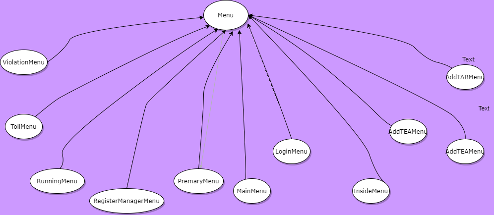
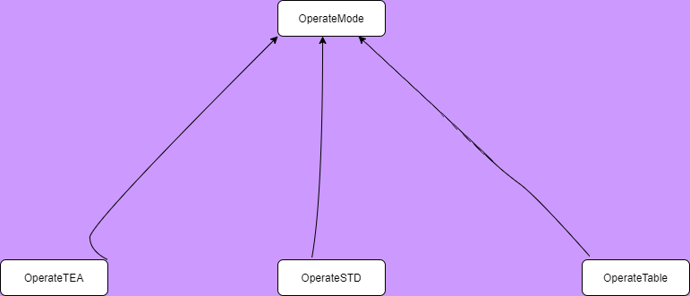
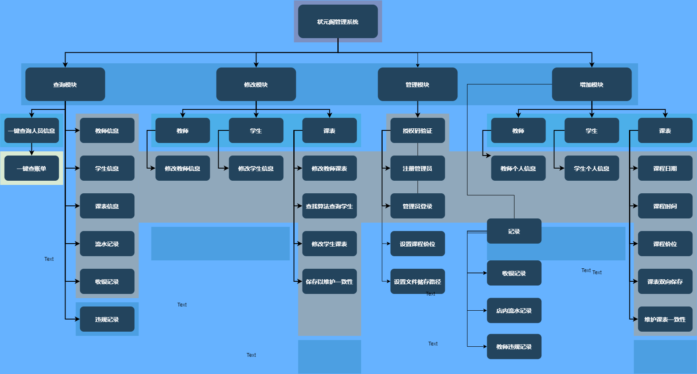

**##  A 需求分析** 

**### 背景陈设**

状元阁坐落于河北省滦州市，创立于2019年夏，是由沈俊东(大连理工大学)、李品桥(清华大学)等河北衡水第一中学优秀毕业生牵头创办的高中生课外辅导机构。自机构成立以来，得到一众高中学生和家长的一致认可，状元阁在当地广受好评。去年暑假，成立之初的状元阁便取得营业额30万元的佳绩。

作为机构任课教师，我有能力和义务用所学的专业知识为状元阁添砖加瓦。

适逢在大一下学期学习了《C++程序设计》这门课程，让酷爱编程学习的我得到一个展示自己的机会，在课程设计布置任务之初，我便决定为状元阁开发一个实用、高效、安全的管理系统，虽然这个设计的出发点远远没有其他同学的宏大雄伟，但是经过一系列的测试，此系统的可靠性和可拓展性是非常不错的。

此外，开发状元阁管理系统的工作量还是比较大的，截止到2020/5/19，有效代码量已经超过了10000行，值得一提的是，在当前的版本中，有些程序的接口虽然没有被用到，但这些接口为以后的版本更新和增减新功能提供了极大的便利，这也体现了此次开发管理系统是从实际出发的特点，所有功能和设计都为满足现有或者未来的的用户需求。

总结一下就是状元阁管理系统是从实际的需求出发，开发出的一款实用性、可拓展性都很强的管理系统。

**### 开发目的：**

\1. 减轻状元阁内部的管理压力

\2. 避免人为因素(核对课表和缴费信息错误等)造成的店内不必要的损失

\3. 提升数据管理效率和安全性

\4. 实现内部数据统一管理和保存

\5. 实现可视化数据和内部存储数据的转换

\6. 增强机构的整体竞争力

  

**### 开发目标：**

\1. 操作界面图形化界面

\2. 操作简便，上手容易

\3. 安全性高，可移植性好（稍加修改可为其他机构服务）

\4. 文件生成和保存的机制严密

\5. 实现数据的备份和隐藏

\+ C++ 是一门伟大的编程语言，同时具有面向对象和面向过程的特性

\+ 对开发者友好，减轻了函数和控制的负担

\+ 利用面向对象的编程形式方便版本升级

\+ 能够连接SQL，在有条件时进行数据库的连接

\+ 学生、老师、课表等典型的类能够实现很好地操作

\+ 文件保存比较便捷

$\color{8470FF} {以下灰色部分为尚未实现的功能}$

\+ ***\*对于学生\****

  

  \1. 学员报名并登记信息（姓名 性别 联系电话 补习科目 QQ等）

  \2. 修改学生信息（可以实现单项修改）

  \3. 学生预约课程（可选择是否缴纳定金）

  \4. 学生确定课程（支付学费，与定金核查）

  \5. 缴费时提醒应缴金额

  \6. 建立学生课表

  \7. 提醒上课科目和时间，任课老师

  \8. 修改学生课表

  \9. 课表自动生成csv文件

  \10. 课表内容屏幕显示

  \11. 移除学生课表

  \12. $\color{#D3D3D3}{学生重名启用第二关键字（性别等）}$

  \13. $\color{#D3D3D3}{学生退课 学生退费（退课后的确认退费）}$

  \14. $\color{#D3D3D3}{学生意见反馈}$

  \15. $\color{#D3D3D3}{学生请求更换老师（记录下）}$

  \16. $\color{#D3D3D3}{ 成功更换老师（进行课表转移和拼接）}$

  

  \1. 添加教师并记录基本信息（姓名 性别 联系电话 教授科目等 ）

  \2. 修改教师个人信息（可单项修改）

  \3. 展示自我介绍文件（连接网站）

  \4. 添加教师课表

  \5. 查询教师课表

  \6. 修改教师课表

  \7. $\color{#D3D3D3}{ 教师日常反馈记录}$

  \8.  $\color{#D3D3D3}{清除教师教学事故记录}$

  \9.  教师工资预查询

  \10. 工资结算（呈现Excel和屏幕显示）

   

\+ ***\*对于管理人员\****

  \1. 注册管理员

  \2. 管理员登录系统

  \3. 一键总账（有密钥，总收款 ）

  \4. $\color{#D3D3D3}{一键总账（收款加退款）}$ 

  \5. 课表核对（双向入口，核对教师课表和学生课表是否一致）

  \6. 添加教师违规记录

  \7. 查询单项教学事故

  \8. 查询教师违规总表

  \9.  添加店内流水账（店内日常开销）

  \10. 查询单项流水情况

  \11. 查询流水账总表

  \12. 收银功能

  \13. 记录当次交易信息

  \14. 查询单项交易数据

  \15. 查询所有交易数据

  \16. 初始化课程收费标准

  \17. 初始化教师工资标准

  \18. 修改课程收费标准

  \19. 修改教师工资标准

  \20. $\color{#D3D3D3}{备份所有数据}$

  \21. $\color{#D3D3D3}{联系开发人员，进行数据解密（启用解密程序）}$

  \22. $\color{#D3D3D3}{反馈管理系统问题给开发人员}$

\+ ***\*对于经营者\****

  \1. 管理人员所有权限

  \2. $\color{#D3D3D3}{数据加密和备份}$

  \3. $\color{#D3D3D3}{利用二进制的简单加密算法进行加密和备份}$

  \4. $\color{#D3D3D3}{利用程序系统反馈管理系统问题给开发人员}$ 

  \5. $\color{#D3D3D3}{删除学生、教师}$

   

**## D 程序运行平台 Visual Studio 2019** 

 $\color{#9370D8}{VisualStudio简介}$

 $\color{#9370D8}{为什么选用VS2019}$

在设计之初，我原本想用我熟悉的轻量级编辑器 Visual Studio Code 作为开发环境，在写了程勋进行到一定程度的时候，我发现没有IDE的开发是很耗费精力的，没有自动生成的文件夹和筛选器让文件的管理变得异常困难，因此我选用了强大的IDE Visual Studio 2019 社区版，为软件的调试和管理提供了很大的便利。另外，VS支持打开和编辑Qt工程，日后增加图形化界面不必再转为选用其他的IDE

**## E 程序类的说明** 

$\color{8470FF} {介绍类前的说明}$

在设计之初，我本想按照往年的课程设计的模板(比如图书馆管理系统)来进行类的设计，用一些名词作为Class，然后其中添加方法，这样一来程序的主体部分还是程序的主函数(或者其他的功能性函数)。***\*但考虑到此次选题各种的功能需求比较复杂，并且初学编程的我没有把这个系统功能分解为几十上百个函数的能力\****，我努力的使用完全面向对象的思想，类似于Java的一切皆是类的思想。

现在返回来看当时类的设计，确实有很多的缺点和不足，甚至曾经出现了头文件循环包含的问题。这里类的说明会有一些比较难理解的地方，我会尽我最大努力把的当初的设计思想展现出来。

**### 类的继承关系视图**

